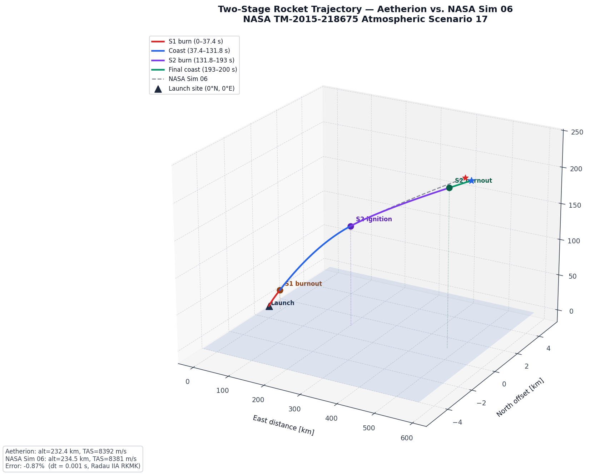
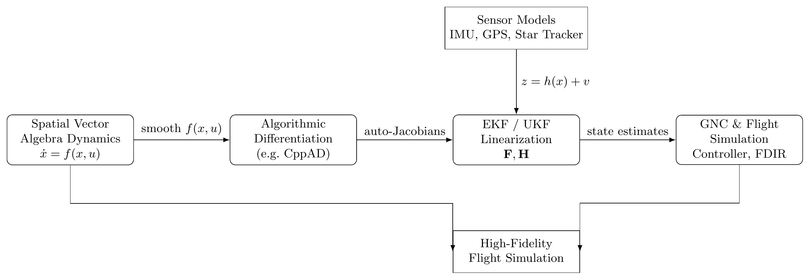
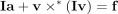

# ΑETHERION — Flight Dynamics Library

[](LICENSE)
[](https://github.com/onurtuncer/Aetherion/actions/workflows/linux.yml)
[](https://github.com/onurtuncer/Aetherion/actions/workflows/windows.yml)
[](https://codecov.io/gh/onurtuncer/Aetherion)
[](https://github.com/onurtuncer/Aetherion/actions/workflows/clang_format.yml)
[](https://github.com/onurtuncer/Aetherion/actions/workflows/cmake_format.yml)
[](https://github.com/onurtuncer/Aetherion/actions/workflows/cmake_lint.yml)
[](https://github.com/onurtuncer/Aetherion/actions/workflows/iwyu.yml)
[](https://github.com/onurtuncer/Aetherion/actions/workflows/clang_tidy.yml)
[](https://onurtuncer.github.io/Aetherion/metrics/)
[](https://github.com/onurtuncer/Aetherion/actions/workflows/sanitizers.yml)
[](https://github.com/onurtuncer/Aetherion/actions/workflows/simulink.yml)
[](https://onurtuncer.github.io/Aetherion/)

<p align="center">
  
</p>

**AETHERION** is a high-precision, research-grade C++ library for **rocket and aerospace flight dynamics**, built on:

- **Featherstone 6-D Spatial Vector Algebra (SVA)**
- **ECI / WGS84 frame transformations**
- **Algorithmic Differentiation (AD-friendly)**
- **Clean ODE formulations for high-fidelity simulation**

The name *ΑΙΘΕΡΙΟΝ* (Aetherion) is inspired by the Greek word **Αιθήρ**, referring to the upper atmosphere — the pristine realm of celestial motion.

---

## Two-Stage Rocket to Orbit — NASA Validation

The flagship simulation is a full 6-DOF two-stage rocket gravity-turn ascent from the equator, validated against **NASA TM-2015-218675 Atmospheric Scenario 17**. The trajectory below was produced entirely by Aetherion using Featherstone SVA dynamics, the US1976 atmosphere, WGS84 gravity, and an implicit RADAU-IIA integrator.

<p align="center">
  
</p>

Stage separation, coast phases, and second-stage ignition are all captured with sub-percent error versus the NASA reference. Final altitude error: **0.87 %** · Final speed error: **0.14 %** (8 392 vs 8 381 m/s true airspeed).

---

## Features

### Dynamics Core
- **Full 6-DOF rigid-body dynamics** using Featherstone Spatial Vector Algebra
- **ECI equations of motion** — no pseudo-forces, no approximations
- **Air-relative velocity** for aerodynamics; rotating atmosphere handled correctly
- **Variable-mass bodies** — propellant burn, staging events, CG travel

### Numerical Methods
- **Lie-structure-preserving Runge-Kutta-Munthe-Kaas (RKMK) integrator** on SE(3)
- **Fully implicit RADAU-IIA solver** for stiff ascent phases
- **Discrete Extended Kalman Filter on a product manifold** containing Lie groups

### Algorithmic Differentiation
- **AD-friendly formulations** throughout — compatible with CppAD, dual numbers, and similar libraries
- Auto-Jacobians fed directly into the EKF/UKF linearisation pipeline

### Environment Models
- **US1976 Standard Atmosphere** (temperature, pressure, density, speed of sound)
- **WGS84 gravity model** with ECI/ECEF/geodetic coordinate conversions
- **Branch-free formulations** designed for AD and Kalman filtering

### Aerodynamics & Propulsion
- **DAVE-ML (DML) aerodynamic model loader** — table-driven aero/inertia/propulsion data
- Multi-axis force and moment models; CG-offset spatial inertia
- Stage-aware propellant tracking with automatic separation logic

### Interoperability
- **FMI/FMU export** via fmu4cpp — drop Aetherion plants into any FMI-compliant simulator
- JSON configuration files for initial conditions and simulation parameters
- CSV output compatible with NASA reference data formats

### Code Quality
- **Post-modern C++23** design throughout
- Enforces a **practical subset of the JSF AV C++ coding standard**
- CI gates: Clang-Format · CMake-Format · CMake-Lint · IWYU · Clang-Tidy · Metrix++ cyclomatic complexity · AddressSanitizer / UBSan

The two CMake gates share their configuration in [`.cmake-format`](.cmake-format) and cover every
`CMakeLists.txt` and `*.cmake` outside the pruned `build/`, `out/`, `vendor/` and `.venv/`
trees. Reproduce them locally with:

```bash
pip install cmakelang

bash .run-cmake-format   # rewrites listfiles in place; CI fails if this leaves a diff

mapfile -t listfiles < <(
  find . \( -path ./build -o -path ./out -o -path ./vendor -o -path ./.venv \) -prune \
    -o -type f \( -name CMakeLists.txt -o -name "*.cmake" \) -print
)
cmake-lint "${listfiles[@]}" --config-files .cmake-format
```

`--config-files` takes a variable number of arguments, so the listfiles have to come *before* it:
piping them in as `xargs cmake-lint --config-files .cmake-format` makes them look like extra config
files and the run checks nothing at all.

---

## SVA → AD → EKF Pipeline

<p align="center">
  
</p>

The library is architected so that the same smooth `ẋ = f(x, u)` used for simulation feeds auto-Jacobians into the EKF linearisation, producing a single consistent GNC pipeline from plant model to state estimator.

---

## Mathematical Foundations

ΑETHERION implements the full suite of Featherstone spatial constructs:

| Symbol | Meaning |
|--------|---------|
| `v` | Spatial velocity (twist) |
| `a` | Spatial acceleration |
| `I` | Spatial inertia |
| `v×` | Motion cross-product operator |
| `v×*` | Force cross-product operator (adjoint) |

Equation of motion:

<p align="center">
  
</p>

Control surfaces and payload stages can be modelled as rigidly attached bodies within the same spatial algebra.

---

## Frames & Conventions

| Label | Frame |
|-------|-------|
| **W** | Inertial (ECI) |
| **E** | Earth-fixed (ECEF) |
| **B** | Rocket/aircraft body |

All transforms follow:

<p align="center">
  
</p>

notation for spatial transforms, keeping the frame algebra explicit and AD-friendly.

---

## Validated Examples

| Example | Vehicle | Reference |
|---------|---------|-----------|
| [`TwoStageRocket`](src/Examples/TwoStageRocket/TwoStageRocket.cpp) | Two-stage launch vehicle | NASA TM-2015-218675 Scenario 17 |
| [`F16SteadyFlight`](src/Examples/F16SteadyFlight/F16SteadyFlight.cpp) | F-16 at trim | NASA TN D-8532 Section 13.1 |
| [`F16AirspeedChange`](src/Examples/F16AirspeedChange/F16AirspeedChange.cpp) | F-16 speed step | NASA TN D-8532 Section 13.2 |
| [`F16AltitudeChange`](src/Examples/F16AltitudeChange/F16AltitudeChange.cpp) | F-16 altitude step | NASA TN D-8532 Section 13.3 |
| [`F16HeadingChange`](src/Examples/F16HeadingChange/F16HeadingChange.cpp) | F-16 heading change | NASA TN D-8532 Section 13.4 |
| [`F16LateralSideStep`](src/Examples/F16LateralSideStep/F16LateralSideStep.cpp) | F-16 lateral manoeuvre | NASA TN D-8532 Appendix |
| [`F16SupersonicTrim`](src/Examples/F16SupersonicTrim/F16SupersonicTrim.cpp) | F-16 supersonic trim | NASA TN D-8532 |
| [`EastwardCannonball`](src/Examples/EastwardCannonball/EastwardCannonball.cpp) | Point mass projectile | Analytic (Coriolis) |
| [`NorthwardCannonball`](src/Examples/NorthwardCannonball/NorthwardCannonball.cpp) | Point mass projectile | Analytic (Coriolis) |
| [`SphereWithAtmosphericDrag`](src/Examples/SphereWithAtmosphericDrag/SphereWithAtmosphericDrag.cpp) | Sphere + drag | Analytical reference |
| [`DroppedSphereSteadyWind`](src/Examples/DroppedSphereSteadyWind/DroppedSphereSteadyWind.cpp) | Sphere in steady crosswind | Analytical reference |
| [`DroppedSphere2DWindShear`](src/Examples/DroppedSphere2DWindShear/DroppedSphere2DWindShear.cpp) | Sphere in wind-shear field | Analytical reference |
| [`TumblingBrickNoDamping`](src/Examples/TumblingBrickNoDamping/TumblingBrickNoDamping.cpp) | Free tumbling rigid body | Angular momentum conservation |
| [`TumblingBrickWithDamping`](src/Examples/TumblingBrickWithDamping/TumblingBrickWithDamping.cpp) | Damped tumbling body | Energy dissipation |
| [`CircleEquatorDateLine`](src/Examples/CircleEquatorDateLine/CircleEquatorDateLine.cpp) | Orbital-like equatorial loop | Geometric consistency |
| [`CircleNorthPole`](src/Examples/CircleNorthPole/CircleNorthPole.cpp) | Polar orbital loop | Geometric consistency |

---

## Testing

- **Catch2 unit tests** covering every module
- **Numerical validation** against NASA technical reports (sub-percent agreement)
- **AddressSanitizer + UBSanitizer** run on every CI push
- **Clang-Tidy static analysis** and **IWYU** include hygiene enforced on every PR

---

## Dependencies

| Library | Purpose | Provided by |
|---------|---------|-------------|
| [Eigen](https://eigen.tuxfamily.org) | Linear algebra | vendored (`vendor/eigen`) |
| [CppAD](https://coin-or.github.io/CppAD/) | Algorithmic differentiation | vcpkg (`vcpkg.json`) |
| [fmu4cpp](https://github.com/markaren/fmu4cpp) | FMI/FMU export | vendored (`vendor/fmu4cpp`) |
| [ecos](https://github.com/Ecos-platform/ecos) | FMI co-simulation engine (FMU smoke testing) | submodule (`vendor/ecos`) |
| [Catch2 v3](https://github.com/catchorg/Catch2) | Unit testing | fetched at configure time |

---

## Documentation

Full API reference and simulation guides are hosted on GitHub Pages:

- [Detailed Documentation](https://onurtuncer.github.io/Aetherion/)

---

## Build & Installation

Clone the repository and initialise submodules:

```bash
git clone https://github.com/onurtuncer/Aetherion.git
cd Aetherion
git submodule update --init --recursive
```

CppAD is consumed through [vcpkg](https://vcpkg.io) on every platform, so a vcpkg clone is
the only external prerequisite:

```bash
git clone https://github.com/microsoft/vcpkg.git ~/vcpkg   # or C:\vcpkg on Windows
~/vcpkg/bootstrap-vcpkg.sh                                 # bootstrap-vcpkg.bat on Windows
export VCPKG_ROOT=~/vcpkg                                  # setx VCPKG_ROOT C:\vcpkg
```

CMake picks the toolchain up from `VCPKG_ROOT` (or `VCPKG_INSTALLATION_ROOT`, which
GitHub-hosted runners already set) and installs the dependencies pinned in `vcpkg.json`
at configure time — no separate `vcpkg install` step. Two caveats:

- `vcvarsall.bat`, and therefore every Visual Studio developer prompt, overwrites
  `VCPKG_ROOT` with the port-less vcpkg stub bundled inside Visual Studio. That stub is
  detected and skipped; if it is the only candidate, pass
  `-DAETHERION_VCPKG_ROOT=<path>` or set `VCPKG_INSTALLATION_ROOT`, which `vcvarsall`
  leaves alone.
- To build against a CppAD that is already installed system-wide, configure with
  `-DAETHERION_USE_VCPKG=OFF` and make sure the prefix is on `CMAKE_PREFIX_PATH`.

### Windows — Visual Studio

1. Open **Visual Studio**
2. **File → Open Folder…** → select the `Aetherion` directory
3. Let Visual Studio configure CMake automatically
4. Choose a configuration (e.g. `x64-Release`)
5. **Build → Build All**

### Linux / macOS — CMake

```bash
cmake -B build -DCMAKE_BUILD_TYPE=Release
cmake --build build --parallel
ctest --test-dir build
```

---

## Community

- **Bug Tracker**: [GitHub Issues](https://github.com/onurtuncer/Aetherion/issues)
- **Discussions**: [GitHub Discussions](https://github.com/onurtuncer/Aetherion/discussions/)

---

## Author

**Prof. Dr. Onur Tuncer**  
Aerospace Engineer, Researcher & C++ Systems Developer  
Istanbul Technical University · [onur.tuncer@itu.edu.tr](mailto:onur.tuncer@itu.edu.tr)

<p align="left">
  
</p>
