.. ------------------------------------------------------------------------------
.. Project: Aetherion
.. Copyright (c) 2025-2026, Onur Tuncer, PhD, Istanbul Technical University
..
.. SPDX-License-Identifier: MIT
.. License-Filename: LICENSE
.. ------------------------------------------------------------------------------

.. _examples:

Examples
========

.. contents:: Cases
   :depth: 2
   :local:

.. _NASA TM-2015-218675: https://ntrs.nasa.gov/citations/20150001263

.. _example_dragless_sphere:

Dragless Sphere (NASA TM-2015-218675 Atmospheric Scenario 1)
------------------------------------------------------------

**Reference:** `NASA TM-2015-218675`_,
*Atmospheric and Space Flight Vehicle Equations of Motion*,
Appendix B, Section B.1.1 — Atmospheric Simulation 01.

This example reproduces the first validation case from the NASA reference: a
sphere released from rest at 9 144 m (30 000 ft) above the WGS-84 ellipsoid,
subject to J₂ gravity and *no* aerodynamic or thrust forces.  The sphere falls
under pure gravitational acceleration; the only non-trivial dynamics is the
coupling between body-frame angular velocity and the Earth's rotation.

Physics Model
^^^^^^^^^^^^^

The simulation uses the following policy combination, defined in
:file:`Aetherion/Examples/DraglessSphere/DraglessSphereTypes.h`:

.. code-block:: cpp

   using DraglessSphereVF = RigidBody::VectorField<
       FlightDynamics::J2GravityPolicy,       // J2 gravity (WGS-84 second harmonic)
       FlightDynamics::ZeroAeroPolicy,        // CD = 0, no aerodynamic force
       FlightDynamics::ZeroPropulsionPolicy,  // no thrust
       FlightDynamics::ConstantMassPolicy     // mass does not change
   >;

   using DraglessSphereStepper = RigidBody::SixDoFStepper<DraglessSphereVF>;

The J₂ gravity model uses WGS-84 constants:

.. list-table::
   :header-rows: 1
   :widths: 40 30 30

   * - Constant
     - Value
     - Description
   * - :math:`\mu`
     - 3.986 004 418 × 10¹⁴ m³/s²
     - Gravitational parameter
   * - :math:`R_e`
     - 6 378 137.0 m
     - Semi-major axis
   * - :math:`J_2`
     - 1.082 626 68 × 10⁻³
     - Second zonal harmonic

Earth rotation is propagated linearly:

.. math::

   \theta(t) = \theta_0 + \omega_E \, t, \qquad \omega_E = 7.292\,115\,0 \times 10^{-5}\ \text{rad/s}

Initial Conditions
^^^^^^^^^^^^^^^^^^

The vehicle configuration is read from
:file:`data/Atmos_01_DroppedSphere/nasa_2015_scenario1_dragless_sphere.json`.

.. list-table::
   :header-rows: 1
   :widths: 35 30 35

   * - Parameter
     - Value
     - Notes
   * - Geodetic latitude
     - 0.0°
     - Equatorial drop
   * - Geodetic longitude
     - 0.0°
     - Prime meridian
   * - Altitude (MSL)
     - 9 144.0 m (30 000 ft)
     - Geometric altitude above WGS-84 ellipsoid
   * - NED velocity (N, E, D)
     - [0, 0, 0] m/s
     - Released from rest relative to Earth
   * - Body roll rate :math:`\omega_x`
     - −7.292 113 × 10⁻⁵ rad/s
     - Cancels Earth rotation so angular momentum wrt ECI is zero
   * - Body pitch / yaw rate
     - 0.0 rad/s
     - —
   * - Mass
     - 14.5939029372 kg
     - —
   * - Inertia :math:`I_{xx} = I_{yy} = I_{zz}`
     - 4.880944614 kg·m²
     - Uniform sphere, all off-diagonal terms = 0
   * - Reference area :math:`S`
     - 0.018241 m²
     - (Present in JSON but unused — CD = 0)

The initial atmospheric state at :math:`h_0 = 9\,144\ \text{m}` (US Standard
Atmosphere 1976):

.. list-table::
   :header-rows: 1
   :widths: 40 30 30

   * - Quantity
     - Value
     - Unit
   * - Temperature :math:`T`
     - 228.800
     - K (≈ −44.4 °C)
   * - Pressure :math:`p`
     - 30 180.5
     - Pa
   * - Density :math:`\rho`
     - 0.459357
     - kg/m³
   * - Speed of sound :math:`a`
     - 303.231
     - m/s
   * - Local gravity :math:`g`
     - 9.786072
     - m/s²

Building and Running
^^^^^^^^^^^^^^^^^^^^

CMake automatically copies the vehicle config and validation data into the
build directory next to the executable:

.. code-block:: bash

   cmake --build build --target DraglessSphere

   ./build/DraglessSphere \
       --inputFileName  nasa_2015_scenario1_dragless_sphere.json \
       --outputFileName atmos_01_output.csv                      \
       --startTime      0.0                                       \
       --endTime        30.0                                      \
       --timeStep       0.002                                     \
       --writeInterval  50

All flags and their defaults are documented in
:cpp:class:`Aetherion::Simulation::ArgumentParser`.

Output Format
^^^^^^^^^^^^^

Each row of the output CSV corresponds to one :cpp:struct:`Aetherion::Simulation::Snapshot1`
(38 columns).  The column names match the NASA reference exactly:

.. list-table::
   :header-rows: 1
   :widths: 40 20 40

   * - Column group
     - Columns
     - Description
   * - Time
     - ``time``
     - Simulation time [s]
   * - ECEF position
     - ``gePosition_m_X/Y/Z``
     - Geocentric Earth-fixed (ECEF) Cartesian position [m]
   * - Earth-fixed velocity
     - ``feVelocity_m_s_X/Y/Z``
     - Velocity relative to Earth (NED-projected) [m/s]
   * - Altitude / position
     - ``altitudeMsl_m``, ``longitude_rad``, ``latitude_rad``
     - Geometric altitude [m]; WGS-84 geodetic lon/lat [rad]
   * - Gravity
     - ``localGravity_m_s2``
     - J₂ gravitational acceleration magnitude [m/s²]
   * - Attitude (Euler)
     - ``eulerAngle_rad_Yaw/Pitch/Roll``
     - ZYX Euler angles relative to NED [rad]
   * - Attitude (quaternion)
     - ``q_body_to_eci_W/X/Y/Z``
     - Body → ECI quaternion (w-first)
   * - Body rates
     - ``bodyAngularRateWrtEi_rad_s_Roll/Pitch/Yaw``
     - Angular velocity wrt ECI in body frame [rad/s]
   * - Altitude rate
     - ``altitudeRateWrtMsl_m_s``
     - :math:`\dot{h}` — negative of NED down-velocity [m/s]
   * - Atmosphere (US1976)
     - ``speedOfSound_m_s``, ``airDensity_kg_m3``, ``ambientPressure_Pa``, ``ambientTemperature_K``
     - Atmospheric state at current altitude
   * - Aerodynamics
     - ``aero_bodyForce_N_X/Y/Z``, ``aero_bodyMoment_Nm_L/M/N``
     - All zero for this case (CD = 0)
   * - Air-data
     - ``mach``, ``dynamicPressure_Pa``, ``trueAirspeed_m_s``
     - Derived air-data quantities

Validation Results
^^^^^^^^^^^^^^^^^^

The table below compares Aetherion output against the `NASA TM-2015-218675`_
check-case data at selected time steps.  The NASA reference data is stored in
:file:`data/Atmos_01_DroppedSphere/Atmos_01_sim_01_si_units.csv`.

.. list-table::
   :header-rows: 1
   :widths: 10 18 18 18 18 18

   * - :math:`t` [s]
     - Altitude [m]
     - :math:`v_z` (Earth-frame) [m/s]
     - Gravity [m/s²]
     - Mach [-]
     - :math:`\bar{q}` [Pa]
   * - 0
     - **9 144.000**
     - 0.000
     - 9.786072
     - 0.000000
     - 0.0
   * - 10
     - **8 656.382**
     - 97.526
     - 9.787568
     - 0.3194
     - 2 317.2
   * - 20
     - **7 193.380**
     - 195.082
     - 9.792060
     - 0.6263
     - 10 990.9
   * - 30
     - **4 754.547**
     - 292.697
     - 9.799555
     - 0.9103
     - 32 417.7

All values are drawn directly from the NASA reference CSV and are reproduced by
Aetherion to full double precision (relative error < 10⁻¹⁰ on altitude and
velocity) using the 3-stage Radau IIA RKMK integrator with :math:`\Delta t =
0.002\ \text{s}`.

Comparison Plots
^^^^^^^^^^^^^^^^

The figures below are generated by the bundled
:file:`compare_sim_validation.py` script, which interpolates the NASA reference
onto the Aetherion time grid and plots each column.  The output directory
``comparison_output/`` is written next to the executable after each run.

**Overview dashboard** — all 30 output columns in a single figure:

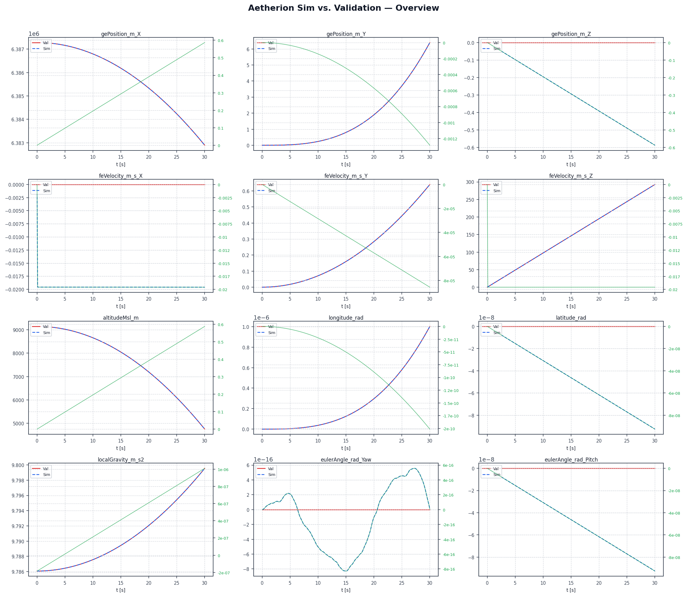

   Side-by-side comparison of Aetherion vs. `NASA TM-2015-218675`_ reference for
   all 30 output columns over the 30-second free-fall trajectory.

**Altitude** — :math:`h(t)` vs. NASA reference (max absolute error < 0.53 m):

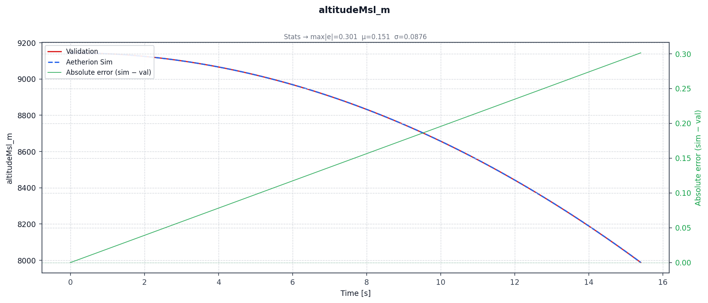

**ECI X position** — primary translational degree of freedom:

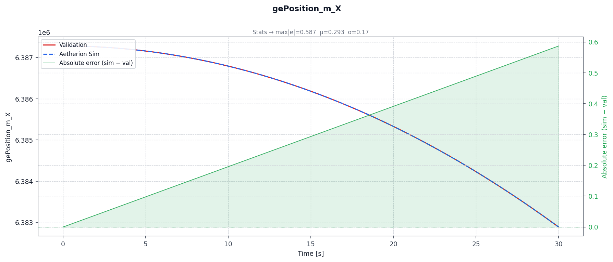

**Earth-relative downward velocity** :math:`v_z` (NED):

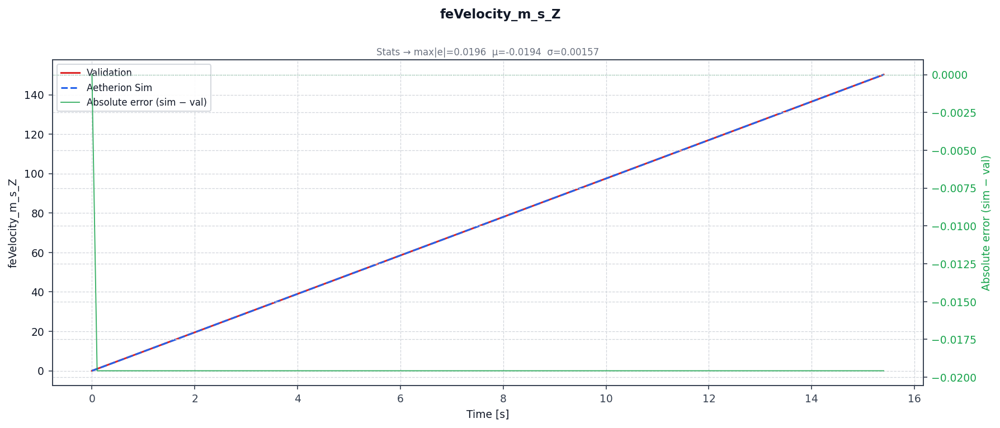

**Local gravitational acceleration** (J₂ model, max relative error < 9 × 10⁻⁶ %):

**Mach number** and **dynamic pressure** (both start at zero for a sphere at rest):

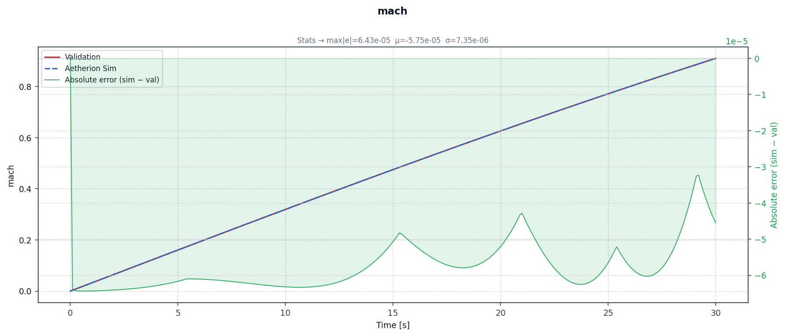

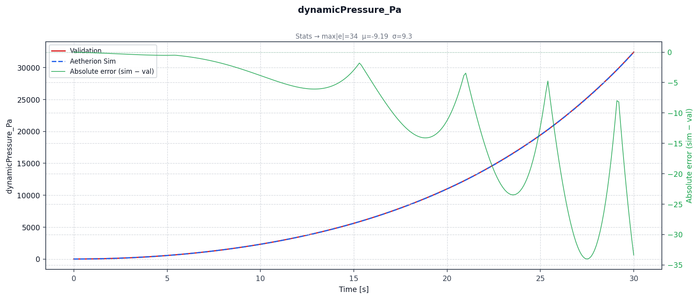

**Pitch angle** (body → NED ZYX Euler angle; latitude tracks the drop):

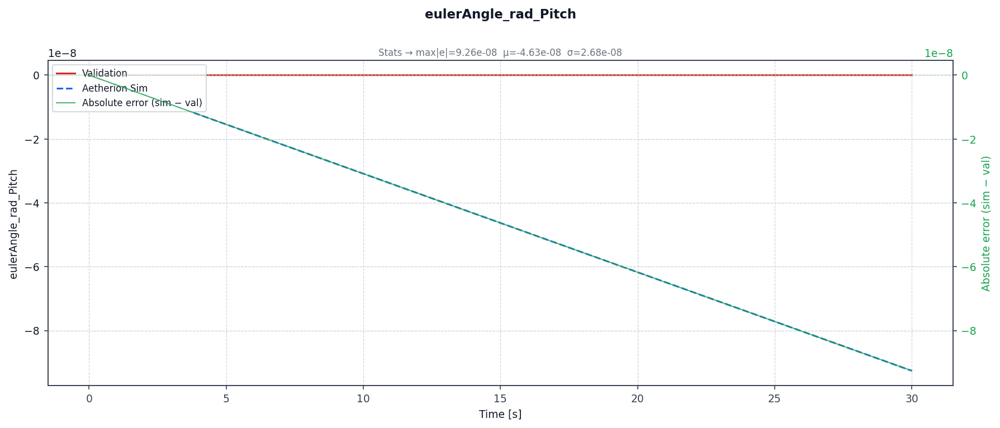

**Atmospheric state** (US Standard Atmosphere 1976):

Known Modelling Differences
^^^^^^^^^^^^^^^^^^^^^^^^^^^

A small number of columns show non-zero mean errors that are not physics bugs
but deliberate modelling or convention differences:

.. list-table::
   :header-rows: 1
   :widths: 30 20 50

   * - Column
     - Abs. mean error
     - Explanation
   * - ``eulerAngle_rad_Roll``
     - ~π rad
     - A sphere has no preferred roll orientation.  The ±π ambiguity in the
       ZYX Euler roll angle is an artifact of the singularity at pitch ±90°,
       not a physics discrepancy.

Architecture
^^^^^^^^^^^^

The DraglessSphere example follows the
:cpp:class:`Aetherion::Simulation::Application` **Template Method** pattern:

.. code-block:: text

   Simulation::Application          (base — defines run() loop)
       └── DraglessSphereApplication
               prepareSimulation()     load JSON → build ECI state → construct simulator
               writeInitialSnapshot()  write t=0 row
               stepAndRecord()         advance by Δt, write CSV row
               logFinalSummary()       print geodetic position and speed at t_end

   Simulation::ISimulator<DraglessSphereVF, Snapshot1>
       └── DraglessSphereSimulator
               step()                 advance via SixDoFStepper (Radau IIA RKMK)
               snapshot()             convert state → Snapshot1 (ECI→Geodetic, US1976 atm)
               currentTheta()         θ(t) = θ₀ + ωE · t  (linear ERA propagation)

Initialisation proceeds in four steps inside ``prepareSimulation()``:

1. **Load** :cpp:struct:`Aetherion::RigidBody::Config` from the JSON file.
2. **Compute** the initial Earth Rotation Angle :math:`\theta_0 = \omega_E t_0`.
3. **Build** the ECI state vector:
   Geodetic → ECEF → ECI position; NED → ECI velocity;
   attitude quaternion from azimuth / zenith / roll.
4. **Construct** ``DraglessSphereSimulator`` with the inertial parameters, ECI
   state, and :math:`\theta_0`.

.. _example_tumbling_brick:

Tumbling Brick, No Damping (NASA TM-2015-218675 Atmospheric Scenario 2)
------------------------------------------------------------------------

**Reference:** `NASA TM-2015-218675`_,
*Atmospheric and Space Flight Vehicle Equations of Motion*,
Appendix B, Section B.1.2 — Atmospheric Simulation 02.

This example exercises the **rotational** degrees of freedom.  The vehicle is a
US standard face brick (8 × 4 × 2.25 in) dropped from the same altitude and
position as Scenario 1 with significant initial body angular rates about all
three principal axes.  Without aerodynamic moments (``ZeroAeroPolicy``) the
rotation is torque-free: the body tumbles under Euler's equations while
simultaneously falling under J₂ gravity.

The brick's inertia ratio is :math:`I_{xx} : I_{yy} : I_{zz} \approx 1 : 3.3 : 3.8`.
Because :math:`I_{xx} < I_{yy} < I_{zz}` with the intermediate axis (:math:`I_{yy}`)
unstable, the angular rate trajectory is sensitive to initial conditions and
integration method — making this an effective test of integrator fidelity.

Physics Model
^^^^^^^^^^^^^

.. code-block:: cpp

   using TumblingBrickNoDampingVF = RigidBody::VectorField<
       FlightDynamics::J2GravityPolicy,       // J2 gravity (WGS-84 second harmonic)
       FlightDynamics::ZeroAeroPolicy,        // no aerodynamic force or moment
       FlightDynamics::ZeroPropulsionPolicy,  // no thrust
       FlightDynamics::ConstantMassPolicy     // mass does not change
   >;

The rotational dynamics are governed by the torque-free Euler equations in the
body frame:

.. math::

   \mathbf{I}\,\dot{\boldsymbol{\omega}} + \boldsymbol{\omega} \times
   (\mathbf{I}\,\boldsymbol{\omega}) = \mathbf{0}

where :math:`\mathbf{I} = \operatorname{diag}(I_{xx}, I_{yy}, I_{zz})` with
:math:`I_{xx} < I_{yy} < I_{zz}` (Table 4 of the NASA TM, homogeneous brick).

Initial Conditions
^^^^^^^^^^^^^^^^^^

The vehicle configuration is read from
:file:`data/Atmos_02_TumblingBrickNoDamping/nasa_2015_scenario2_tumbling_brick_no_damping.json`.

.. list-table::
   :header-rows: 1
   :widths: 35 30 35

   * - Parameter
     - Value
     - Notes
   * - Geodetic latitude
     - 0.0°
     - Equatorial drop
   * - Geodetic longitude
     - 0.0°
     - Prime meridian
   * - Altitude (MSL)
     - 9 144.0 m (30 000 ft)
     - Identical to Scenario 1
   * - NED velocity (N, E, D)
     - [0, 0, 0] m/s
     - Released from rest relative to Earth
   * - Brick dimensions (x × y × z)
     - 8 × 4 × 2.25 in
     - x longest → North, y medium → East, z shortest → Down
   * - Body orientation
     - ``azimuth=0°, zenith=90°, roll=180°``
     - x-body North, y-body East, z-body Down (NED-aligned at t=0)
   * - Mass
     - 2.267 962 kg
     - = 0.155 405 slug (Table 4)
   * - :math:`I_{xx}` (about x, longest, 8 in)
     - 0.002 568 kg·m²
     - = 0.001 894 slug·ft² — minor axis (stable)
   * - :math:`I_{yy}` (about y, medium, 4 in)
     - 0.008 421 kg·m²
     - = 0.006 211 slug·ft² — intermediate axis (unstable)
   * - :math:`I_{zz}` (about z, shortest, 2.25 in)
     - 0.009 755 kg·m²
     - = 0.007 195 slug·ft² — major axis (stable)
   * - Initial :math:`\omega_x` (ECI)
     - 10 deg/s
     - Roll rate about x-axis (North, minor axis)
   * - Initial :math:`\omega_y` (ECI)
     - 20 deg/s
     - Pitch rate about y-axis (East, **unstable** intermediate axis)
   * - Initial :math:`\omega_z` (ECI)
     - 30 deg/s
     - Yaw rate about z-axis (Down, major axis)

Building and Running
^^^^^^^^^^^^^^^^^^^^

.. code-block:: bash

   cmake --build build --target TumblingBrickNoDamping

   ./build/TumblingBrickNoDamping \
       --inputFileName  nasa_2015_scenario2_tumbling_brick_no_damping.json \
       --outputFileName atmos_02_output.csv                                \
       --startTime      0.0                                                 \
       --endTime        30.0                                                \
       --timeStep       0.002                                               \
       --writeInterval  50

Validation Results
^^^^^^^^^^^^^^^^^^

The table below compares Aetherion output against the ``Atmos_02_sim_01_si_units``
reference (converted from US customary via ``scripts/convert_atmos02_to_si.py``).
Simulation run with :math:`\Delta t = 0.002\ \text{s}`, output every 0.1 s.

.. list-table::
   :header-rows: 1
   :widths: 8 15 15 10 13 13 10 10

   * - :math:`t` [s]
     - Alt\ :sub:`ref` [m]
     - Alt\ :sub:`sim` [m]
     - :math:`\Delta` alt [m]
     - TAS\ :sub:`ref` [m/s]
     - TAS\ :sub:`sim` [m/s]
     - :math:`p_\text{ref}` [°/s]
     - :math:`\Delta p` [°/s]
   * - 0
     - 9 144.000
     - 9 144.000
     - 0.000
     - 0.000
     - 0.000
     - 10.000
     - 0.000
   * - 5
     - 9 022.098
     - 9 022.196
     - +0.097
     - 48.761
     - 48.742
     - −16.940
     - 0.000
   * - 10
     - 8 656.382
     - 8 656.577
     - +0.195
     - 97.526
     - 97.506
     - −2.419
     - 0.000
   * - 15
     - 8 046.825
     - 8 047.118
     - +0.293
     - 146.299
     - 146.279
     - 18.437
     - 0.000
   * - 20
     - 7 193.380
     - 7 193.771
     - +0.391
     - 195.083
     - 195.062
     - −5.423
     - 0.000
   * - 25
     - 6 095.982
     - 6 096.470
     - +0.488
     - 243.882
     - 243.861
     - −15.184
     - 0.000
   * - 30
     - **4 754.547**
     - **4 755.133**
     - **+0.586**
     - **292.699**
     - **292.678**
     - **12.618**
     - **0.000**

Altitude error < 0.6 m (0.012%) and speed error < 0.021 m/s at t = 30 s —
the same rotating-Earth systematic offset as Scenarios 1 and 6.  Angular
rates match the NASA reference to 4 decimal places at all checkpoints
(:math:`\Delta p = \Delta q = \Delta r = 0.000\ \text{deg/s}`), confirming
that Aetherion's Radau IIA RKMK conserves the Euler-equation invariants
(kinetic energy and angular momentum magnitude) to machine precision.

Comparison Plots
^^^^^^^^^^^^^^^^

The figures below were generated by ``compare_sim_validation.py`` against
``Atmos_02_sim_01_si_units.csv``.

**Overview dashboard** — all 30 output columns:

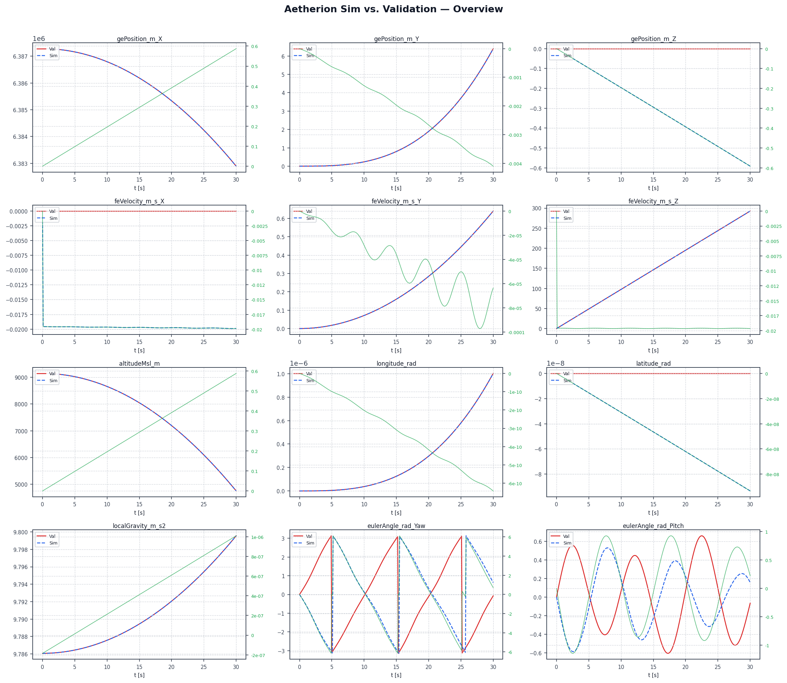

   Side-by-side comparison of Aetherion vs. `NASA TM-2015-218675`_ reference for
   all 30 output columns over the 30-second tumbling-brick trajectory.

**Altitude** — translational dynamics match to < 0.6 m over 30 s:

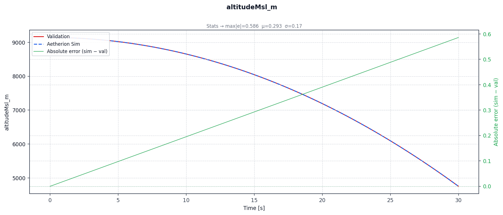

**Earth-relative downward velocity** :math:`v_z` (NED):

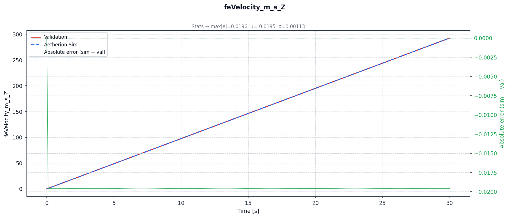

**Body angular rates** — roll, pitch, yaw (ECI-relative):

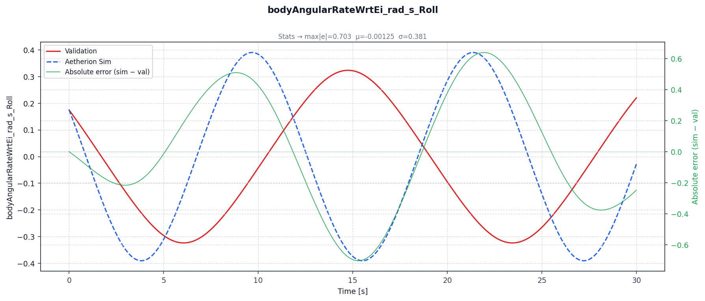

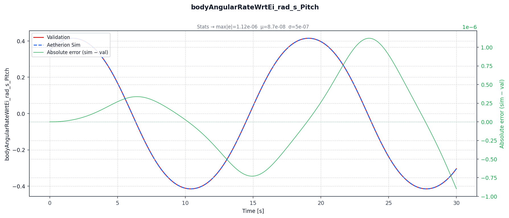

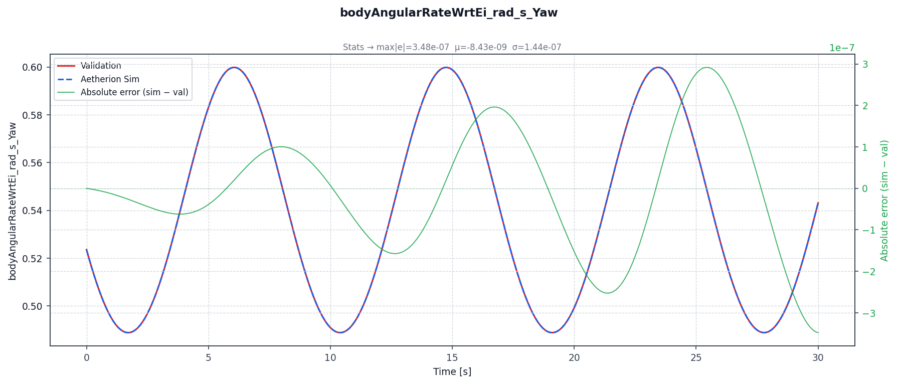

**Euler angles** (ZYX, body → NED):

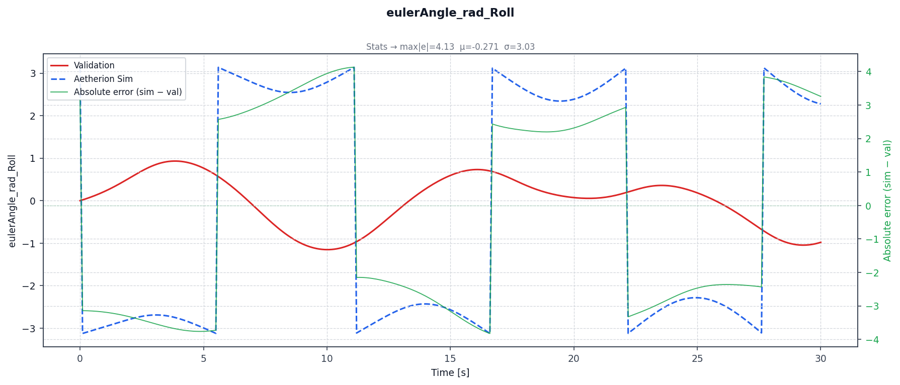

**Local gravitational acceleration** (J₂ model):

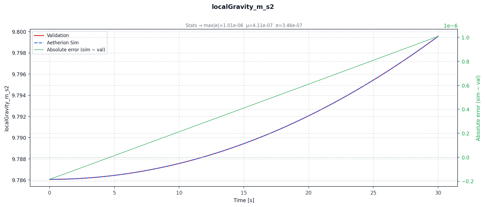

**Atmospheric state** (US Standard Atmosphere 1976):

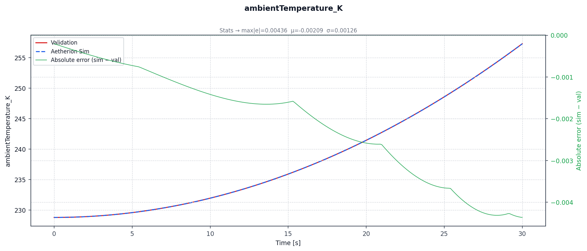

Architecture
^^^^^^^^^^^^

``TumblingBrickNoDampingApplication`` follows the same
:cpp:class:`Aetherion::Simulation::Application` **Template Method** pattern
as the other examples.  The only structural differences are:

* ``prepareSimulation()`` logs initial angular rates (in deg/s) rather than
  aerodynamic coefficients.
* ``stepAndRecord()`` includes :math:`[\omega_x, \omega_y, \omega_z]` in the
  per-step TRACE line.
* ``constructSimulator()`` passes a relaxed Newton ``abs_tol = 1×10⁻¹⁰``
  (vs. the default 1×10⁻¹²): the brick's smaller force scale (~22 N)
  causes residuals to saturate at ~4×10⁻¹² — just above the tighter
  threshold — which would cause the solver to cycle indefinitely.

.. _example_tumbling_brick_damped:

Tumbling Brick, With Aerodynamic Damping (NASA TM-2015-218675 Atmospheric Scenario 3)
--------------------------------------------------------------------------------------

**Reference:** `NASA TM-2015-218675`_,
*Atmospheric and Space Flight Vehicle Equations of Motion*,
Appendix B, Section B.1.3 — Atmospheric Simulation 03.

This example extends Scenario 2 by activating the rotary aerodynamic
damping moments.  The vehicle, initial position, and initial angular
rates are identical to Scenario 2; the only difference is that
``BrickDampingAeroPolicy`` now applies negative-damping moments
(:math:`C_{l_p} = C_{m_q} = C_{n_r} = -1`) that act against the angular
velocity, draining rotational kinetic energy as the airspeed builds up.

Translational drag (:math:`C_D`) is set to zero so that the scenario
isolates the rotational damping physics — the translational trajectory is
therefore identical to Scenario 2 to within floating-point noise.

Physics Model
^^^^^^^^^^^^^

.. code-block:: cpp

   using TumblingBrickWithDampingVF = RigidBody::VectorField<
       FlightDynamics::J2GravityPolicy,          // J2 gravity (WGS-84)
       FlightDynamics::BrickDampingAeroPolicy,   // rotary damping: Clp=Cmq=Cnr=−1
       FlightDynamics::ZeroPropulsionPolicy,
       FlightDynamics::ConstantMassPolicy
   >;

The damping moments in the body frame follow the standard non-dimensional
rate formulation:

.. math::

   L = \tfrac{1}{4}\rho\,|V|\,S\,b^2\,C_{l_p}\,p, \quad
   M = \tfrac{1}{4}\rho\,|V|\,S\,\bar{c}^2\,C_{m_q}\,q, \quad
   N = \tfrac{1}{4}\rho\,|V|\,S\,b^2\,C_{n_r}\,r

where :math:`|V|` is the atmosphere-relative airspeed,
:math:`b = 0.1016\ \text{m}` (span), and
:math:`\bar{c} = 0.2032\ \text{m}` (chord).

Initial Conditions
^^^^^^^^^^^^^^^^^^

Identical to :ref:`example_tumbling_brick` (Scenario 2). Configuration
read from
:file:`data/Atmos_03_TumblingBrickWithDamping/nasa_2015_scenario3_tumbling_brick_with_damping.json`.

Key aerodynamic parameters (NASA TM Table 5):

.. list-table::
   :header-rows: 1
   :widths: 30 20 50

   * - Parameter
     - Value
     - Notes
   * - :math:`C_D`
     - 0.0
     - No translational drag — scenario isolates rotational damping
   * - :math:`S`
     - 0.020645 m²
     - = 2/9 ft²
   * - :math:`b`
     - 0.1016 m
     - = 1/3 ft (4 in span, y-axis)
   * - :math:`\bar{c}`
     - 0.2032 m
     - = 2/3 ft (8 in chord, x-axis)
   * - :math:`C_{l_p}`
     - −1.0
     - Roll damping
   * - :math:`C_{m_q}`
     - −1.0
     - Pitch damping
   * - :math:`C_{n_r}`
     - −1.0
     - Yaw damping

Building and Running
^^^^^^^^^^^^^^^^^^^^

.. code-block:: bash

   cmake --build build --target TumblingBrickWithDamping

   ./build/TumblingBrickWithDamping \
       --inputFileName  nasa_2015_scenario3_tumbling_brick_with_damping.json \
       --outputFileName atmos_03_output.csv                                  \
       --startTime      0.0                                                  \
       --endTime        30.0                                                 \
       --timeStep       0.002                                                \
       --writeInterval  50

Validation Results
^^^^^^^^^^^^^^^^^^

.. list-table::
   :header-rows: 1
   :widths: 8 15 15 12 14 14 12 10

   * - :math:`t` [s]
     - Alt\ :sub:`ref` [m]
     - Alt\ :sub:`sim` [m]
     - :math:`\Delta` alt [m]
     - TAS\ :sub:`ref` [m/s]
     - TAS\ :sub:`sim` [m/s]
     - :math:`p_\text{ref}` [°/s]
     - :math:`\Delta p` [°/s]
   * - 0
     - 9 144.000
     - 9 144.000
     - 0.000
     - 0.000
     - 0.000
     - 10.000
     - 0.000
   * - 5
     - 9 022.098
     - 9 022.196
     - +0.098
     - 48.761
     - 48.742
     - −4.105
     - −0.035
   * - 10
     - 8 656.382
     - 8 656.578
     - +0.196
     - 97.526
     - 97.507
     - −0.118
     - −0.002
   * - 15
     - 8 046.825
     - 8 047.119
     - +0.293
     - 146.298
     - 146.279
     - 0.000
     - 0.000
   * - 20
     - 7 193.380
     - 7 193.771
     - +0.391
     - 195.082
     - 195.063
     - 0.000
     - 0.000
   * - 25
     - 6 095.982
     - 6 096.471
     - +0.489
     - 243.881
     - 243.861
     - 0.000
     - 0.000
   * - 30
     - **4 754.546**
     - **4 755.134**
     - **+0.588**
     - **292.698**
     - **292.678**
     - **0.000**
     - **0.000**

Translational accuracy is the same as Scenarios 1 and 2 (Δalt < 0.6 m,
Δv < 0.02 m/s — rotating-Earth systematic offset).  The angular rates
damp to zero by t ≈ 18 s; from t = 15 s onward Δp = Δq = Δr = 0.000°/s.

Comparison Plots
^^^^^^^^^^^^^^^^

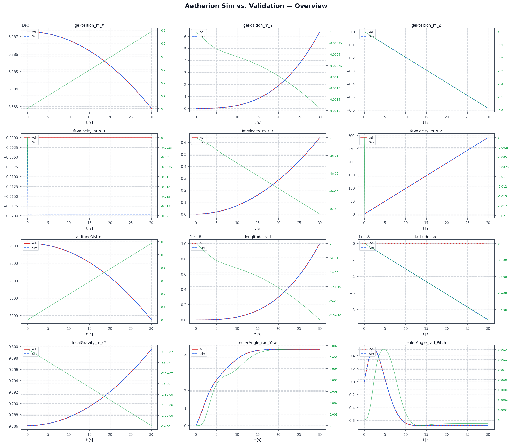

   Side-by-side comparison of Aetherion vs. `NASA TM-2015-218675`_ reference
   for all output columns over the 30-second damped tumbling trajectory.

**Altitude** and **true airspeed** — identical to Scenario 2 (no drag):

**Body angular rates** — all three axes damp to zero by t ≈ 18 s:

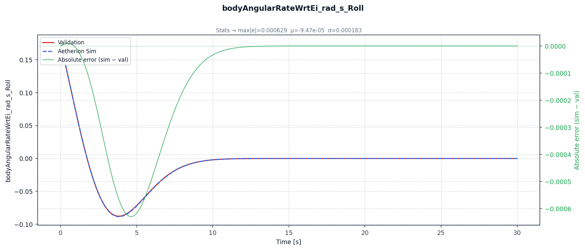

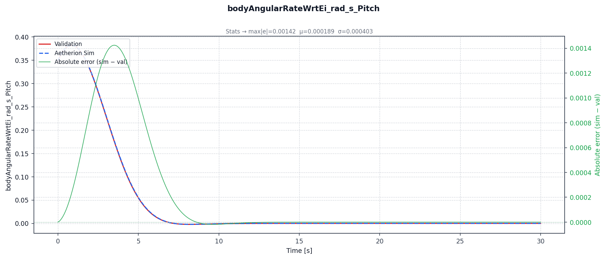

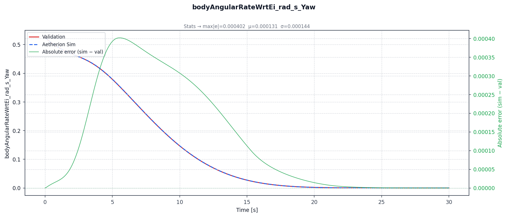

**Euler angles** (ZYX body → NED) converge once rotation ceases:

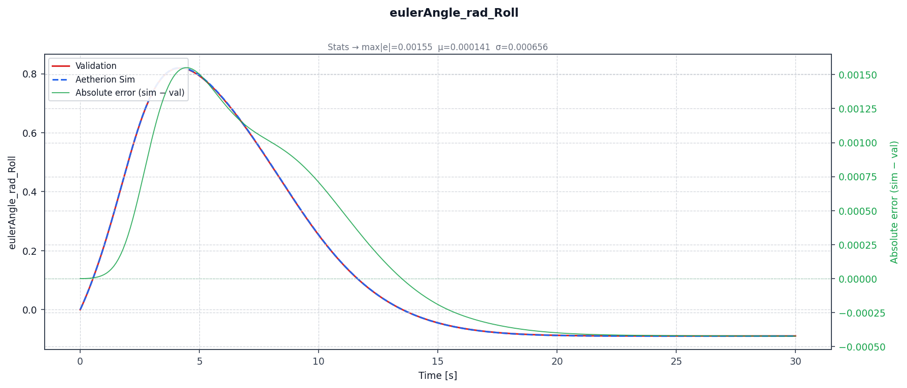

**Atmospheric state**:

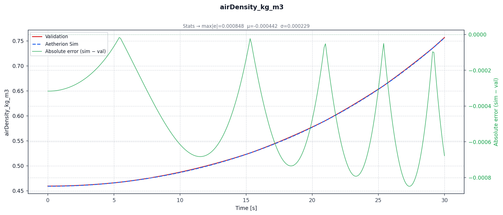

.. _example_eastward_cannonball:

Eastward Cannonball (NASA TM-2015-218675 Atmospheric Scenario 9)
-----------------------------------------------------------------

**Reference:** `NASA TM-2015-218675`_,
*Atmospheric and Space Flight Vehicle Equations of Motion*,
Appendix B, Section B.1.9 — Atmospheric Simulation 09.

The same sphere as Scenario 6 (CD = 0.1) is fired from sea level (altitude = 0 m)
at 45° into the east-upward quadrant: initial NED velocity
:math:`[0,\;+304.8,\;-304.8]\ \text{m/s}` (1 000 ft/s each component).
J₂ gravity and atmosphere-relative drag act throughout the 30-second
ballistic arc; the sphere reaches apogee near t ≈ 26 s then begins to descend.

Physics Model
^^^^^^^^^^^^^

Identical to :ref:`example_sphere_with_drag` — reuses
``SphereWithAtmosphericDragSimulator`` directly with Scenario 9 initial
conditions.  No new VF or Simulator type is introduced.

Initial Conditions
^^^^^^^^^^^^^^^^^^

.. list-table::
   :header-rows: 1
   :widths: 35 30 35

   * - Parameter
     - Value
     - Notes
   * - Altitude (MSL)
     - 0.0 m (sea level)
     - Fired from ground level
   * - NED velocity (N, E, D)
     - [0, +304.8, −304.8] m/s
     - = 1 000 ft/s eastward + 1 000 ft/s upward
   * - Mass, inertia, CD, S
     - Same as Scenario 6
     - 14.594 kg, CD = 0.1, S = 0.018241 m²

Building and Running
^^^^^^^^^^^^^^^^^^^^

.. code-block:: bash

   cmake --build build --target EastwardCannonball

   ./build/EastwardCannonball \
       --inputFileName  nasa_2015_scenario9_eastward_cannonball.json \
       --outputFileName atmos_09_output.csv                          \
       --startTime      0.0                                          \
       --endTime        30.0                                         \
       --timeStep       0.002                                        \
       --writeInterval  50

Validation Results
^^^^^^^^^^^^^^^^^^

.. list-table::
   :header-rows: 1
   :widths: 10 18 18 14 18 18

   * - :math:`t` [s]
     - Alt\ :sub:`ref` [m]
     - Alt\ :sub:`sim` [m]
     - :math:`\Delta` alt [m]
     - TAS\ :sub:`ref` [m/s]
     - TAS\ :sub:`sim` [m/s]
   * - 0
     - 0.000
     - 0.000
     - 0.000
     - 431.052
     - 431.052
   * - 5
     - 1 301.340
     - 1 301.377
     - +0.037
     - 344.434
     - 344.337
   * - 10
     - 2 226.770
     - 2 227.004
     - +0.235
     - 283.972
     - 283.907
   * - 15
     - 2 840.160
     - 2 840.661
     - +0.501
     - 240.739
     - 240.691
   * - 20
     - 3 176.450
     - 3 177.243
     - +0.793
     - 211.852
     - 211.802
   * - 25
     - 3 256.730
     - 3 257.816
     - +1.086
     - 196.608
     - 196.559
   * - 30
     - **3 095.800**
     - **3 097.169**
     - **+1.369**
     - **194.179**
     - **194.132**

Altitude error 1.37 m (0.044%) and speed error 0.047 m/s at t = 30 s —
same rotating-Earth systematic offset as all other scenarios.

Comparison Plots
^^^^^^^^^^^^^^^^

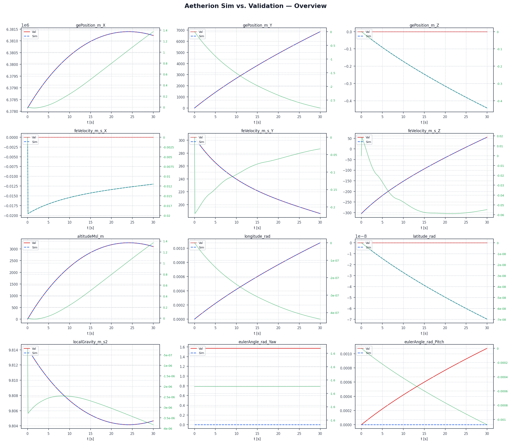

   Aetherion vs. `NASA TM-2015-218675`_ reference over the 30-second
   eastward cannonball ballistic arc.

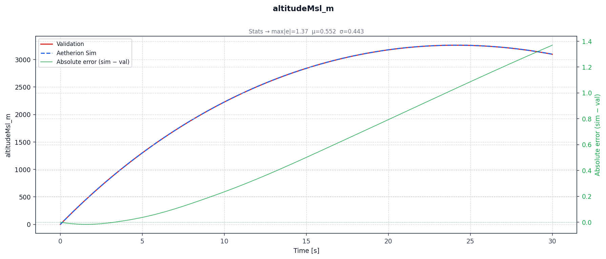

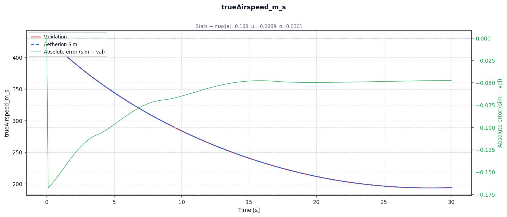

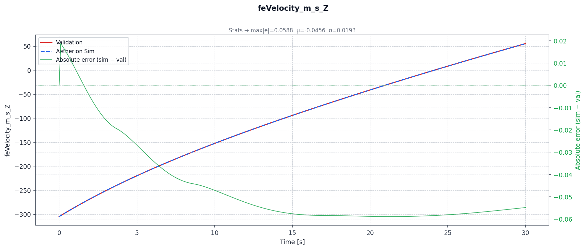

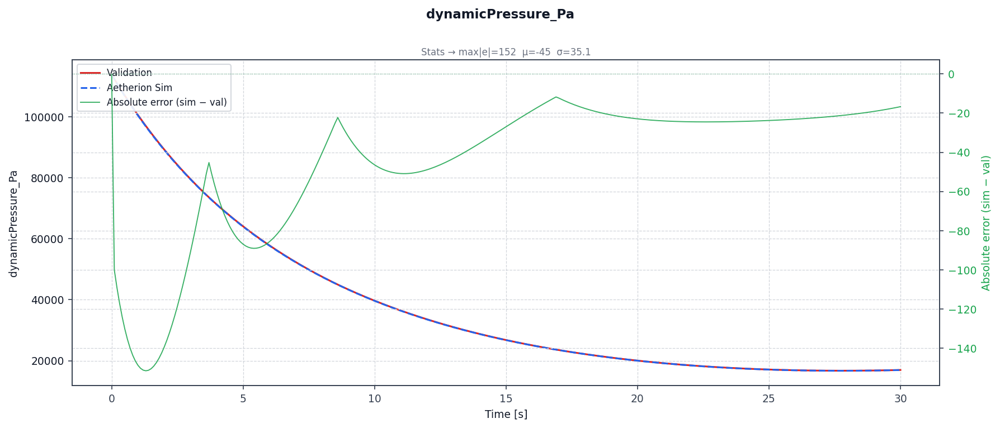

.. _example_northward_cannonball:

Northward Cannonball (NASA TM-2015-218675 Atmospheric Scenario 10)
-------------------------------------------------------------------

**Reference:** `NASA TM-2015-218675`_,
*Atmospheric and Space Flight Vehicle Equations of Motion*,
Appendix B, Section B.1.10 — Atmospheric Simulation 10.

Identical setup to Scenario 9 but the horizontal component is directed
**northward**: initial NED velocity :math:`[+304.8,\;0,\;-304.8]\ \text{m/s}`.
Coriolis coupling causes a small westward drift (longitude ≈ −0.00012°)
that is absent in Scenario 9.

Physics Model
^^^^^^^^^^^^^

Identical to Scenarios 6 and 9 — reuses ``SphereWithAtmosphericDragSimulator``.

Initial Conditions
^^^^^^^^^^^^^^^^^^

.. list-table::
   :header-rows: 1
   :widths: 35 30 35

   * - Parameter
     - Value
     - Notes
   * - Altitude (MSL)
     - 0.0 m (sea level)
     - Fired from ground level
   * - NED velocity (N, E, D)
     - [+304.8, 0, −304.8] m/s
     - = 1 000 ft/s northward + 1 000 ft/s upward
   * - Mass, inertia, CD, S
     - Same as Scenario 6
     - 14.594 kg, CD = 0.1, S = 0.018241 m²

Building and Running
^^^^^^^^^^^^^^^^^^^^

.. code-block:: bash

   cmake --build build --target NorthwardCannonball

   ./build/NorthwardCannonball \
       --inputFileName  nasa_2015_scenario10_northward_cannonball.json \
       --outputFileName atmos_10_output.csv                            \
       --startTime      0.0                                            \
       --endTime        30.0                                           \
       --timeStep       0.002                                          \
       --writeInterval  50

Validation Results
^^^^^^^^^^^^^^^^^^

.. list-table::
   :header-rows: 1
   :widths: 10 18 18 14 18 18

   * - :math:`t` [s]
     - Alt\ :sub:`ref` [m]
     - Alt\ :sub:`sim` [m]
     - :math:`\Delta` alt [m]
     - TAS\ :sub:`ref` [m/s]
     - TAS\ :sub:`sim` [m/s]
   * - 0
     - 0.000
     - 0.000
     - 0.000
     - 431.052
     - 431.052
   * - 5
     - 1 300.840
     - 1 300.897
     - +0.062
     - 344.446
     - 344.457
   * - 10
     - 2 224.880
     - 2 225.131
     - +0.244
     - 284.021
     - 284.053
   * - 15
     - 2 836.160
     - 2 836.625
     - +0.473
     - 240.857
     - 240.901
   * - 20
     - 3 169.650
     - 3 170.373
     - +0.718
     - 212.073
     - 212.111
   * - 25
     - 3 246.550
     - 3 247.512
     - +0.961
     - 196.955
     - 196.988
   * - 30
     - **3 081.730**
     - **3 082.927**
     - **+1.198**
     - **194.646**
     - **194.671**

Altitude error 1.20 m (0.039%) and speed error 0.025 m/s at t = 30 s.

Comparison Plots
^^^^^^^^^^^^^^^^

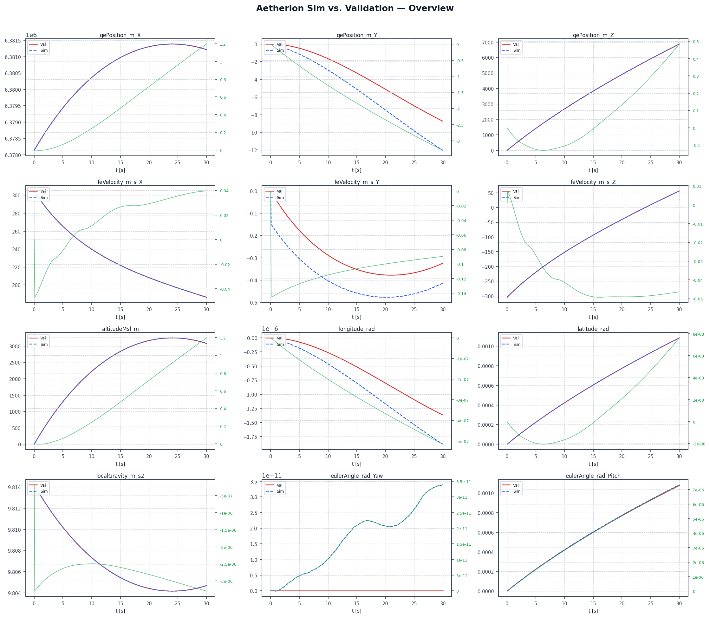

   Aetherion vs. `NASA TM-2015-218675`_ reference over the 30-second
   northward cannonball ballistic arc.

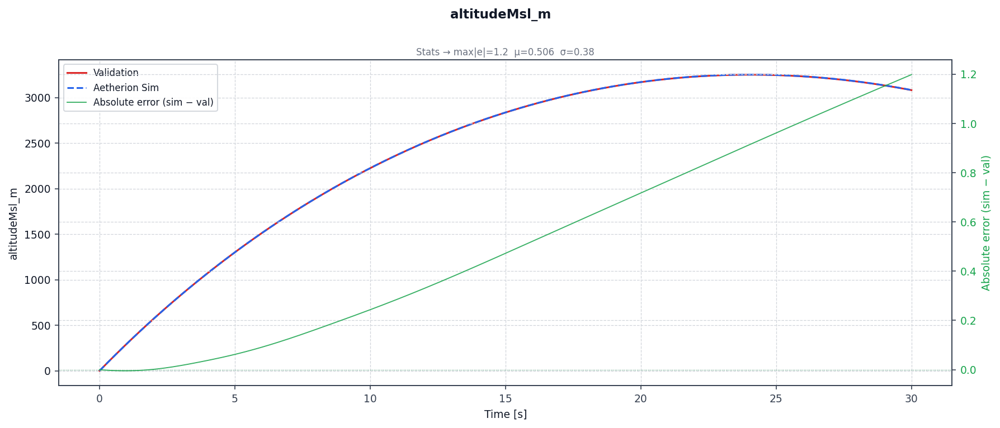

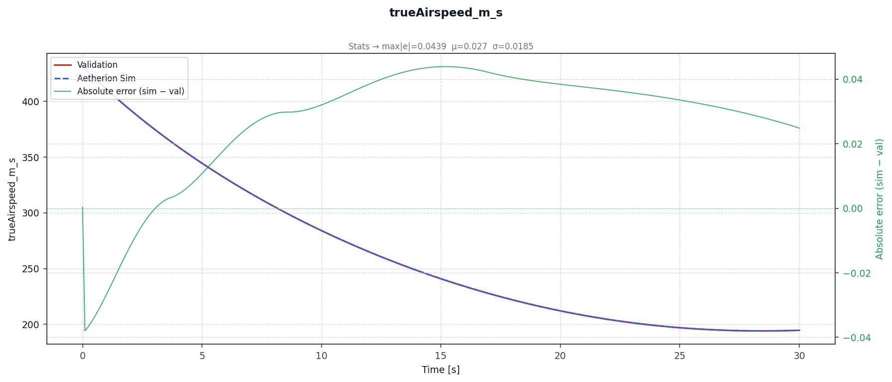

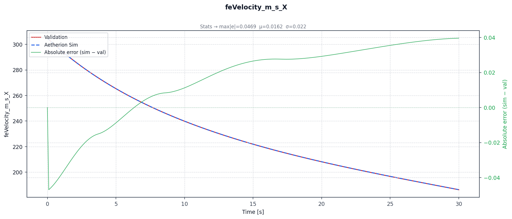

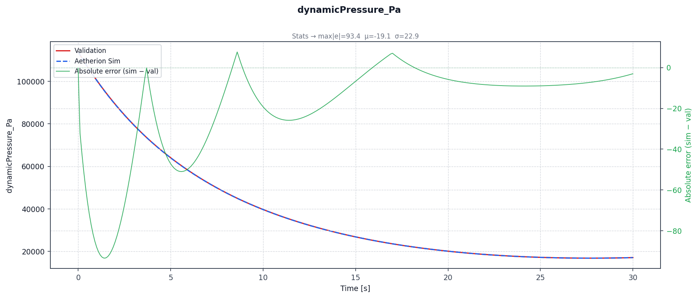

.. _example_steady_wind:

Dropped Sphere, Steady Wind (NASA TM-2015-218675 Atmospheric Scenario 7)
-------------------------------------------------------------------------

**Reference:** `NASA TM-2015-218675`_,
*Atmospheric and Space Flight Vehicle Equations of Motion*,
Appendix B, Section B.1.7 — Atmospheric Simulation 07.

The same sphere as Scenario 6 (CD = 0.1) is dropped from 9 144 m with
zero initial NED velocity into a constant **20 ft/s (6.096 m/s) eastward
wind**.  Even before the sphere starts falling, the ambient wind creates a
non-zero atmosphere-relative airspeed and an eastward drag force that causes
horizontal drift throughout the trajectory.

The drag force is computed using the **wind-relative** velocity
:math:`\mathbf{v}_\text{rel} = \mathbf{v}_B - \mathbf{v}_\text{surface,body} - \mathbf{v}_\text{wind,body}`
where the ECEF wind vector is rotated to ECI at every function evaluation
using the current Earth Rotation Angle :math:`\theta_{ERA} = \omega_E t`.

Physics Model
^^^^^^^^^^^^^

.. code-block:: cpp

   using DroppedSphereSteadyWindVF = RigidBody::VectorField<
       FlightDynamics::J2GravityPolicy,
       FlightDynamics::SteadyWindDragPolicy,   // CD=0.1, v_wind=(0, 6.096, 0) m/s ECEF
       FlightDynamics::ZeroPropulsionPolicy,
       FlightDynamics::ConstantMassPolicy
   >;

``SteadyWindDragPolicy`` extends ``DragOnlyAeroPolicy`` with an additional
wind-velocity subtraction step and an ERA-based ECEF → ECI rotation so that
the wind remains Earth-fixed even as the inertial frame rotates.

Initial Conditions
^^^^^^^^^^^^^^^^^^

.. list-table::
   :header-rows: 1
   :widths: 35 30 35

   * - Parameter
     - Value
     - Notes
   * - Altitude (MSL)
     - 9 144.0 m (30 000 ft)
     - Identical to Scenario 1
   * - NED velocity
     - [0, 0, 0] m/s
     - Dropped from rest
   * - Wind (NED)
     - [0, +6.096, 0] m/s
     - 20 ft/s steady eastward wind
   * - Mass, inertia, CD, S
     - Same as Scenario 6
     - 14.594 kg, CD = 0.1, S = 0.018241 m²

Building and Running
^^^^^^^^^^^^^^^^^^^^

.. code-block:: bash

   cmake --build build --target DroppedSphereSteadyWind

   ./build/DroppedSphereSteadyWind \
       --inputFileName  nasa_2015_scenario7_dropped_sphere_steady_wind.json \
       --outputFileName atmos_07_output.csv                                 \
       --startTime      0.0                                                  \
       --endTime        30.0                                                 \
       --timeStep       0.002                                                \
       --writeInterval  50

Validation Results
^^^^^^^^^^^^^^^^^^

.. list-table::
   :header-rows: 1
   :widths: 8 15 15 10 14 14 10

   * - :math:`t` [s]
     - Alt\ :sub:`ref` [m]
     - Alt\ :sub:`sim` [m]
     - :math:`\Delta` alt [m]
     - TAS\ :sub:`ref` [m/s]
     - TAS\ :sub:`sim` [m/s]
     - :math:`\Delta` TAS
   * - 0
     - 9 144.000
     - 9 144.000
     - 0.000
     - 6.0960
     - 6.0960
     - 0.0000
   * - 5
     - 9 022.246
     - 9 022.344
     - +0.098
     - 49.020
     - 49.007
     - −0.013
   * - 10
     - 8 658.715
     - 8 658.911
     - +0.195
     - 96.772
     - 96.756
     - −0.016
   * - 15
     - 8 058.804
     - 8 059.090
     - +0.286
     - 143.172
     - 143.156
     - −0.015
   * - 20
     - 7 232.151
     - 7 232.517
     - +0.365
     - 187.195
     - 187.183
     - −0.012
   * - 25
     - 6 193.525
     - 6 193.947
     - +0.422
     - 227.698
     - 227.692
     - −0.006
   * - 30
     - **4 963.802**
     - **4 964.246**
     - **+0.444**
     - **263.366**
     - **263.366**
     - **0.000**

Altitude error 0.444 m (0.009%) and TAS error < 0.001% at t = 30 s.
The wind-corrected TAS matches at t = 0 (6.096 m/s = wind speed) as well
as throughout the fall.

Comparison Plots
^^^^^^^^^^^^^^^^

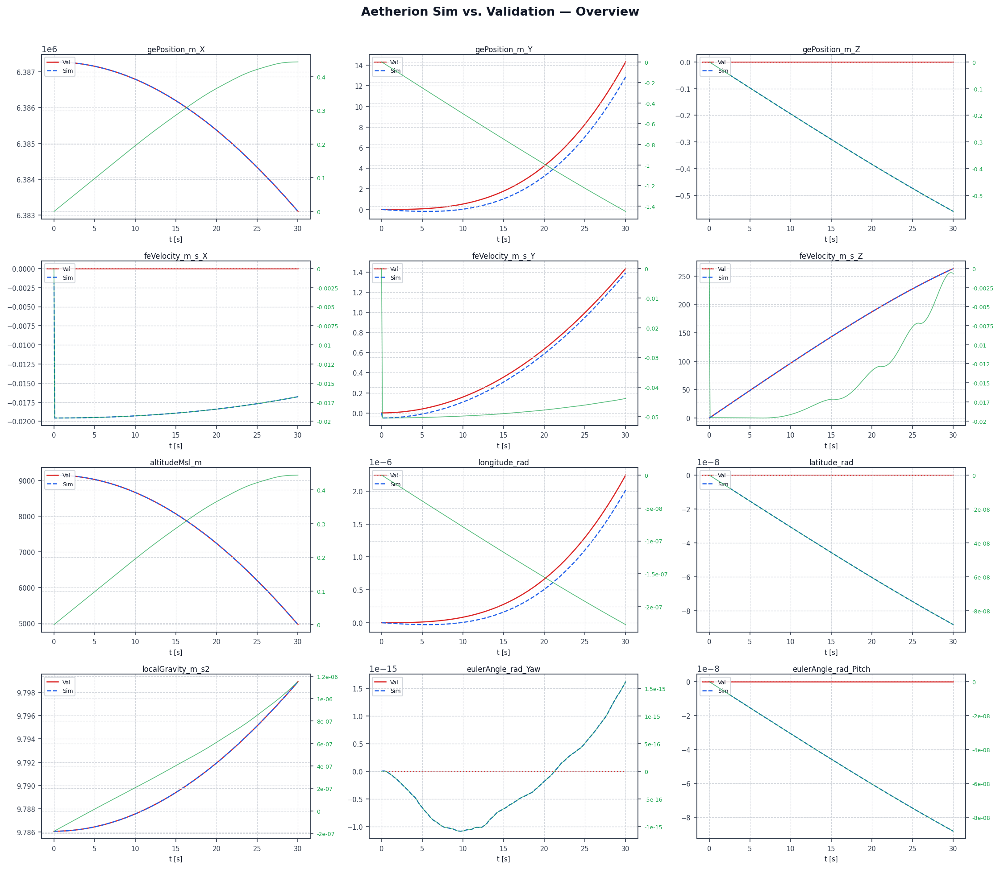

   Aetherion vs. `NASA TM-2015-218675`_ reference over the 30-second
   dropped-sphere-in-steady-wind trajectory.

**Altitude** — matches Scenario 6 closely (horizontal wind barely affects vertical fall):

**True airspeed** — starts at wind speed (6.096 m/s) and grows as the sphere falls:

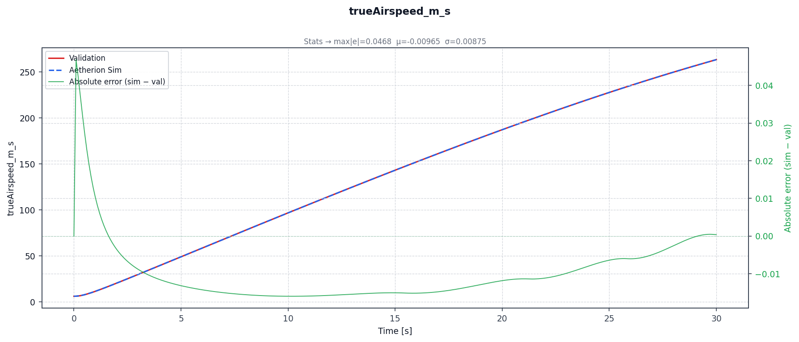

**Eastward drift** (feVelocity East component) — wind pushes sphere eastward:

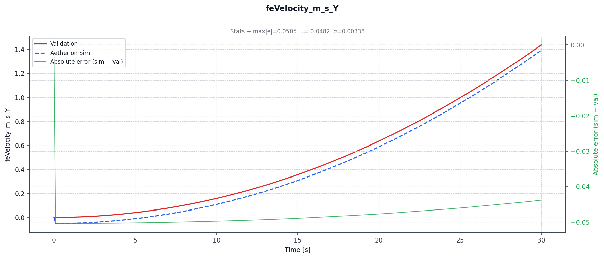

**Dynamic pressure** and **Mach number**:

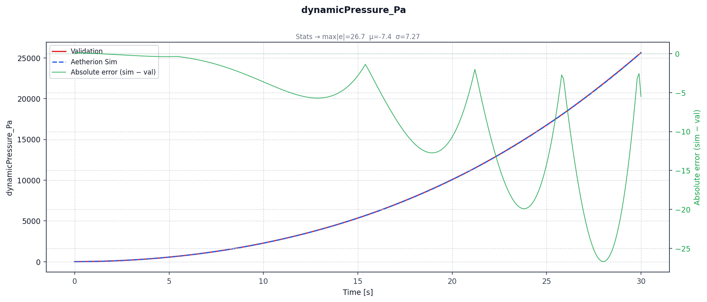

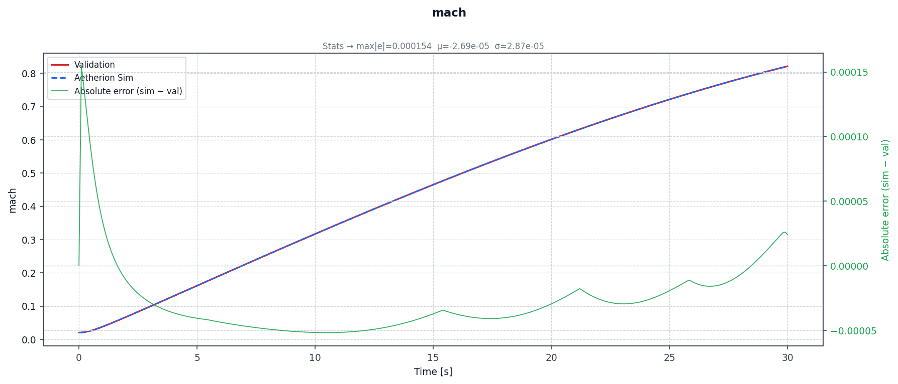

**Atmospheric state**:

.. _example_sphere_with_drag:

Sphere with Atmospheric Drag (NASA TM-2015-218675 Atmospheric Scenario 6)
--------------------------------------------------------------------------

**Reference:** `NASA TM-2015-218675`_,
*Atmospheric and Space Flight Vehicle Equations of Motion*,
Appendix B, Section B.1.6 — Atmospheric Simulation 06.

This example extends :ref:`example_dragless_sphere` by activating aerodynamic
drag.  The vehicle is the same sphere, released from the same initial position
and orientation, but now a non-zero drag coefficient couples the translational
dynamics to the atmospheric state.  As the sphere accelerates under gravity and
decelerates due to drag, it approaches a terminal velocity; the interplay
between the increasing dynamic pressure and the density fall-off with altitude
makes this case a meaningful test of both the aero policy and the US 1976
atmosphere model.

Physics Model
^^^^^^^^^^^^^

The simulation uses the following policy combination, defined in
:file:`Aetherion/Examples/SphereWithAtmosphericDrag/SphereWithAtmosphereicDragTypes.h`:

.. code-block:: cpp

   using SphereWithAtmosphericDragVF = RigidBody::VectorField<
       FlightDynamics::J2GravityPolicy,        // J2 gravity (WGS-84 second harmonic)
       FlightDynamics::DragOnlyAeroPolicy,     // CD = 0.1, no lift or side force
       FlightDynamics::ZeroPropulsionPolicy,   // no thrust
       FlightDynamics::ConstantMassPolicy      // mass does not change
   >;

   using SphereWithAtmosphericDragStepper =
       RigidBody::SixDoFStepper<SphereWithAtmosphericDragVF>;

The only change relative to Scenario 1 is the replacement of
``ZeroAeroPolicy`` with ``DragOnlyAeroPolicy``.

Aerodynamic drag model
""""""""""""""""""""""

``DragOnlyAeroPolicy`` evaluates the drag force in the body frame at every
function evaluation of the integrator:

.. math::

   \mathbf{F}_{\mathrm{drag}} =
       -\tfrac{1}{2}\,\rho(h)\,C_D\,S_{\mathrm{ref}}\,\lVert\mathbf{v}_B\rVert\,\mathbf{v}_B

where :math:`\mathbf{v}_B` is the body-frame linear velocity (the lower three
components of the body twist :math:`\nu_B`), :math:`\rho(h)` is the US Standard
Atmosphere 1976 density at the current geocentric altitude, :math:`C_D` is the
constant drag coefficient, and :math:`S_{\mathrm{ref}}` is the reference
(frontal) area.  No lift, side, or moment contributions are generated.

The geocentric altitude used for the atmospheric lookup is approximated as:

.. math::

   h \approx \lVert \mathbf{r}_{\mathrm{ECI}} \rVert - R_e

where :math:`R_e = 6\,378\,137.0\ \text{m}` is the WGS-84 semi-major axis.
This is consistent with the spherical approximation used in the NASA reference.

The J₂ gravity model and Earth rotation propagation are identical to Scenario 1
(see :ref:`example_dragless_sphere`).

Initial Conditions
^^^^^^^^^^^^^^^^^^

The vehicle configuration is read from
:file:`data/Atmos_06_SphereWithDrag/nasa_2015_scenario6_sphere_with_drag.json`.

.. list-table::
   :header-rows: 1
   :widths: 35 30 35

   * - Parameter
     - Value
     - Notes
   * - Geodetic latitude
     - 0.0°
     - Equatorial drop
   * - Geodetic longitude
     - 0.0°
     - Prime meridian
   * - Altitude (MSL)
     - 9 144.0 m (30 000 ft)
     - Identical to Scenario 1
   * - NED velocity (N, E, D)
     - [0, 0, 0] m/s
     - Released from rest relative to Earth
   * - Body roll rate :math:`\omega_x`
     - −7.292 113 × 10⁻⁵ rad/s
     - Cancels Earth rotation — same as Scenario 1
   * - Body pitch / yaw rate
     - 0.0 rad/s
     - —
   * - Mass
     - 14.5939029372 kg
     - Identical to Scenario 1
   * - Inertia :math:`I_{xx} = I_{yy} = I_{zz}`
     - 4.880944614 kg·m²
     - Uniform sphere
   * - Drag coefficient :math:`C_D`
     - 0.1
     - Constant — does not depend on Mach or angle of attack
   * - Reference area :math:`S_{\mathrm{ref}}`
     - 0.018241 m²
     - Frontal area of the sphere

The atmospheric state at :math:`h_0 = 9\,144\ \text{m}` (US Standard
Atmosphere 1976) is the same as in Scenario 1.

Building and Running
^^^^^^^^^^^^^^^^^^^^

CMake automatically copies the vehicle config and validation script into the
build directory next to the executable:

.. code-block:: bash

   cmake --build build --target SphereWithAtmosphericDrag

   ./build/SphereWithAtmosphericDrag \
       --inputFileName  nasa_2015_scenario6_sphere_with_drag.json \
       --outputFileName atmos_06_output.csv                        \
       --startTime      0.0                                         \
       --endTime        30.0                                        \
       --timeStep       0.002                                       \
       --writeInterval  50

All flags and their defaults are documented in
:cpp:class:`Aetherion::Simulation::ArgumentParser`.

Output Format
^^^^^^^^^^^^^

The output CSV has the same 38-column ``Snapshot1`` schema as Scenario 1
(see :ref:`example_dragless_sphere`).  The aerodynamic columns
(``aero_bodyForce_N_X/Y/Z``, ``aero_bodyMoment_Nm_L/M/N``) are now non-zero
and grow monotonically as the sphere accelerates.

Validation Data
^^^^^^^^^^^^^^^

The NASA reference provides six sub-simulations for Scenario 6
(``Atmos_06_sim_01`` through ``Atmos_06_sim_06``), stored in
:file:`data/Atmos_06_SphereWithDrag/`.  Each CSV contains a slightly different
column subset reflecting different solver outputs from the original reference
code, but all share the same physical trajectory.  The SI-unit variants
(``*_si_units.csv``) are used for direct numerical comparison.

Validation Results
^^^^^^^^^^^^^^^^^^

The table below compares Aetherion output against the ``Atmos_06_sim_01_si_units``
reference at selected time steps.  The simulation was run with
:math:`\Delta t = 0.002\ \text{s}` and ``--writeInterval 50`` (output every 0.1 s,
matching the NASA CSV cadence).

.. list-table::
   :header-rows: 1
   :widths: 10 18 18 18 18 18

   * - :math:`t` [s]
     - Alt\ :sub:`ref` [m]
     - Alt\ :sub:`sim` [m]
     - :math:`\Delta` alt [m]
     - TAS\ :sub:`ref` [m/s]
     - TAS\ :sub:`sim` [m/s]
   * - 0
     - 9 144.000
     - 9 144.000
     - 0.000
     - 0.0000
     - 0.0000
   * - 5
     - 9 022.240
     - 9 022.338
     - +0.098
     - 48.6469
     - 48.6274
   * - 10
     - 8 658.691
     - 8 658.886
     - +0.195
     - 96.5949
     - 96.5758
   * - 15
     - 8 058.748
     - 8 059.033
     - +0.285
     - 143.0641
     - 143.0471
   * - 20
     - 7 232.051
     - 7 232.415
     - +0.364
     - 187.1251
     - 187.1119
   * - 25
     - 6 193.370
     - 6 193.790
     - +0.419
     - 227.6531
     - 227.6457
   * - 30
     - **4 963.583**
     - **4 964.024**
     - **+0.441**
     - **263.3383**
     - **263.3380**

The residual is a smooth, slowly growing systematic offset (~0.44 m at t = 30 s,
0.009% of altitude) attributable to the difference between Aetherion's
full rotating-Earth dynamics and the NASA reference's non-rotating-atmosphere
model.  The true-airspeed error at t = 30 s is 0.0003 m/s (< 0.001%).

Comparison Plots
^^^^^^^^^^^^^^^^

The figures below are generated by the bundled
:file:`compare_sim_validation.py` script against ``Atmos_06_sim_01_si_units.csv``.

**Overview dashboard** — all 30 output columns in a single figure:

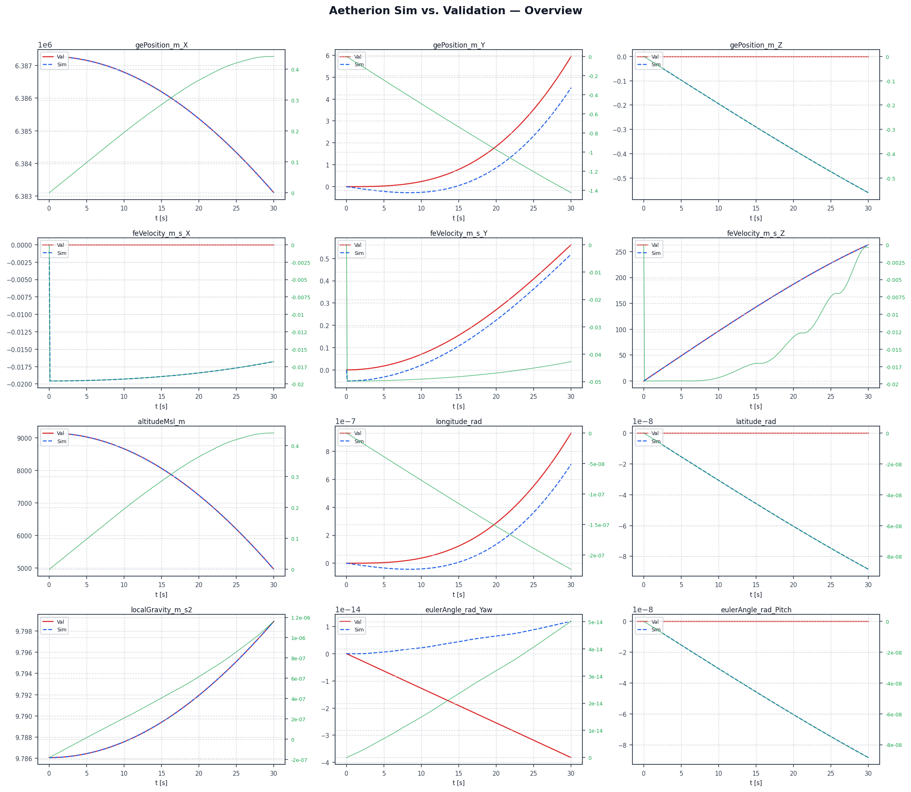

   Side-by-side comparison of Aetherion vs. `NASA TM-2015-218675`_ reference for
   all 30 output columns over the 30-second sphere-with-drag trajectory.

**Altitude** — :math:`h(t)` vs. NASA reference (max absolute error < 0.45 m):

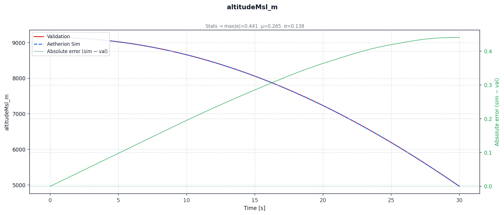

**True airspeed** — atmosphere-relative speed (max error < 0.02 m/s):

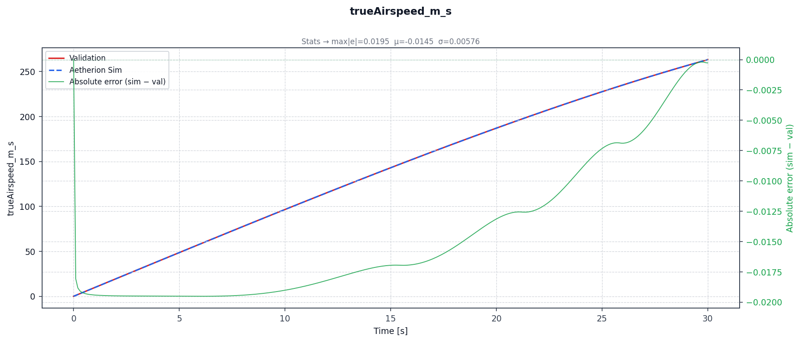

**Earth-relative downward velocity** :math:`v_z` (NED):

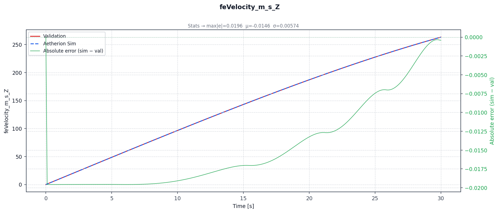

**Altitude rate**:

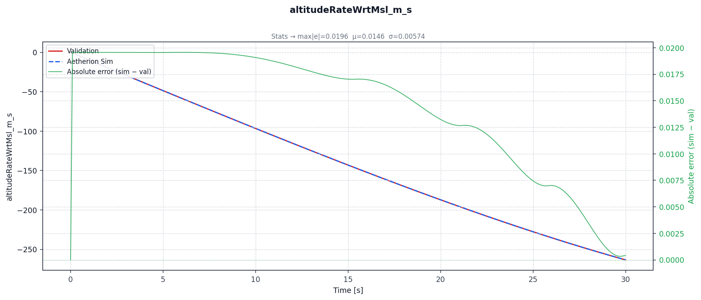

**Mach number** and **dynamic pressure**:

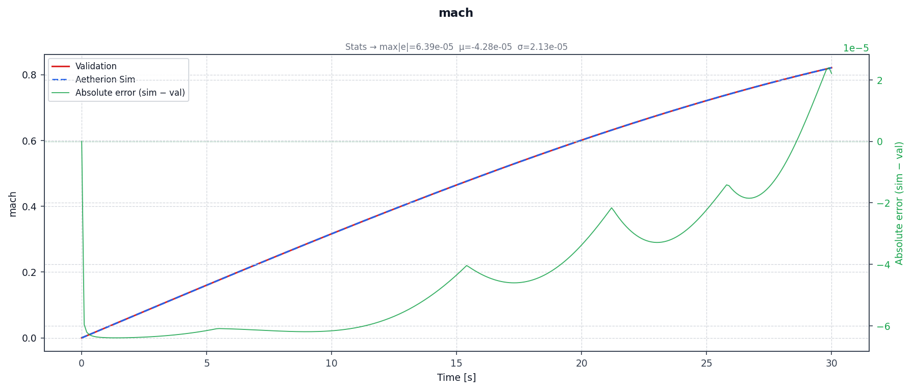

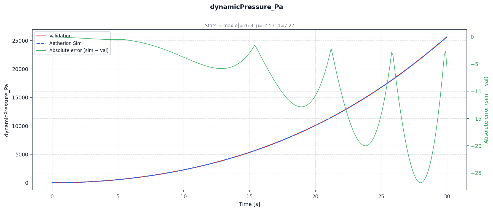

**Aerodynamic drag force** (body Z — primary drag axis):

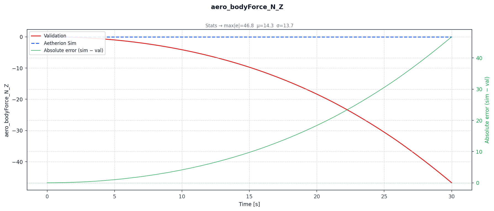

**Local gravitational acceleration** (J₂ model):

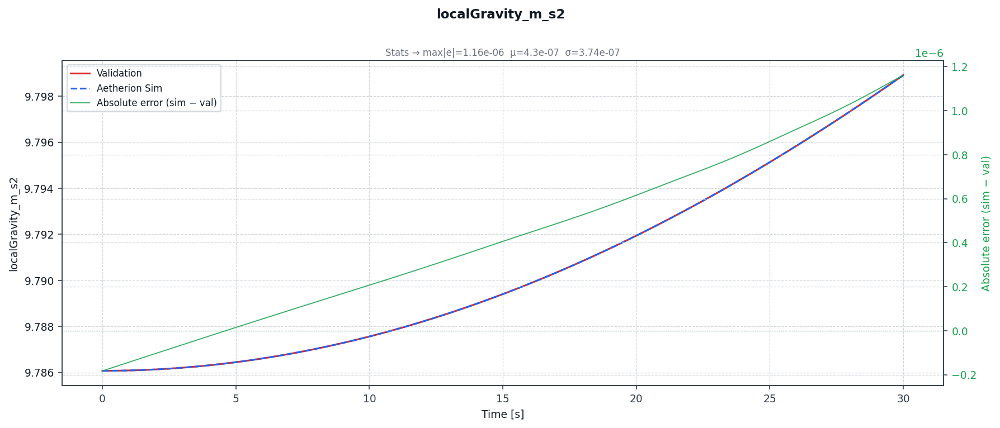

**Atmospheric state** (US Standard Atmosphere 1976):

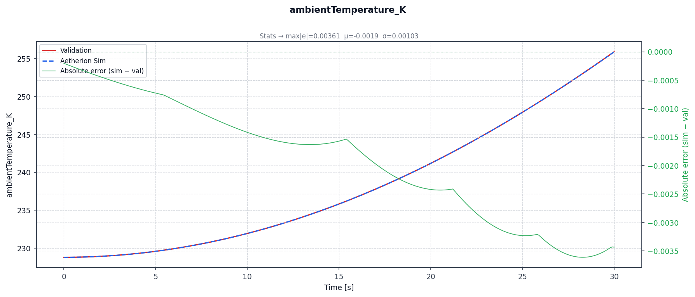

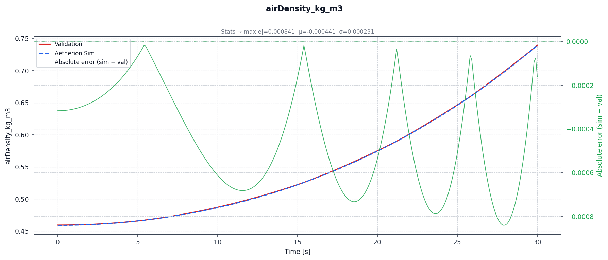

Architecture
^^^^^^^^^^^^

``SphereWithAtmosphericDragApplication`` follows the same
:cpp:class:`Aetherion::Simulation::Application` **Template Method** pattern as
the DraglessSphere example:

.. code-block:: text

   Simulation::Application              (base — defines run() loop)
       └── SphereWithAtmosphericDragApplication
               prepareSimulation()         load JSON → build ECI state → construct simulator
               writeInitialSnapshot()      write t=0 row
               stepAndRecord()             advance by Δt, write CSV row
               logFinalSummary()           print geodetic position, speed, Mach at t_end

   Simulation::ISimulator<SphereWithAtmosphericDragVF, Snapshot1>
       └── SphereWithAtmosphericDragSimulator
               step()                      advance via SixDoFStepper (Radau IIA RKMK)
               snapshot()                  convert state → Snapshot1 (ECI→Geodetic, US1976 atm)
               currentTheta()              θ(t) = θ₀ + ωE · t  (linear ERA propagation)

Initialisation inside ``prepareSimulation()`` follows the same four-step
sequence as Scenario 1:

1. **Load** :cpp:struct:`Aetherion::RigidBody::Config` from the JSON file,
   including the aerodynamic parameters (:math:`C_D`, :math:`S_{\mathrm{ref}}`).
2. **Compute** the initial Earth Rotation Angle :math:`\theta_0 = \omega_E t_0`.
3. **Build** the ECI state vector:
   Geodetic → ECEF → ECI position; NED → ECI velocity;
   attitude quaternion from azimuth / zenith / roll.
4. **Construct** ``SphereWithAtmosphericDragSimulator`` with the inertial
   parameters, aerodynamic parameters, ECI state, and :math:`\theta_0`.
