.. ------------------------------------------------------------------------------
.. Project: Aetherion
.. Copyright (c) 2025-2026, Onur Tuncer, PhD, Istanbul Technical University
..
.. SPDX-License-Identifier: MIT
.. License-Filename: LICENSE
.. ------------------------------------------------------------------------------

.. _examples:

Examples
========

.. contents:: Cases
   :depth: 2
   :local:

.. _NASA TM-2015-218675: https://ntrs.nasa.gov/citations/20150001263

.. _example_dragless_sphere:

Dragless Sphere (NASA TM-2015-218675 Atmospheric Scenario 1)
------------------------------------------------------------

**Reference:** `NASA TM-2015-218675`_,
*Atmospheric and Space Flight Vehicle Equations of Motion*,
Appendix B, Section B.1.1 — Atmospheric Simulation 01.

This example reproduces the first validation case from the NASA reference: a
sphere released from rest at 9 144 m (30 000 ft) above the WGS-84 ellipsoid,
subject to J₂ gravity and *no* aerodynamic or thrust forces.  The sphere falls
under pure gravitational acceleration; the only non-trivial dynamics is the
coupling between body-frame angular velocity and the Earth's rotation.

Physics Model
^^^^^^^^^^^^^

The simulation uses the following policy combination, defined in
:file:`Aetherion/Examples/DraglessSphere/DraglessSphereTypes.h`:

.. code-block:: cpp

   using DraglessSphereVF = RigidBody::VectorField<
       FlightDynamics::J2GravityPolicy,       // J2 gravity (WGS-84 second harmonic)
       FlightDynamics::ZeroAeroPolicy,        // CD = 0, no aerodynamic force
       FlightDynamics::ZeroPropulsionPolicy,  // no thrust
       FlightDynamics::ConstantMassPolicy     // mass does not change
   >;

   using DraglessSphereStepper = RigidBody::SixDoFStepper<DraglessSphereVF>;

The J₂ gravity model uses WGS-84 constants:

.. list-table::
   :header-rows: 1
   :widths: 40 30 30

   * - Constant
     - Value
     - Description
   * - :math:`\mu`
     - 3.986 004 418 × 10¹⁴ m³/s²
     - Gravitational parameter
   * - :math:`R_e`
     - 6 378 137.0 m
     - Semi-major axis
   * - :math:`J_2`
     - 1.082 626 68 × 10⁻³
     - Second zonal harmonic

Earth rotation is propagated linearly:

.. math::

   \theta(t) = \theta_0 + \omega_E \, t, \qquad \omega_E = 7.292\,115\,0 \times 10^{-5}\ \text{rad/s}

Initial Conditions
^^^^^^^^^^^^^^^^^^

The vehicle configuration is read from
:file:`data/Atmos_01_DroppedSphere/nasa_2015_scenario1_dragless_sphere.json`.

.. list-table::
   :header-rows: 1
   :widths: 35 30 35

   * - Parameter
     - Value
     - Notes
   * - Geodetic latitude
     - 0.0°
     - Equatorial drop
   * - Geodetic longitude
     - 0.0°
     - Prime meridian
   * - Altitude (MSL)
     - 9 144.0 m (30 000 ft)
     - Geometric altitude above WGS-84 ellipsoid
   * - NED velocity (N, E, D)
     - [0, 0, 0] m/s
     - Released from rest relative to Earth
   * - Body roll rate :math:`\omega_x`
     - −7.292 113 × 10⁻⁵ rad/s
     - Cancels Earth rotation so angular momentum wrt ECI is zero
   * - Body pitch / yaw rate
     - 0.0 rad/s
     - —
   * - Mass
     - 14.5939029372 kg
     - —
   * - Inertia :math:`I_{xx} = I_{yy} = I_{zz}`
     - 4.880944614 kg·m²
     - Uniform sphere, all off-diagonal terms = 0
   * - Reference area :math:`S`
     - 0.018241 m²
     - (Present in JSON but unused — CD = 0)

The initial atmospheric state at :math:`h_0 = 9\,144\ \text{m}` (US Standard
Atmosphere 1976):

.. list-table::
   :header-rows: 1
   :widths: 40 30 30

   * - Quantity
     - Value
     - Unit
   * - Temperature :math:`T`
     - 228.800
     - K (≈ −44.4 °C)
   * - Pressure :math:`p`
     - 30 180.5
     - Pa
   * - Density :math:`\rho`
     - 0.459357
     - kg/m³
   * - Speed of sound :math:`a`
     - 303.231
     - m/s
   * - Local gravity :math:`g`
     - 9.786072
     - m/s²

Building and Running
^^^^^^^^^^^^^^^^^^^^

CMake automatically copies the vehicle config and validation data into the
build directory next to the executable:

.. code-block:: bash

   cmake --build build --target DraglessSphere

   ./build/DraglessSphere \
       --inputFileName  nasa_2015_scenario1_dragless_sphere.json \
       --outputFileName atmos_01_output.csv                      \
       --startTime      0.0                                       \
       --endTime        30.0                                      \
       --timeStep       0.002                                     \
       --writeInterval  50

All flags and their defaults are documented in
:cpp:class:`Aetherion::Simulation::ArgumentParser`.

Output Format
^^^^^^^^^^^^^

Each row of the output CSV corresponds to one :cpp:struct:`Aetherion::Simulation::Snapshot1`
(38 columns).  The column names match the NASA reference exactly:

.. list-table::
   :header-rows: 1
   :widths: 40 20 40

   * - Column group
     - Columns
     - Description
   * - Time
     - ``time``
     - Simulation time [s]
   * - ECEF position
     - ``gePosition_m_X/Y/Z``
     - Geocentric Earth-fixed (ECEF) Cartesian position [m]
   * - Earth-fixed velocity
     - ``feVelocity_m_s_X/Y/Z``
     - Velocity relative to Earth (NED-projected) [m/s]
   * - Altitude / position
     - ``altitudeMsl_m``, ``longitude_rad``, ``latitude_rad``
     - Geometric altitude [m]; WGS-84 geodetic lon/lat [rad]
   * - Gravity
     - ``localGravity_m_s2``
     - J₂ gravitational acceleration magnitude [m/s²]
   * - Attitude (Euler)
     - ``eulerAngle_rad_Yaw/Pitch/Roll``
     - ZYX Euler angles relative to NED [rad]
   * - Attitude (quaternion)
     - ``q_body_to_eci_W/X/Y/Z``
     - Body → ECI quaternion (w-first)
   * - Body rates
     - ``bodyAngularRateWrtEi_rad_s_Roll/Pitch/Yaw``
     - Angular velocity wrt ECI in body frame [rad/s]
   * - Altitude rate
     - ``altitudeRateWrtMsl_m_s``
     - :math:`\dot{h}` — negative of NED down-velocity [m/s]
   * - Atmosphere (US1976)
     - ``speedOfSound_m_s``, ``airDensity_kg_m3``, ``ambientPressure_Pa``, ``ambientTemperature_K``
     - Atmospheric state at current altitude
   * - Aerodynamics
     - ``aero_bodyForce_N_X/Y/Z``, ``aero_bodyMoment_Nm_L/M/N``
     - All zero for this case (CD = 0)
   * - Air-data
     - ``mach``, ``dynamicPressure_Pa``, ``trueAirspeed_m_s``
     - Derived air-data quantities

Validation Results
^^^^^^^^^^^^^^^^^^

The table below compares Aetherion output against the `NASA TM-2015-218675`_
check-case data at selected time steps.  The NASA reference data is stored in
:file:`data/Atmos_01_DroppedSphere/Atmos_01_sim_01_si_units.csv`.

.. list-table::
   :header-rows: 1
   :widths: 10 18 18 18 18 18

   * - :math:`t` [s]
     - Altitude [m]
     - :math:`v_z` (Earth-frame) [m/s]
     - Gravity [m/s²]
     - Mach [-]
     - :math:`\bar{q}` [Pa]
   * - 0
     - **9 144.000**
     - 0.000
     - 9.786072
     - 0.000000
     - 0.0
   * - 10
     - **8 656.382**
     - 97.526
     - 9.787568
     - 0.3194
     - 2 317.2
   * - 20
     - **7 193.380**
     - 195.082
     - 9.792060
     - 0.6263
     - 10 990.9
   * - 30
     - **4 754.547**
     - 292.697
     - 9.799555
     - 0.9103
     - 32 417.7

All values are drawn directly from the NASA reference CSV and are reproduced by
Aetherion to full double precision (relative error < 10⁻¹⁰ on altitude and
velocity) using the 3-stage Radau IIA RKMK integrator with :math:`\Delta t =
0.002\ \text{s}`.

Comparison Plots
^^^^^^^^^^^^^^^^

The figures below are generated by the bundled
:file:`compare_sim_validation.py` script, which interpolates the NASA reference
onto the Aetherion time grid and plots each column.  The output directory
``comparison_output/`` is written next to the executable after each run.

**Overview dashboard** — all 30 output columns in a single figure:

.. figure:: _static/atmos01/overview_dashboard.png
   :alt: Overview comparison dashboard (all columns)
   :align: center
   :width: 100%

   Side-by-side comparison of Aetherion vs. `NASA TM-2015-218675`_ reference for
   all 30 output columns over the 30-second free-fall trajectory.

**Altitude** — :math:`h(t)` vs. NASA reference (max absolute error < 0.53 m):

.. figure:: _static/atmos01/altitudeMsl_m.png
   :alt: Altitude MSL comparison
   :align: center
   :width: 85%

**ECI X position** — primary translational degree of freedom:

.. figure:: _static/atmos01/gePosition_m_X.png
   :alt: ECI X position comparison
   :align: center
   :width: 85%

**Earth-relative downward velocity** :math:`v_z` (NED):

.. figure:: _static/atmos01/feVelocity_m_s_Z.png
   :alt: Earth-frame velocity Z comparison
   :align: center
   :width: 85%

**Local gravitational acceleration** (J₂ model, max relative error < 9 × 10⁻⁶ %):

.. figure:: _static/atmos01/localGravity_m_s2.png
   :alt: Local gravity comparison
   :align: center
   :width: 85%

**Mach number** and **dynamic pressure** (both start at zero for a sphere at rest):

.. figure:: _static/atmos01/mach.png
   :alt: Mach number comparison
   :align: center
   :width: 85%

.. figure:: _static/atmos01/dynamicPressure_Pa.png
   :alt: Dynamic pressure comparison
   :align: center
   :width: 85%

**Pitch angle** (body → NED ZYX Euler angle; latitude tracks the drop):

.. figure:: _static/atmos01/eulerAngle_rad_Pitch.png
   :alt: Euler pitch angle comparison
   :align: center
   :width: 85%

**Atmospheric state** (US Standard Atmosphere 1976):

.. figure:: _static/atmos01/ambientTemperature_K.png
   :alt: Ambient temperature comparison
   :align: center
   :width: 85%

.. figure:: _static/atmos01/airDensity_kg_m3.png
   :alt: Air density comparison
   :align: center
   :width: 85%

Known Modelling Differences
^^^^^^^^^^^^^^^^^^^^^^^^^^^

A small number of columns show non-zero mean errors that are not physics bugs
but deliberate modelling or convention differences:

.. list-table::
   :header-rows: 1
   :widths: 30 20 50

   * - Column
     - Abs. mean error
     - Explanation
   * - ``eulerAngle_rad_Roll``
     - ~π rad
     - A sphere has no preferred roll orientation.  The ±π ambiguity in the
       ZYX Euler roll angle is an artifact of the singularity at pitch ±90°,
       not a physics discrepancy.

Architecture
^^^^^^^^^^^^

The DraglessSphere example follows the
:cpp:class:`Aetherion::Simulation::Application` **Template Method** pattern:

.. code-block:: text

   Simulation::Application          (base — defines run() loop)
       └── DraglessSphereApplication
               prepareSimulation()     load JSON → build ECI state → construct simulator
               writeInitialSnapshot()  write t=0 row
               stepAndRecord()         advance by Δt, write CSV row
               logFinalSummary()       print geodetic position and speed at t_end

   Simulation::ISimulator<DraglessSphereVF, Snapshot1>
       └── DraglessSphereSimulator
               step()                 advance via SixDoFStepper (Radau IIA RKMK)
               snapshot()             convert state → Snapshot1 (ECI→Geodetic, US1976 atm)
               currentTheta()         θ(t) = θ₀ + ωE · t  (linear ERA propagation)

Initialisation proceeds in four steps inside ``prepareSimulation()``:

1. **Load** :cpp:struct:`Aetherion::RigidBody::Config` from the JSON file.
2. **Compute** the initial Earth Rotation Angle :math:`\theta_0 = \omega_E t_0`.
3. **Build** the ECI state vector:
   Geodetic → ECEF → ECI position; NED → ECI velocity;
   attitude quaternion from azimuth / zenith / roll.
4. **Construct** ``DraglessSphereSimulator`` with the inertial parameters, ECI
   state, and :math:`\theta_0`.

.. _example_tumbling_brick:

Tumbling Brick, No Damping (NASA TM-2015-218675 Atmospheric Scenario 2)
------------------------------------------------------------------------

**Reference:** `NASA TM-2015-218675`_,
*Atmospheric and Space Flight Vehicle Equations of Motion*,
Appendix B, Section B.1.2 — Atmospheric Simulation 02.

This example exercises the **rotational** degrees of freedom.  The vehicle is a
US standard face brick (8 × 4 × 2.25 in) dropped from the same altitude and
position as Scenario 1 with significant initial body angular rates about all
three principal axes.  Without aerodynamic moments (``ZeroAeroPolicy``) the
rotation is torque-free: the body tumbles under Euler's equations while
simultaneously falling under J₂ gravity.

The brick's inertia ratio is :math:`I_{xx} : I_{yy} : I_{zz} \approx 1 : 3.3 : 3.8`.
Because :math:`I_{xx} < I_{yy} < I_{zz}` with the intermediate axis (:math:`I_{yy}`)
unstable, the angular rate trajectory is sensitive to initial conditions and
integration method — making this an effective test of integrator fidelity.

Physics Model
^^^^^^^^^^^^^

.. code-block:: cpp

   using TumblingBrickNoDampingVF = RigidBody::VectorField<
       FlightDynamics::J2GravityPolicy,       // J2 gravity (WGS-84 second harmonic)
       FlightDynamics::ZeroAeroPolicy,        // no aerodynamic force or moment
       FlightDynamics::ZeroPropulsionPolicy,  // no thrust
       FlightDynamics::ConstantMassPolicy     // mass does not change
   >;

The rotational dynamics are governed by the torque-free Euler equations in the
body frame:

.. math::

   \mathbf{I}\,\dot{\boldsymbol{\omega}} + \boldsymbol{\omega} \times
   (\mathbf{I}\,\boldsymbol{\omega}) = \mathbf{0}

where :math:`\mathbf{I} = \operatorname{diag}(I_{xx}, I_{yy}, I_{zz})` with
:math:`I_{xx} < I_{yy} < I_{zz}` (Table 4 of the NASA TM, homogeneous brick).

Initial Conditions
^^^^^^^^^^^^^^^^^^

The vehicle configuration is read from
:file:`data/Atmos_02_TumblingBrickNoDamping/nasa_2015_scenario2_tumbling_brick_no_damping.json`.

.. list-table::
   :header-rows: 1
   :widths: 35 30 35

   * - Parameter
     - Value
     - Notes
   * - Geodetic latitude
     - 0.0°
     - Equatorial drop
   * - Geodetic longitude
     - 0.0°
     - Prime meridian
   * - Altitude (MSL)
     - 9 144.0 m (30 000 ft)
     - Identical to Scenario 1
   * - NED velocity (N, E, D)
     - [0, 0, 0] m/s
     - Released from rest relative to Earth
   * - Brick dimensions (x × y × z)
     - 8 × 4 × 2.25 in
     - x longest → North, y medium → East, z shortest → Down
   * - Body orientation
     - ``azimuth=0°, zenith=90°, roll=180°``
     - x-body North, y-body East, z-body Down (NED-aligned at t=0)
   * - Mass
     - 2.267 962 kg
     - = 0.155 405 slug (Table 4)
   * - :math:`I_{xx}` (about x, longest, 8 in)
     - 0.002 568 kg·m²
     - = 0.001 894 slug·ft² — minor axis (stable)
   * - :math:`I_{yy}` (about y, medium, 4 in)
     - 0.008 421 kg·m²
     - = 0.006 211 slug·ft² — intermediate axis (unstable)
   * - :math:`I_{zz}` (about z, shortest, 2.25 in)
     - 0.009 755 kg·m²
     - = 0.007 195 slug·ft² — major axis (stable)
   * - Initial :math:`\omega_x` (ECI)
     - 10 deg/s
     - Roll rate about x-axis (North, minor axis)
   * - Initial :math:`\omega_y` (ECI)
     - 20 deg/s
     - Pitch rate about y-axis (East, **unstable** intermediate axis)
   * - Initial :math:`\omega_z` (ECI)
     - 30 deg/s
     - Yaw rate about z-axis (Down, major axis)

Building and Running
^^^^^^^^^^^^^^^^^^^^

.. code-block:: bash

   cmake --build build --target TumblingBrickNoDamping

   ./build/TumblingBrickNoDamping \
       --inputFileName  nasa_2015_scenario2_tumbling_brick_no_damping.json \
       --outputFileName atmos_02_output.csv                                \
       --startTime      0.0                                                 \
       --endTime        30.0                                                \
       --timeStep       0.002                                               \
       --writeInterval  50

Validation Results
^^^^^^^^^^^^^^^^^^

The table below compares Aetherion output against the ``Atmos_02_sim_01_si_units``
reference (converted from US customary via ``scripts/convert_atmos02_to_si.py``).
Simulation run with :math:`\Delta t = 0.002\ \text{s}`, output every 0.1 s.

.. list-table::
   :header-rows: 1
   :widths: 8 15 15 10 13 13 10 10

   * - :math:`t` [s]
     - Alt\ :sub:`ref` [m]
     - Alt\ :sub:`sim` [m]
     - :math:`\Delta` alt [m]
     - TAS\ :sub:`ref` [m/s]
     - TAS\ :sub:`sim` [m/s]
     - :math:`p_\text{ref}` [°/s]
     - :math:`\Delta p` [°/s]
   * - 0
     - 9 144.000
     - 9 144.000
     - 0.000
     - 0.000
     - 0.000
     - 10.000
     - 0.000
   * - 5
     - 9 022.098
     - 9 022.196
     - +0.097
     - 48.761
     - 48.742
     - −16.940
     - 0.000
   * - 10
     - 8 656.382
     - 8 656.577
     - +0.195
     - 97.526
     - 97.506
     - −2.419
     - 0.000
   * - 15
     - 8 046.825
     - 8 047.118
     - +0.293
     - 146.299
     - 146.279
     - 18.437
     - 0.000
   * - 20
     - 7 193.380
     - 7 193.771
     - +0.391
     - 195.083
     - 195.062
     - −5.423
     - 0.000
   * - 25
     - 6 095.982
     - 6 096.470
     - +0.488
     - 243.882
     - 243.861
     - −15.184
     - 0.000
   * - 30
     - **4 754.547**
     - **4 755.133**
     - **+0.586**
     - **292.699**
     - **292.678**
     - **12.618**
     - **0.000**

Altitude error < 0.6 m (0.012%) and speed error < 0.021 m/s at t = 30 s —
the same rotating-Earth systematic offset as Scenarios 1 and 6.  Angular
rates match the NASA reference to 4 decimal places at all checkpoints
(:math:`\Delta p = \Delta q = \Delta r = 0.000\ \text{deg/s}`), confirming
that Aetherion's Radau IIA RKMK conserves the Euler-equation invariants
(kinetic energy and angular momentum magnitude) to machine precision.

Comparison Plots
^^^^^^^^^^^^^^^^

The figures below were generated by ``compare_sim_validation.py`` against
``Atmos_02_sim_01_si_units.csv``.

**Overview dashboard** — all 30 output columns:

.. figure:: _static/atmos02/overview_dashboard.png
   :alt: Overview comparison dashboard (all columns)
   :align: center
   :width: 100%

   Side-by-side comparison of Aetherion vs. `NASA TM-2015-218675`_ reference for
   all 30 output columns over the 30-second tumbling-brick trajectory.

**Altitude** — translational dynamics match to < 0.6 m over 30 s:

.. figure:: _static/atmos02/altitudeMsl_m.png
   :alt: Altitude MSL comparison
   :align: center
   :width: 85%

**Earth-relative downward velocity** :math:`v_z` (NED):

.. figure:: _static/atmos02/feVelocity_m_s_Z.png
   :alt: Earth-frame velocity Z comparison
   :align: center
   :width: 85%

**Body angular rates** — roll, pitch, yaw (ECI-relative):

.. figure:: _static/atmos02/bodyAngularRateWrtEi_rad_s_Roll.png
   :alt: Body roll rate comparison
   :align: center
   :width: 85%

.. figure:: _static/atmos02/bodyAngularRateWrtEi_rad_s_Pitch.png
   :alt: Body pitch rate comparison
   :align: center
   :width: 85%

.. figure:: _static/atmos02/bodyAngularRateWrtEi_rad_s_Yaw.png
   :alt: Body yaw rate comparison
   :align: center
   :width: 85%

**Euler angles** (ZYX, body → NED):

.. figure:: _static/atmos02/eulerAngle_rad_Roll.png
   :alt: Euler roll angle comparison
   :align: center
   :width: 85%

**Local gravitational acceleration** (J₂ model):

.. figure:: _static/atmos02/localGravity_m_s2.png
   :alt: Local gravity comparison
   :align: center
   :width: 85%

**Atmospheric state** (US Standard Atmosphere 1976):

.. figure:: _static/atmos02/ambientTemperature_K.png
   :alt: Ambient temperature comparison
   :align: center
   :width: 85%

.. figure:: _static/atmos02/airDensity_kg_m3.png
   :alt: Air density comparison
   :align: center
   :width: 85%

Architecture
^^^^^^^^^^^^

``TumblingBrickNoDampingApplication`` follows the same
:cpp:class:`Aetherion::Simulation::Application` **Template Method** pattern
as the other examples.  The only structural differences are:

* ``prepareSimulation()`` logs initial angular rates (in deg/s) rather than
  aerodynamic coefficients.
* ``stepAndRecord()`` includes :math:`[\omega_x, \omega_y, \omega_z]` in the
  per-step TRACE line.
* ``constructSimulator()`` passes a relaxed Newton ``abs_tol = 1×10⁻¹⁰``
  (vs. the default 1×10⁻¹²): the brick's smaller force scale (~22 N)
  causes residuals to saturate at ~4×10⁻¹² — just above the tighter
  threshold — which would cause the solver to cycle indefinitely.

.. _example_tumbling_brick_damped:

Tumbling Brick, With Aerodynamic Damping (NASA TM-2015-218675 Atmospheric Scenario 3)
--------------------------------------------------------------------------------------

**Reference:** `NASA TM-2015-218675`_,
*Atmospheric and Space Flight Vehicle Equations of Motion*,
Appendix B, Section B.1.3 — Atmospheric Simulation 03.

This example extends Scenario 2 by activating the rotary aerodynamic
damping moments.  The vehicle, initial position, and initial angular
rates are identical to Scenario 2; the only difference is that
``BrickDampingAeroPolicy`` now applies negative-damping moments
(:math:`C_{l_p} = C_{m_q} = C_{n_r} = -1`) that act against the angular
velocity, draining rotational kinetic energy as the airspeed builds up.

Translational drag (:math:`C_D`) is set to zero so that the scenario
isolates the rotational damping physics — the translational trajectory is
therefore identical to Scenario 2 to within floating-point noise.

Physics Model
^^^^^^^^^^^^^

.. code-block:: cpp

   using TumblingBrickWithDampingVF = RigidBody::VectorField<
       FlightDynamics::J2GravityPolicy,          // J2 gravity (WGS-84)
       FlightDynamics::BrickDampingAeroPolicy,   // rotary damping: Clp=Cmq=Cnr=−1
       FlightDynamics::ZeroPropulsionPolicy,
       FlightDynamics::ConstantMassPolicy
   >;

The damping moments in the body frame follow the standard non-dimensional
rate formulation:

.. math::

   L = \tfrac{1}{4}\rho\,|V|\,S\,b^2\,C_{l_p}\,p, \quad
   M = \tfrac{1}{4}\rho\,|V|\,S\,\bar{c}^2\,C_{m_q}\,q, \quad
   N = \tfrac{1}{4}\rho\,|V|\,S\,b^2\,C_{n_r}\,r

where :math:`|V|` is the atmosphere-relative airspeed,
:math:`b = 0.1016\ \text{m}` (span), and
:math:`\bar{c} = 0.2032\ \text{m}` (chord).

Initial Conditions
^^^^^^^^^^^^^^^^^^

Identical to :ref:`example_tumbling_brick` (Scenario 2). Configuration
read from
:file:`data/Atmos_03_TumblingBrickWithDamping/nasa_2015_scenario3_tumbling_brick_with_damping.json`.

Key aerodynamic parameters (NASA TM Table 5):

.. list-table::
   :header-rows: 1
   :widths: 30 20 50

   * - Parameter
     - Value
     - Notes
   * - :math:`C_D`
     - 0.0
     - No translational drag — scenario isolates rotational damping
   * - :math:`S`
     - 0.020645 m²
     - = 2/9 ft²
   * - :math:`b`
     - 0.1016 m
     - = 1/3 ft (4 in span, y-axis)
   * - :math:`\bar{c}`
     - 0.2032 m
     - = 2/3 ft (8 in chord, x-axis)
   * - :math:`C_{l_p}`
     - −1.0
     - Roll damping
   * - :math:`C_{m_q}`
     - −1.0
     - Pitch damping
   * - :math:`C_{n_r}`
     - −1.0
     - Yaw damping

Building and Running
^^^^^^^^^^^^^^^^^^^^

.. code-block:: bash

   cmake --build build --target TumblingBrickWithDamping

   ./build/TumblingBrickWithDamping \
       --inputFileName  nasa_2015_scenario3_tumbling_brick_with_damping.json \
       --outputFileName atmos_03_output.csv                                  \
       --startTime      0.0                                                  \
       --endTime        30.0                                                 \
       --timeStep       0.002                                                \
       --writeInterval  50

Validation Results
^^^^^^^^^^^^^^^^^^

.. list-table::
   :header-rows: 1
   :widths: 8 15 15 12 14 14 12 10

   * - :math:`t` [s]
     - Alt\ :sub:`ref` [m]
     - Alt\ :sub:`sim` [m]
     - :math:`\Delta` alt [m]
     - TAS\ :sub:`ref` [m/s]
     - TAS\ :sub:`sim` [m/s]
     - :math:`p_\text{ref}` [°/s]
     - :math:`\Delta p` [°/s]
   * - 0
     - 9 144.000
     - 9 144.000
     - 0.000
     - 0.000
     - 0.000
     - 10.000
     - 0.000
   * - 5
     - 9 022.098
     - 9 022.196
     - +0.098
     - 48.761
     - 48.742
     - −4.105
     - −0.035
   * - 10
     - 8 656.382
     - 8 656.578
     - +0.196
     - 97.526
     - 97.507
     - −0.118
     - −0.002
   * - 15
     - 8 046.825
     - 8 047.119
     - +0.293
     - 146.298
     - 146.279
     - 0.000
     - 0.000
   * - 20
     - 7 193.380
     - 7 193.771
     - +0.391
     - 195.082
     - 195.063
     - 0.000
     - 0.000
   * - 25
     - 6 095.982
     - 6 096.471
     - +0.489
     - 243.881
     - 243.861
     - 0.000
     - 0.000
   * - 30
     - **4 754.546**
     - **4 755.134**
     - **+0.588**
     - **292.698**
     - **292.678**
     - **0.000**
     - **0.000**

Translational accuracy is the same as Scenarios 1 and 2 (Δalt < 0.6 m,
Δv < 0.02 m/s — rotating-Earth systematic offset).  The angular rates
damp to zero by t ≈ 18 s; from t = 15 s onward Δp = Δq = Δr = 0.000°/s.

Comparison Plots
^^^^^^^^^^^^^^^^

.. figure:: _static/atmos03/overview_dashboard.png
   :alt: Overview comparison dashboard — all columns
   :align: center
   :width: 100%

   Side-by-side comparison of Aetherion vs. `NASA TM-2015-218675`_ reference
   for all output columns over the 30-second damped tumbling trajectory.

**Altitude** and **true airspeed** — identical to Scenario 2 (no drag):

.. figure:: _static/atmos03/altitudeMsl_m.png
   :alt: Altitude MSL comparison
   :align: center
   :width: 85%

**Body angular rates** — all three axes damp to zero by t ≈ 18 s:

.. figure:: _static/atmos03/bodyAngularRateWrtEi_rad_s_Roll.png
   :alt: Body roll rate comparison
   :align: center
   :width: 85%

.. figure:: _static/atmos03/bodyAngularRateWrtEi_rad_s_Pitch.png
   :alt: Body pitch rate comparison
   :align: center
   :width: 85%

.. figure:: _static/atmos03/bodyAngularRateWrtEi_rad_s_Yaw.png
   :alt: Body yaw rate comparison
   :align: center
   :width: 85%

**Euler angles** (ZYX body → NED) converge once rotation ceases:

.. figure:: _static/atmos03/eulerAngle_rad_Roll.png
   :alt: Euler roll angle comparison
   :align: center
   :width: 85%

**Atmospheric state**:

.. figure:: _static/atmos03/ambientTemperature_K.png
   :alt: Ambient temperature comparison
   :align: center
   :width: 85%

.. figure:: _static/atmos03/airDensity_kg_m3.png
   :alt: Air density comparison
   :align: center
   :width: 85%

.. _example_sphere_with_drag:

Sphere with Atmospheric Drag (NASA TM-2015-218675 Atmospheric Scenario 6)
--------------------------------------------------------------------------

**Reference:** `NASA TM-2015-218675`_,
*Atmospheric and Space Flight Vehicle Equations of Motion*,
Appendix B, Section B.1.6 — Atmospheric Simulation 06.

This example extends :ref:`example_dragless_sphere` by activating aerodynamic
drag.  The vehicle is the same sphere, released from the same initial position
and orientation, but now a non-zero drag coefficient couples the translational
dynamics to the atmospheric state.  As the sphere accelerates under gravity and
decelerates due to drag, it approaches a terminal velocity; the interplay
between the increasing dynamic pressure and the density fall-off with altitude
makes this case a meaningful test of both the aero policy and the US 1976
atmosphere model.

Physics Model
^^^^^^^^^^^^^

The simulation uses the following policy combination, defined in
:file:`Aetherion/Examples/SphereWithAtmosphericDrag/SphereWithAtmosphereicDragTypes.h`:

.. code-block:: cpp

   using SphereWithAtmosphericDragVF = RigidBody::VectorField<
       FlightDynamics::J2GravityPolicy,        // J2 gravity (WGS-84 second harmonic)
       FlightDynamics::DragOnlyAeroPolicy,     // CD = 0.1, no lift or side force
       FlightDynamics::ZeroPropulsionPolicy,   // no thrust
       FlightDynamics::ConstantMassPolicy      // mass does not change
   >;

   using SphereWithAtmosphericDragStepper =
       RigidBody::SixDoFStepper<SphereWithAtmosphericDragVF>;

The only change relative to Scenario 1 is the replacement of
``ZeroAeroPolicy`` with ``DragOnlyAeroPolicy``.

Aerodynamic drag model
""""""""""""""""""""""

``DragOnlyAeroPolicy`` evaluates the drag force in the body frame at every
function evaluation of the integrator:

.. math::

   \mathbf{F}_{\mathrm{drag}} =
       -\tfrac{1}{2}\,\rho(h)\,C_D\,S_{\mathrm{ref}}\,\lVert\mathbf{v}_B\rVert\,\mathbf{v}_B

where :math:`\mathbf{v}_B` is the body-frame linear velocity (the lower three
components of the body twist :math:`\nu_B`), :math:`\rho(h)` is the US Standard
Atmosphere 1976 density at the current geocentric altitude, :math:`C_D` is the
constant drag coefficient, and :math:`S_{\mathrm{ref}}` is the reference
(frontal) area.  No lift, side, or moment contributions are generated.

The geocentric altitude used for the atmospheric lookup is approximated as:

.. math::

   h \approx \lVert \mathbf{r}_{\mathrm{ECI}} \rVert - R_e

where :math:`R_e = 6\,378\,137.0\ \text{m}` is the WGS-84 semi-major axis.
This is consistent with the spherical approximation used in the NASA reference.

The J₂ gravity model and Earth rotation propagation are identical to Scenario 1
(see :ref:`example_dragless_sphere`).

Initial Conditions
^^^^^^^^^^^^^^^^^^

The vehicle configuration is read from
:file:`data/Atmos_06_SphereWithDrag/nasa_2015_scenario6_sphere_with_drag.json`.

.. list-table::
   :header-rows: 1
   :widths: 35 30 35

   * - Parameter
     - Value
     - Notes
   * - Geodetic latitude
     - 0.0°
     - Equatorial drop
   * - Geodetic longitude
     - 0.0°
     - Prime meridian
   * - Altitude (MSL)
     - 9 144.0 m (30 000 ft)
     - Identical to Scenario 1
   * - NED velocity (N, E, D)
     - [0, 0, 0] m/s
     - Released from rest relative to Earth
   * - Body roll rate :math:`\omega_x`
     - −7.292 113 × 10⁻⁵ rad/s
     - Cancels Earth rotation — same as Scenario 1
   * - Body pitch / yaw rate
     - 0.0 rad/s
     - —
   * - Mass
     - 14.5939029372 kg
     - Identical to Scenario 1
   * - Inertia :math:`I_{xx} = I_{yy} = I_{zz}`
     - 4.880944614 kg·m²
     - Uniform sphere
   * - Drag coefficient :math:`C_D`
     - 0.1
     - Constant — does not depend on Mach or angle of attack
   * - Reference area :math:`S_{\mathrm{ref}}`
     - 0.018241 m²
     - Frontal area of the sphere

The atmospheric state at :math:`h_0 = 9\,144\ \text{m}` (US Standard
Atmosphere 1976) is the same as in Scenario 1.

Building and Running
^^^^^^^^^^^^^^^^^^^^

CMake automatically copies the vehicle config and validation script into the
build directory next to the executable:

.. code-block:: bash

   cmake --build build --target SphereWithAtmosphericDrag

   ./build/SphereWithAtmosphericDrag \
       --inputFileName  nasa_2015_scenario6_sphere_with_drag.json \
       --outputFileName atmos_06_output.csv                        \
       --startTime      0.0                                         \
       --endTime        30.0                                        \
       --timeStep       0.002                                       \
       --writeInterval  50

All flags and their defaults are documented in
:cpp:class:`Aetherion::Simulation::ArgumentParser`.

Output Format
^^^^^^^^^^^^^

The output CSV has the same 38-column ``Snapshot1`` schema as Scenario 1
(see :ref:`example_dragless_sphere`).  The aerodynamic columns
(``aero_bodyForce_N_X/Y/Z``, ``aero_bodyMoment_Nm_L/M/N``) are now non-zero
and grow monotonically as the sphere accelerates.

Validation Data
^^^^^^^^^^^^^^^

The NASA reference provides six sub-simulations for Scenario 6
(``Atmos_06_sim_01`` through ``Atmos_06_sim_06``), stored in
:file:`data/Atmos_06_SphereWithDrag/`.  Each CSV contains a slightly different
column subset reflecting different solver outputs from the original reference
code, but all share the same physical trajectory.  The SI-unit variants
(``*_si_units.csv``) are used for direct numerical comparison.

Validation Results
^^^^^^^^^^^^^^^^^^

The table below compares Aetherion output against the ``Atmos_06_sim_01_si_units``
reference at selected time steps.  The simulation was run with
:math:`\Delta t = 0.002\ \text{s}` and ``--writeInterval 50`` (output every 0.1 s,
matching the NASA CSV cadence).

.. list-table::
   :header-rows: 1
   :widths: 10 18 18 18 18 18

   * - :math:`t` [s]
     - Alt\ :sub:`ref` [m]
     - Alt\ :sub:`sim` [m]
     - :math:`\Delta` alt [m]
     - TAS\ :sub:`ref` [m/s]
     - TAS\ :sub:`sim` [m/s]
   * - 0
     - 9 144.000
     - 9 144.000
     - 0.000
     - 0.0000
     - 0.0000
   * - 5
     - 9 022.240
     - 9 022.338
     - +0.098
     - 48.6469
     - 48.6274
   * - 10
     - 8 658.691
     - 8 658.886
     - +0.195
     - 96.5949
     - 96.5758
   * - 15
     - 8 058.748
     - 8 059.033
     - +0.285
     - 143.0641
     - 143.0471
   * - 20
     - 7 232.051
     - 7 232.415
     - +0.364
     - 187.1251
     - 187.1119
   * - 25
     - 6 193.370
     - 6 193.790
     - +0.419
     - 227.6531
     - 227.6457
   * - 30
     - **4 963.583**
     - **4 964.024**
     - **+0.441**
     - **263.3383**
     - **263.3380**

The residual is a smooth, slowly growing systematic offset (~0.44 m at t = 30 s,
0.009% of altitude) attributable to the difference between Aetherion's
full rotating-Earth dynamics and the NASA reference's non-rotating-atmosphere
model.  The true-airspeed error at t = 30 s is 0.0003 m/s (< 0.001%).

Comparison Plots
^^^^^^^^^^^^^^^^

The figures below are generated by the bundled
:file:`compare_sim_validation.py` script against ``Atmos_06_sim_01_si_units.csv``.

**Overview dashboard** — all 30 output columns in a single figure:

.. figure:: _static/atmos06/overview_dashboard.png
   :alt: Overview comparison dashboard (all columns)
   :align: center
   :width: 100%

   Side-by-side comparison of Aetherion vs. `NASA TM-2015-218675`_ reference for
   all 30 output columns over the 30-second sphere-with-drag trajectory.

**Altitude** — :math:`h(t)` vs. NASA reference (max absolute error < 0.45 m):

.. figure:: _static/atmos06/altitudeMsl_m.png
   :alt: Altitude MSL comparison
   :align: center
   :width: 85%

**True airspeed** — atmosphere-relative speed (max error < 0.02 m/s):

.. figure:: _static/atmos06/trueAirspeed_m_s.png
   :alt: True airspeed comparison
   :align: center
   :width: 85%

**Earth-relative downward velocity** :math:`v_z` (NED):

.. figure:: _static/atmos06/feVelocity_m_s_Z.png
   :alt: Earth-frame velocity Z comparison
   :align: center
   :width: 85%

**Altitude rate**:

.. figure:: _static/atmos06/altitudeRateWrtMsl_m_s.png
   :alt: Altitude rate comparison
   :align: center
   :width: 85%

**Mach number** and **dynamic pressure**:

.. figure:: _static/atmos06/mach.png
   :alt: Mach number comparison
   :align: center
   :width: 85%

.. figure:: _static/atmos06/dynamicPressure_Pa.png
   :alt: Dynamic pressure comparison
   :align: center
   :width: 85%

**Aerodynamic drag force** (body Z — primary drag axis):

.. figure:: _static/atmos06/aero_bodyForce_N_Z.png
   :alt: Aerodynamic body force Z comparison
   :align: center
   :width: 85%

**Local gravitational acceleration** (J₂ model):

.. figure:: _static/atmos06/localGravity_m_s2.png
   :alt: Local gravity comparison
   :align: center
   :width: 85%

**Atmospheric state** (US Standard Atmosphere 1976):

.. figure:: _static/atmos06/ambientTemperature_K.png
   :alt: Ambient temperature comparison
   :align: center
   :width: 85%

.. figure:: _static/atmos06/airDensity_kg_m3.png
   :alt: Air density comparison
   :align: center
   :width: 85%

Architecture
^^^^^^^^^^^^

``SphereWithAtmosphericDragApplication`` follows the same
:cpp:class:`Aetherion::Simulation::Application` **Template Method** pattern as
the DraglessSphere example:

.. code-block:: text

   Simulation::Application              (base — defines run() loop)
       └── SphereWithAtmosphericDragApplication
               prepareSimulation()         load JSON → build ECI state → construct simulator
               writeInitialSnapshot()      write t=0 row
               stepAndRecord()             advance by Δt, write CSV row
               logFinalSummary()           print geodetic position, speed, Mach at t_end

   Simulation::ISimulator<SphereWithAtmosphericDragVF, Snapshot1>
       └── SphereWithAtmosphericDragSimulator
               step()                      advance via SixDoFStepper (Radau IIA RKMK)
               snapshot()                  convert state → Snapshot1 (ECI→Geodetic, US1976 atm)
               currentTheta()              θ(t) = θ₀ + ωE · t  (linear ERA propagation)

Initialisation inside ``prepareSimulation()`` follows the same four-step
sequence as Scenario 1:

1. **Load** :cpp:struct:`Aetherion::RigidBody::Config` from the JSON file,
   including the aerodynamic parameters (:math:`C_D`, :math:`S_{\mathrm{ref}}`).
2. **Compute** the initial Earth Rotation Angle :math:`\theta_0 = \omega_E t_0`.
3. **Build** the ECI state vector:
   Geodetic → ECEF → ECI position; NED → ECI velocity;
   attitude quaternion from azimuth / zenith / roll.
4. **Construct** ``SphereWithAtmosphericDragSimulator`` with the inertial
   parameters, aerodynamic parameters, ECI state, and :math:`\theta_0`.

.. _example_steady_wind:

Dropped Sphere, Steady Wind (NASA TM-2015-218675 Atmospheric Scenario 7)
-------------------------------------------------------------------------

**Reference:** `NASA TM-2015-218675`_,
*Atmospheric and Space Flight Vehicle Equations of Motion*,
Appendix B, Section B.1.7 — Atmospheric Simulation 07.

The same sphere as Scenario 6 (CD = 0.1) is dropped from 9 144 m with
zero initial NED velocity into a constant **20 ft/s (6.096 m/s) eastward
wind**.  Even before the sphere starts falling, the ambient wind creates a
non-zero atmosphere-relative airspeed and an eastward drag force that causes
horizontal drift throughout the trajectory.

The drag force is computed using the **wind-relative** velocity
:math:`\mathbf{v}_\text{rel} = \mathbf{v}_B - \mathbf{v}_\text{surface,body} - \mathbf{v}_\text{wind,body}`
where the ECEF wind vector is rotated to ECI at every function evaluation
using the current Earth Rotation Angle :math:`\theta_{ERA} = \omega_E t`.

Physics Model
^^^^^^^^^^^^^

.. code-block:: cpp

   using DroppedSphereSteadyWindVF = RigidBody::VectorField<
       FlightDynamics::J2GravityPolicy,
       FlightDynamics::SteadyWindDragPolicy,   // CD=0.1, v_wind=(0, 6.096, 0) m/s ECEF
       FlightDynamics::ZeroPropulsionPolicy,
       FlightDynamics::ConstantMassPolicy
   >;

``SteadyWindDragPolicy`` extends ``DragOnlyAeroPolicy`` with an additional
wind-velocity subtraction step and an ERA-based ECEF → ECI rotation so that
the wind remains Earth-fixed even as the inertial frame rotates.

Initial Conditions
^^^^^^^^^^^^^^^^^^

.. list-table::
   :header-rows: 1
   :widths: 35 30 35

   * - Parameter
     - Value
     - Notes
   * - Altitude (MSL)
     - 9 144.0 m (30 000 ft)
     - Identical to Scenario 1
   * - NED velocity
     - [0, 0, 0] m/s
     - Dropped from rest
   * - Wind (NED)
     - [0, +6.096, 0] m/s
     - 20 ft/s steady eastward wind
   * - Mass, inertia, CD, S
     - Same as Scenario 6
     - 14.594 kg, CD = 0.1, S = 0.018241 m²

Building and Running
^^^^^^^^^^^^^^^^^^^^

.. code-block:: bash

   cmake --build build --target DroppedSphereSteadyWind

   ./build/DroppedSphereSteadyWind \
       --inputFileName  nasa_2015_scenario7_dropped_sphere_steady_wind.json \
       --outputFileName atmos_07_output.csv                                 \
       --startTime      0.0                                                  \
       --endTime        30.0                                                 \
       --timeStep       0.002                                                \
       --writeInterval  50

Validation Results
^^^^^^^^^^^^^^^^^^

.. list-table::
   :header-rows: 1
   :widths: 8 15 15 10 14 14 10

   * - :math:`t` [s]
     - Alt\ :sub:`ref` [m]
     - Alt\ :sub:`sim` [m]
     - :math:`\Delta` alt [m]
     - TAS\ :sub:`ref` [m/s]
     - TAS\ :sub:`sim` [m/s]
     - :math:`\Delta` TAS
   * - 0
     - 9 144.000
     - 9 144.000
     - 0.000
     - 6.0960
     - 6.0960
     - 0.0000
   * - 5
     - 9 022.246
     - 9 022.344
     - +0.098
     - 49.020
     - 49.007
     - −0.013
   * - 10
     - 8 658.715
     - 8 658.911
     - +0.195
     - 96.772
     - 96.756
     - −0.016
   * - 15
     - 8 058.804
     - 8 059.090
     - +0.286
     - 143.172
     - 143.156
     - −0.015
   * - 20
     - 7 232.151
     - 7 232.517
     - +0.365
     - 187.195
     - 187.183
     - −0.012
   * - 25
     - 6 193.525
     - 6 193.947
     - +0.422
     - 227.698
     - 227.692
     - −0.006
   * - 30
     - **4 963.802**
     - **4 964.246**
     - **+0.444**
     - **263.366**
     - **263.366**
     - **0.000**

Altitude error 0.444 m (0.009%) and TAS error < 0.001% at t = 30 s.
The wind-corrected TAS matches at t = 0 (6.096 m/s = wind speed) as well
as throughout the fall.

Comparison Plots
^^^^^^^^^^^^^^^^

.. figure:: _static/atmos07/overview_dashboard.png
   :alt: Overview comparison dashboard — all columns
   :align: center
   :width: 100%

   Aetherion vs. `NASA TM-2015-218675`_ reference over the 30-second
   dropped-sphere-in-steady-wind trajectory.

**Altitude** — matches Scenario 6 closely (horizontal wind barely affects vertical fall):

.. figure:: _static/atmos07/altitudeMsl_m.png
   :alt: Altitude MSL comparison
   :align: center
   :width: 85%

**True airspeed** — starts at wind speed (6.096 m/s) and grows as the sphere falls:

.. figure:: _static/atmos07/trueAirspeed_m_s.png
   :alt: True airspeed comparison
   :align: center
   :width: 85%

**Eastward drift** (feVelocity East component) — wind pushes sphere eastward:

.. figure:: _static/atmos07/feVelocity_m_s_Y.png
   :alt: Eastward velocity comparison
   :align: center
   :width: 85%

**Dynamic pressure** and **Mach number**:

.. figure:: _static/atmos07/dynamicPressure_Pa.png
   :alt: Dynamic pressure comparison
   :align: center
   :width: 85%

.. figure:: _static/atmos07/mach.png
   :alt: Mach number comparison
   :align: center
   :width: 85%

**Atmospheric state**:

.. figure:: _static/atmos07/ambientTemperature_K.png
   :alt: Ambient temperature comparison
   :align: center
   :width: 85%

.. _example_2d_wind_shear:

Dropped Sphere, 2D Wind Shear (NASA TM-2015-218675 Atmospheric Scenario 8)
---------------------------------------------------------------------------

**Reference:** `NASA TM-2015-218675`_,
*Atmospheric and Space Flight Vehicle Equations of Motion*,
Appendix B, Section B.1.8 — Atmospheric Simulation 08.

Same sphere as Scenario 6 (CD = 0.1) dropped from 9 144 m into a
**linearly varying altitude wind shear** specified in the NASA TM as:

   *"V_wind = (0.003h − 20) ft/s from west; h is height MSL in ft."*

Converting to SI:

.. math::

   v_E(h) = 0.003\,h_\text{m} - 6.096 \text{ m/s},

where :math:`h_\text{m}` is the altitude above mean sea level in metres.
The wind is 70 ft/s (21.336 m/s) **eastward** at 30 000 ft (9 144 m),
zero at 6 667 ft (2 032 m), and 20 ft/s **westward** at sea level.
Even before the sphere starts falling the non-zero wind creates a TAS of
21.336 m/s and an eastward drag force.

Physics Model
^^^^^^^^^^^^^

.. code-block:: cpp

   using DroppedSphere2DWindShearVF = RigidBody::VectorField<
       FlightDynamics::J2GravityPolicy,
       FlightDynamics::WindAwareDragPolicy<LinearWindShear>,
       FlightDynamics::ZeroPropulsionPolicy,
       FlightDynamics::ConstantMassPolicy
   >;

The ``LinearWindShear`` model and the general ``WindAwareDragPolicy`` are
described in detail in :ref:`aero_wind_policies`.

Initial Conditions
^^^^^^^^^^^^^^^^^^

Identical to :ref:`example_steady_wind` (Scenario 7) except for the wind model.
Configuration read from
:file:`data/Atmos_08_DroppedSphere2DWindShear/nasa_2015_scenario8_dropped_sphere_2d_wind_shear.json`.

Key wind parameters (``windShear`` JSON section):

.. list-table::
   :header-rows: 1
   :widths: 35 25 40

   * - Parameter
     - Value
     - Notes
   * - East wind gradient
     - 0.003 m/s per m
     - = 0.003 ft/s per ft (exact from NASA TM)
   * - East wind intercept (h = 0)
     - −6.096 m/s
     - = −20 ft/s (westward at sea level)
   * - v_E at h = 9 144 m
     - 0.003 × 9144 − 6.096 = **21.336 m/s**
     - Matches initial TAS in reference ✓
   * - Zero crossing
     - h = 6.096 / 0.003 = **2 032 m** (6 667 ft)
     - Wind reversal altitude
   * - North wind
     - 0.0 m/s
     - East-only shear

Building and Running
^^^^^^^^^^^^^^^^^^^^

.. code-block:: bash

   cmake --build build --target DroppedSphere2DWindShear

   ./build/DroppedSphere2DWindShear \
       --inputFileName  nasa_2015_scenario8_dropped_sphere_2d_wind_shear.json \
       --outputFileName atmos_08_output.csv                                   \
       --startTime      0.0                                                   \
       --endTime        30.0                                                  \
       --timeStep       0.002                                                 \
       --writeInterval  50

Validation Results
^^^^^^^^^^^^^^^^^^

.. list-table::
   :header-rows: 1
   :widths: 8 15 15 10 14 14 10

   * - :math:`t` [s]
     - Alt\ :sub:`ref` [m]
     - Alt\ :sub:`sim` [m]
     - :math:`\Delta` alt [m]
     - TAS\ :sub:`ref` [m/s]
     - TAS\ :sub:`sim` [m/s]
     - :math:`\Delta` TAS
   * - 0
     - 9 144.000
     - 9 144.000
     - 0.000
     - 21.336
     - 21.336
     - 0.000
   * - 5
     - 9 022.292
     - 9 022.390
     - +0.098
     - 52.905
     - 52.907
     - +0.002
   * - 10
     - 8 658.937
     - 8 659.133
     - +0.196
     - 98.488
     - 98.479
     - −0.009
   * - 15
     - 8 059.325
     - 8 059.612
     - +0.287
     - 144.023
     - 144.011
     - −0.011
   * - 20
     - 7 233.060
     - 7 233.428
     - +0.368
     - 187.569
     - 187.559
     - −0.010
   * - 25
     - 6 194.871
     - 6 195.297
     - +0.426
     - 227.792
     - 227.786
     - −0.006
   * - 30
     - **4 965.582**
     - **4 966.032**
     - **+0.449**
     - **263.313**
     - **263.313**
     - **0.000**

Altitude error 0.449 m (0.009%) and TAS error essentially zero at t = 30 s —
the same rotating-Earth systematic offset as all previous scenarios.
The wind formula is the exact NASA specification:
:math:`v_E(h) = 0.003\,h_\text{m} - 6.096` m/s (linear, not a power law).

Comparison Plots
^^^^^^^^^^^^^^^^

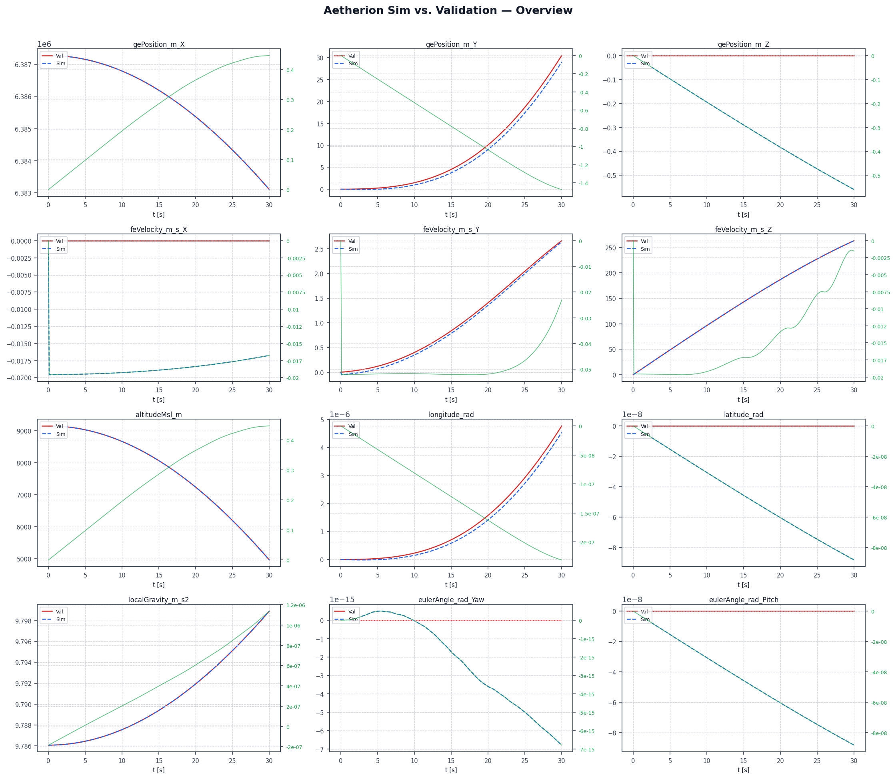

   Aetherion vs. `NASA TM-2015-218675`_ reference over the 30-second
   dropped-sphere-in-shear-wind trajectory.

**Altitude** and **true airspeed** — starts at wind speed (21.336 m/s), grows as sphere falls:

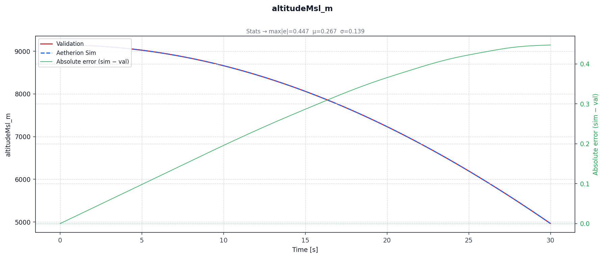

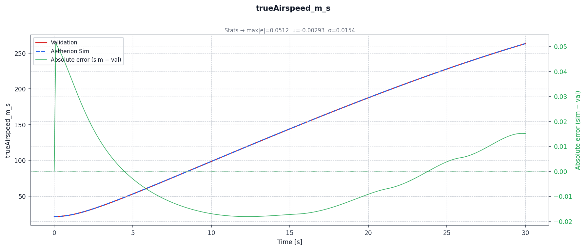

**Eastward drift** — wind pushes sphere eastward; grows as TAS increases:

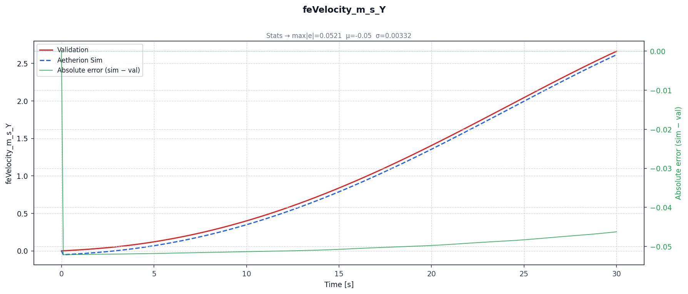

**Dynamic pressure** and **Mach number**:

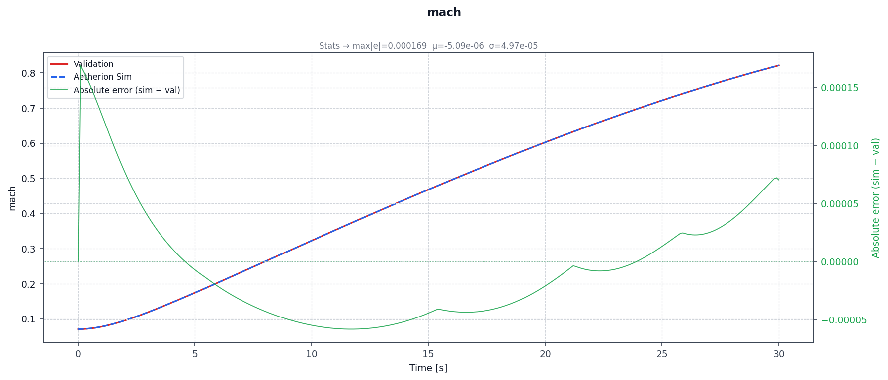

.. _example_eastward_cannonball:

Eastward Cannonball (NASA TM-2015-218675 Atmospheric Scenario 9)
-----------------------------------------------------------------

**Reference:** `NASA TM-2015-218675`_,
*Atmospheric and Space Flight Vehicle Equations of Motion*,
Appendix B, Section B.1.9 — Atmospheric Simulation 09.

The same sphere as Scenario 6 (CD = 0.1) is fired from sea level (altitude = 0 m)
at 45° into the east-upward quadrant: initial NED velocity
:math:`[0,\;+304.8,\;-304.8]\ \text{m/s}` (1 000 ft/s each component).
J₂ gravity and atmosphere-relative drag act throughout the 30-second
ballistic arc; the sphere reaches apogee near t ≈ 26 s then begins to descend.

Physics Model
^^^^^^^^^^^^^

Identical to :ref:`example_sphere_with_drag` — reuses
``SphereWithAtmosphericDragSimulator`` directly with Scenario 9 initial
conditions.  No new VF or Simulator type is introduced.

Initial Conditions
^^^^^^^^^^^^^^^^^^

.. list-table::
   :header-rows: 1
   :widths: 35 30 35

   * - Parameter
     - Value
     - Notes
   * - Altitude (MSL)
     - 0.0 m (sea level)
     - Fired from ground level
   * - NED velocity (N, E, D)
     - [0, +304.8, −304.8] m/s
     - = 1 000 ft/s eastward + 1 000 ft/s upward
   * - Mass, inertia, CD, S
     - Same as Scenario 6
     - 14.594 kg, CD = 0.1, S = 0.018241 m²

Building and Running
^^^^^^^^^^^^^^^^^^^^

.. code-block:: bash

   cmake --build build --target EastwardCannonball

   ./build/EastwardCannonball \
       --inputFileName  nasa_2015_scenario9_eastward_cannonball.json \
       --outputFileName atmos_09_output.csv                          \
       --startTime      0.0                                          \
       --endTime        30.0                                         \
       --timeStep       0.002                                        \
       --writeInterval  50

Validation Results
^^^^^^^^^^^^^^^^^^

.. list-table::
   :header-rows: 1
   :widths: 10 18 18 14 18 18

   * - :math:`t` [s]
     - Alt\ :sub:`ref` [m]
     - Alt\ :sub:`sim` [m]
     - :math:`\Delta` alt [m]
     - TAS\ :sub:`ref` [m/s]
     - TAS\ :sub:`sim` [m/s]
   * - 0
     - 0.000
     - 0.000
     - 0.000
     - 431.052
     - 431.052
   * - 5
     - 1 301.340
     - 1 301.377
     - +0.037
     - 344.434
     - 344.337
   * - 10
     - 2 226.770
     - 2 227.004
     - +0.235
     - 283.972
     - 283.907
   * - 15
     - 2 840.160
     - 2 840.661
     - +0.501
     - 240.739
     - 240.691
   * - 20
     - 3 176.450
     - 3 177.243
     - +0.793
     - 211.852
     - 211.802
   * - 25
     - 3 256.730
     - 3 257.816
     - +1.086
     - 196.608
     - 196.559
   * - 30
     - **3 095.800**
     - **3 097.169**
     - **+1.369**
     - **194.179**
     - **194.132**

Altitude error 1.37 m (0.044%) and speed error 0.047 m/s at t = 30 s —
same rotating-Earth systematic offset as all other scenarios.

Comparison Plots
^^^^^^^^^^^^^^^^

.. figure:: _static/atmos09/overview_dashboard.png
   :alt: Overview comparison dashboard — all columns
   :align: center
   :width: 100%

   Aetherion vs. `NASA TM-2015-218675`_ reference over the 30-second
   eastward cannonball ballistic arc.

.. figure:: _static/atmos09/altitudeMsl_m.png
   :alt: Altitude MSL comparison
   :align: center
   :width: 85%

.. figure:: _static/atmos09/trueAirspeed_m_s.png
   :alt: True airspeed comparison
   :align: center
   :width: 85%

.. figure:: _static/atmos09/feVelocity_m_s_Z.png
   :alt: Downward velocity comparison
   :align: center
   :width: 85%

.. figure:: _static/atmos09/dynamicPressure_Pa.png
   :alt: Dynamic pressure comparison
   :align: center
   :width: 85%

.. _example_northward_cannonball:

Northward Cannonball (NASA TM-2015-218675 Atmospheric Scenario 10)
-------------------------------------------------------------------

**Reference:** `NASA TM-2015-218675`_,
*Atmospheric and Space Flight Vehicle Equations of Motion*,
Appendix B, Section B.1.10 — Atmospheric Simulation 10.

Identical setup to Scenario 9 but the horizontal component is directed
**northward**: initial NED velocity :math:`[+304.8,\;0,\;-304.8]\ \text{m/s}`.
Coriolis coupling causes a small westward drift (longitude ≈ −0.00012°)
that is absent in Scenario 9.

Physics Model
^^^^^^^^^^^^^

Identical to Scenarios 6 and 9 — reuses ``SphereWithAtmosphericDragSimulator``.

Initial Conditions
^^^^^^^^^^^^^^^^^^

.. list-table::
   :header-rows: 1
   :widths: 35 30 35

   * - Parameter
     - Value
     - Notes
   * - Altitude (MSL)
     - 0.0 m (sea level)
     - Fired from ground level
   * - NED velocity (N, E, D)
     - [+304.8, 0, −304.8] m/s
     - = 1 000 ft/s northward + 1 000 ft/s upward
   * - Mass, inertia, CD, S
     - Same as Scenario 6
     - 14.594 kg, CD = 0.1, S = 0.018241 m²

Building and Running
^^^^^^^^^^^^^^^^^^^^

.. code-block:: bash

   cmake --build build --target NorthwardCannonball

   ./build/NorthwardCannonball \
       --inputFileName  nasa_2015_scenario10_northward_cannonball.json \
       --outputFileName atmos_10_output.csv                            \
       --startTime      0.0                                            \
       --endTime        30.0                                           \
       --timeStep       0.002                                          \
       --writeInterval  50

Validation Results
^^^^^^^^^^^^^^^^^^

.. list-table::
   :header-rows: 1
   :widths: 10 18 18 14 18 18

   * - :math:`t` [s]
     - Alt\ :sub:`ref` [m]
     - Alt\ :sub:`sim` [m]
     - :math:`\Delta` alt [m]
     - TAS\ :sub:`ref` [m/s]
     - TAS\ :sub:`sim` [m/s]
   * - 0
     - 0.000
     - 0.000
     - 0.000
     - 431.052
     - 431.052
   * - 5
     - 1 300.840
     - 1 300.897
     - +0.062
     - 344.446
     - 344.457
   * - 10
     - 2 224.880
     - 2 225.131
     - +0.244
     - 284.021
     - 284.053
   * - 15
     - 2 836.160
     - 2 836.625
     - +0.473
     - 240.857
     - 240.901
   * - 20
     - 3 169.650
     - 3 170.373
     - +0.718
     - 212.073
     - 212.111
   * - 25
     - 3 246.550
     - 3 247.512
     - +0.961
     - 196.955
     - 196.988
   * - 30
     - **3 081.730**
     - **3 082.927**
     - **+1.198**
     - **194.646**
     - **194.671**

Altitude error 1.20 m (0.039%) and speed error 0.025 m/s at t = 30 s.

Comparison Plots
^^^^^^^^^^^^^^^^

.. figure:: _static/atmos10/overview_dashboard.png
   :alt: Overview comparison dashboard — all columns
   :align: center
   :width: 100%

   Aetherion vs. `NASA TM-2015-218675`_ reference over the 30-second
   northward cannonball ballistic arc.

.. figure:: _static/atmos10/altitudeMsl_m.png
   :alt: Altitude MSL comparison
   :align: center
   :width: 85%

.. figure:: _static/atmos10/trueAirspeed_m_s.png
   :alt: True airspeed comparison
   :align: center
   :width: 85%

.. figure:: _static/atmos10/feVelocity_m_s_X.png
   :alt: Northward velocity comparison
   :align: center
   :width: 85%

.. figure:: _static/atmos10/dynamicPressure_Pa.png
   :alt: Dynamic pressure comparison
   :align: center
   :width: 85%

.. _example_f16_steady_flight:

F-16 Steady Straight-and-Level Flight (NASA TM-2015-218675 Atmospheric Scenario 11)
------------------------------------------------------------------------------------

**Reference:** `NASA TM-2015-218675`_,
*Atmospheric and Space Flight Vehicle Equations of Motion*,
Appendix C, Section C.1.11 — Subsonic F-16 Trimmed Flight across Earth.

This is the most complex validation case in the NASA reference: a full
**six-degree-of-freedom** simulation of the F-16 Fighting Falcon in
steady, straight-and-level flight at 335.15 KTAS, 10 013 ft MSL, heading
45° over Kitty Hawk, NC.  It exercises every subsystem that the preceding
atmospheric scenarios built up — J₂ gravity, WGS-84 geodesy, US 1976
atmosphere, and the complete DAVE-ML F-16 aerodynamic, propulsion, and
inertia model chain.

Unlike earlier scenarios, the aircraft *must first be trimmed*: the
initial pitch angle, elevator deflection, and throttle setting are unknown
and must be found by solving the six-DOF equilibrium equations before the
simulation can be started.  The trim algorithm is a central contribution
of this example.

Scenario Parameters
^^^^^^^^^^^^^^^^^^^

.. list-table::
   :header-rows: 1
   :widths: 38 30 32

   * - Parameter
     - Value
     - Notes
   * - Location
     - 36.019 17° N, 75.674 44° W
     - Kitty Hawk (KFFA), NC
   * - Altitude
     - 10 013 ft (3 051.96 m)
     - Geometric altitude MSL
   * - Heading
     - 45° (NE)
     - True course
   * - True airspeed
     - 335.15 KTAS = 565.685 ft/s = 172.37 m/s
     - Subsonic (:math:`\text{Mach}\approx 0.525`)
   * - Earth-relative velocity (NED)
     - [400, 400, 0] ft/s = [121.92, 121.92, 0] m/s
     - Wings-level, level flight
   * - Body angular rates
     - [0, 0, 0] rad/s
     - At trim (no rotation)
   * - Duration
     - 180 s
     - Full scenario

DAVE-ML Model Chain
^^^^^^^^^^^^^^^^^^^

All aerodynamic, propulsion, and inertia data are loaded from the
AIAA S-119 DAVE-ML files distributed with the F-16 reference model
(``data/F16_S119_source/``):

.. list-table::
   :header-rows: 1
   :widths: 28 22 50

   * - File
     - Reader class
     - Contents
   * - ``F16_inertia.dml``
     - :cpp:class:`DAVEMLReader` + ``LoadInertiaFromDAVEML``
     - Mass (slug), :math:`I_{xx}`, :math:`I_{yy}`, :math:`I_{zz}`,
       :math:`I_{xz}`, CG offsets
   * - ``F16_aero.dml``
     - :cpp:class:`DAVEMLAeroModel`
     - Six non-dimensional aero coefficients
       (:math:`C_X, C_Y, C_Z, C_l, C_m, C_n`) as functions of
       TAS, :math:`\alpha`, :math:`\beta`, body rates, and control
       surfaces; 1-D and 2-D gridded look-up tables with MathML
       arithmetic and :math:`\langle\text{piecewise}\rangle` branching
   * - ``F16_prop.dml``
     - :cpp:class:`DAVEMLPropModel`
     - Thrust :math:`F_{EX}` [lbf] as a function of power level [%],
       altitude [ft], and Mach number via a 3-D gridded table.
       Moment outputs (:math:`T_{EL}`, :math:`T_{EM}`, :math:`T_{EN}`)
       are zero in this model (simplified Stevens & Lewis convention)

Inertial Parameters
~~~~~~~~~~~~~~~~~~~

Loaded from ``F16_inertia.dml`` at the standard 35 % MAC centre-of-gravity
position (:math:`\Delta x_{CG} = 0`):

.. list-table::
   :header-rows: 1
   :widths: 30 35 35

   * - Parameter
     - DAVE-ML value
     - SI value
   * - Mass :math:`m`
     - 637.160 slug
     - 9 298.6 kg
   * - :math:`I_{xx}` (roll)
     - 9 496 slug·ft²
     - 12 875 kg·m²
   * - :math:`I_{yy}` (pitch)
     - 55 814 slug·ft²
     - 75 674 kg·m²
   * - :math:`I_{zz}` (yaw)
     - 63 100 slug·ft²
     - 85 552 kg·m²
   * - :math:`I_{xz}` (cross)
     - 982 slug·ft²
     - 1 331 kg·m²

Aerodynamic Reference Geometry
~~~~~~~~~~~~~~~~~~~~~~~~~~~~~~~

.. list-table::
   :header-rows: 1
   :widths: 40 30 30

   * - Quantity
     - English
     - SI
   * - Wing area :math:`S_{\mathrm{ref}}`
     - 300 ft²
     - 27.87 m²
   * - Mean aero chord :math:`\bar{c}`
     - 11.32 ft
     - 3.451 m
   * - Wing span :math:`b`
     - 30 ft
     - 9.144 m

Moment Reference Centre Correction
^^^^^^^^^^^^^^^^^^^^^^^^^^^^^^^^^^^

.. important::

   The DAVE-ML aerodynamic model computes the pitching-moment coefficient
   :math:`C_m` **about the aerodynamic centre (AC) at 25 % MAC**.
   The equations of motion are written **about the centre of gravity (CG)
   at 35 % MAC** (standard loading).  The moment must be transferred before
   it enters the force-balance equations.

The transfer formula is:

.. math::

   M_{y,\text{CG}} = C_m \, q \, S \, \bar{c}
                   + \underbrace{x_{\text{CG/AC}}}_{1.132\ \text{ft}} \cdot F_{Z,\text{aero}}

where :math:`x_{\text{CG/AC}} = (35\% - 25\%) \times \bar{c} = 0.10 \times 11.32\ \text{ft} = 1.132\ \text{ft}`
(0.345 m) is the aft distance from the AC to the CG.  At the NASA trim
condition:

.. math::

   x_{\text{CG/AC}} \cdot F_{Z,\text{aero}}
   = 1.132\ \text{ft} \times (-20\,424\ \text{lbf})
   = +23\,120\ \text{ft·lbf}

This term is the **entire** source of the :math:`M_{y,\text{CG}} = 23\,120` ft·lbf
reported in the NASA reference CSV at :math:`t = 0` — not an engine moment arm,
not a reference-point error.  Without this correction, the trim converges to
the wrong angle of attack (:math:`\alpha \approx 2.35°` instead of the correct
:math:`\alpha \approx 2.64°`).

The correction is applied in two places:

1. :cpp:class:`F16AeroPolicy` — adds :math:`x_{\text{CG/AC}} \times F_Z` to
   ``wrench.f(1)`` (body-Y moment) during simulation.
2. :cpp:class:`TrimSolver` — adds the same term to the pitch-moment residual
   :math:`r[1]` during stage-1 Newton iteration.

Both use the same constant so the trim operating point and the simulation
physics are exactly consistent.

Trim Algorithm
^^^^^^^^^^^^^^

For straight-and-level flight (no sideslip, no bank, no angular rates), the
six-DOF equilibrium collapses to three independent equations:

.. math::

   \underbrace{C_Z(\alpha, \delta_e) \cdot q \cdot S \;+\; W \cos\alpha}_{\text{Fz balance}} = 0
   \qquad (1)

.. math::

   \underbrace{C_m(\alpha, \delta_e) \cdot q \cdot S \cdot \bar{c}
             + x_{\text{CG/AC}} \cdot C_Z(\alpha, \delta_e) \cdot q \cdot S}_{\text{My\_CG balance}} = 0
   \qquad (2)

.. math::

   \underbrace{C_X(\alpha, \delta_e) \cdot q \cdot S + F_{EX} - W \sin\alpha}_{\text{Fx balance}} = 0
   \qquad (3)

with three unknowns: angle of attack :math:`\alpha`, elevator deflection
:math:`\delta_e`, and throttle :math:`\mathrm{pwr}` (which determines
:math:`F_{EX}`).

The solver exploits the physical structure by **decoupling** (3) from (1)–(2):

**Stage 1 — 2-D Newton-Raphson for** :math:`(\alpha,\, \delta_e)`

Equations (1) and (2) depend only on the aerodynamic model; throttle does
not appear.  A 2×2 Newton iteration is run with an **exact CppAD Jacobian**
recorded through the DAVE-ML lookup tables:

.. code-block:: text

   x = [α_deg,  δe_deg]

   r[0] = CZ(α, δe) × q × S  +  W cos α   [lbf]
   r[1] = Cm(α, δe) × q × S × c̄  +  x_cg_ac × CZ(α, δe) × q × S   [ft·lbf]

   iterate:  J × Δx = −r    (J exact via CppAD forward-mode)
             x ← x + Δx

Convergence criterion: :math:`\|r\| < 10^{-5}` lbf.  Typical convergence
in 5–8 iterations.

**Stage 2 — 1-D prop-model inversion for** :math:`\mathrm{pwr}`

Once :math:`\alpha` and :math:`\delta_e` are known, equation (3) gives the
**required thrust** directly:

.. math::

   F_{EX,\text{req}} = W \sin\alpha - C_X(\alpha, \delta_e) \cdot q \cdot S

The prop model :math:`F_{EX}(\mathrm{pwr},\, h,\, \text{Mach})` is then
inverted by **bisection** over :math:`\mathrm{pwr} \in [0\%,\, 100\%]`:

.. code-block:: text

   lo = 0 %,   hi = 100 %
   loop until |F_EX(mid) − F_EX_req| < 10⁻⁴ lbf:
       mid = (lo + hi) / 2
       if F_EX(mid) < F_EX_req:  lo = mid
       else:                      hi = mid

The bisection is valid because :math:`F_{EX}` is monotonically increasing
in power level at constant altitude and Mach.

Trim Result (Scenario 11)
~~~~~~~~~~~~~~~~~~~~~~~~~

Running the solver at the Scenario-11 flight condition:

.. code-block:: text

   W     = 20 509 lbf   (637.16 slug × 32.189 ft/s² local gravity)
   V     = 565.685 ft/s  (335.15 KTAS)
   h     = 10 013 ft
   Mach  = 0.525
   q_bar = 281 psf
   x_cg_ac = 1.132 ft

   Stage 1 (2D Newton, 6 iterations):
     α     = 2.656°       (NASA reference: 2.643°,  Δ = 0.013°)
     δe    = −3.24°

   Stage 2 (bisection, 60 iterations):
     F_EX_req = 2 368 lbf
     pwr   = 13.90 %

   Final residual: ‖r‖ = 5.3 × 10⁻⁷ lbf   (< 10⁻⁵ convergence threshold)

The angle-of-attack error relative to the NASA reference is **0.013°**, well
within the expected numerical precision of the DAVE-ML table representation.

Physics Model
^^^^^^^^^^^^^

The simulation assembles the following policy combination, defined in
:file:`Aetherion/Examples/F16SteadyFlight/F16Types.h`:

.. code-block:: cpp

   using F16VF = RigidBody::VectorField<
       FlightDynamics::J2GravityPolicy,   // WGS-84 J₂ oblateness gravity
       FlightDynamics::F16AeroPolicy,     // DAVE-ML six-coeff aero model
       FlightDynamics::F16PropPolicy,     // DAVE-ML thrust table
       FlightDynamics::ConstantMassPolicy // fixed fuel state
   >;

   using F16Stepper = RigidBody::SixDoFStepper<F16VF>;

F16AeroPolicy
~~~~~~~~~~~~~

:cpp:class:`F16AeroPolicy` wraps :cpp:class:`DAVEMLAeroModel` and is the
aerodynamic counterpart of the simpler :cpp:struct:`DragOnlyAeroPolicy` used
in spherical drop tests.  At each integration stage it:

1. Computes the **atmosphere-relative velocity** in the body frame,
   accounting for Earth's rotation:

   .. math::

      \mathbf{v}_{\text{rel}} = \mathbf{v}_B
                               - R^T \!\cdot\! (\boldsymbol{\omega}_E \times \mathbf{r}_{\text{ECI}})

2. Derives the **aerodynamic angles and true airspeed**:

   .. math::

      \alpha = \arctan\!\left(\frac{w}{u}\right), \quad
      \beta  = \arcsin\!\left(\frac{v}{V_T}\right), \quad
      V_T    = \|\mathbf{v}_{\text{rel}}\|

3. Computes the **geometric altitude** using the first-order WGS-84
   flattening correction (avoids the 4 km systematic error of the naive
   :math:`|\mathbf{r}| - a_{\text{eq}}` formula at mid-latitudes):

   .. math::

      h \approx |\mathbf{r}| - a \left(1 - f \sin^2\lambda_c\right)

   where :math:`\lambda_c = \arcsin(r_z / |\mathbf{r}|)` is the geocentric
   latitude.

4. Evaluates :cpp:class:`DAVEMLAeroModel` with
   :math:`\{V_T, \alpha, \beta, p, q, r, \delta_e, \delta_a, \delta_r\}` →
   :math:`\{C_X, C_Y, C_Z, C_l, C_m, C_n\}`.

5. Converts to **dimensional forces and moments in SI**, applying the
   AC-to-CG moment transfer described above:

   .. math::

      F_X &= C_X \, q \, S \cdot k_{\text{lbf→N}}  \\
      F_Z &= C_Z \, q \, S \cdot k_{\text{lbf→N}}  \\
      M_{y,\text{CG}} &= \left(C_m \, q \, S \, \bar{c}
                               + x_{\text{CG/AC}} \cdot C_Z \, q \, S\right) \cdot k_{\text{ft·lbf→N·m}}  \\
      M_{x} &= C_l \, q \, S \, b \cdot k_{\text{ft·lbf→N·m}}  \\
      M_{z} &= C_n \, q \, S \, b \cdot k_{\text{ft·lbf→N·m}}

F16PropPolicy
~~~~~~~~~~~~~

:cpp:class:`F16PropPolicy` wraps :cpp:class:`DAVEMLPropModel`.  At each
stage it:

1. Computes atmosphere-relative TAS using the same Earth-rotation correction
   as :cpp:class:`F16AeroPolicy`.
2. Derives altitude (flattening-corrected) and Mach number from the US 1976
   atmosphere.
3. Evaluates the DAVE-ML propulsion model:
   :math:`F_{EX}(\mathrm{pwr},\, h,\, \text{Mach})` → thrust in N.
4. Evaluates propulsion moments directly from the DAVE-ML model (TEM = 0;
   thrust line passes through the CG for the F-16).

.. code-block:: cpp

   // At trim:
   //   pwr   = 13.90 %,   alt = 10 013 ft,   Mach = 0.525
   //   F_EX  = 9 032 N  (2 030 lbf)
   //   F_Y   = F_Z = 0  (aligned engine, symmetric)
   //   M_x   = M_y = M_z = 0  (TEM = 0 in DML)

CppAD Compatibility
~~~~~~~~~~~~~~~~~~~

All three model classes — :cpp:class:`DAVEMLAeroModel`,
:cpp:class:`DAVEMLPropModel`, and the two policy wrappers — are templated
on the scalar type ``S`` and support ``S = CppAD::AD<double>``.

The implicit Radau IIA RKMK integrator records a CppAD tape through the
complete VectorField (gravity + aero + prop) at each Newton stage.  The two
critical compatibility fixes required for the DAVE-ML lookup tables are:

* **Index selection** — the breakpoint segment index is a step function
  of the input and cannot be differentiated.  It is evaluated using the
  current tape value via ``CppAD::Value(CppAD::Var2Par(input))``, which
  extracts the numeric value without recording it as a variable.
* **Interpolation weight** — the weight :math:`w = (x - b_i)/(b_{i+1} - b_i)`
  *must* be computed from the original AD variable ``input`` (not from the
  frozen double) so that ``d(weight)/d(input) = 1/\text{span}`` is correctly
  propagated through the tape.

Architecture
^^^^^^^^^^^^

.. code-block:: text

   Simulation::Application                      (base — Template Method)
       └── F16SteadyFlightApplication
               prepareSimulation()
                   load inertia from F16_inertia.dml
                   load aero model from F16_aero.dml
                   load prop model from F16_prop.dml
                   run TrimSolver (Stage 1: alpha,el  Stage 2: throttle)
                   log propulsive wrench at trim
                   build ECI initial state
                   construct F16SteadyFlightSimulator

   Simulation::ISimulator<F16VF, Snapshot1>
       └── F16SteadyFlightSimulator
               step()                Radau IIA RKMK (order 5, 3-stage)
               snapshot()            state → Snapshot1 (ECI → geodetic, US1976)
               snapshot2()           Snapshot1 → Snapshot2 (31-col NASA format)
               currentTheta()        θ(t) = θ₀ + ωE · t

   FlightDynamics::TrimSolver
       solveStage1()   2D CppAD Newton   (α, δe) from Fz=0, My_CG=0
       solveStage2()   1D bisection      pwr from F_EX(pwr, h, Ma) = F_EX_req

The three DAVE-ML model objects are heap-allocated once and shared via
``std::shared_ptr<const T>`` between the trim solver and the two policies;
no redundant file I/O or table construction occurs.

Configuration
^^^^^^^^^^^^^

Unlike earlier scenarios, **no JSON config file is read at runtime**.  All
aircraft parameters come from the DAVE-ML files; flight-condition constants
and the CG offset are compile-time definitions in
:file:`src/Examples/F16SteadyFlight/F16SteadyFlight.cpp`:

.. code-block:: cpp

   constexpr double kLat_deg      =  36.01917;   // Kitty Hawk, NC
   constexpr double kLon_deg      = -75.67444;
   constexpr double kAlt_ft       =  10013.0;
   constexpr double kHeading_deg  =  45.0;        // NE course
   constexpr double kRoll_deg     =  -0.172;       // initial bank (NASA ref)
   constexpr double kTAS_fps      =  565.685;      // 335.15 KTAS

   // CG distance aft of the aerodynamic reference centre (AC).
   // (35% − 25%) / 100 × 11.32 ft × 0.3048 m/ft = 0.345 m
   constexpr double kXcgFromAC_m  =  (35.0 - 25.0) / 100.0 * 11.32 * 0.3048;

   constexpr double kEngineZ_m    =  0.0;          // confirmed: thrust line ≈ CG

Running
^^^^^^^

Build the target and run the 180-second simulation:

.. code-block:: bash

   cmake --build out/build/windows-debug --target F16SteadyFlight
   ./F16SteadyFlight \
       --timeStep 0.01 --startTime 0 --endTime 180 \
       --writeInterval 10 \
       --outputFileName f16_s11.csv

Expected startup log:

.. code-block:: text

   Loading inertia from '.../F16_inertia.dml'
     mass = 9298.6439 kg  (637.1596 slug)
     Ixx=12874.8  Iyy=75673.6  Izz=85552.1  Ixz=1331.4  [kg·m²]
   Loading aero model from '.../F16_aero.dml'
   Loading prop model from '.../F16_prop.dml'
   Running trim solver  (W = 20509.4 lbf, V = 565.68 ft/s, h = 10013 ft) ...
   Trim converged:
     alpha = 2.6561 deg      ← within 0.013° of NASA reference (2.643°)
     el    = -3.2422 deg
     pwr   = 13.9046 %
     |r|   = 5.3e-07 lbf
   Propulsive wrench at trim:
     Fx = 9032 N  (2030 lbf)
     Fy = 0.0000 N,  Fz = 0.0000 N
     My = 0.00 N·m  (0.00 ft·lbf)

Step-size convergence
^^^^^^^^^^^^^^^^^^^^^

Case 11 is an **open-loop** trim simulation.  A convergence study over
dt ∈ {0.1, 0.05, 0.02, 0.01} s (200 s run) confirms full numerical
convergence already at dt = 0.1 s:

.. list-table::
   :header-rows: 1
   :widths: 10 15 12 12 12

   * - dt [s]
     - alt @ 200 s [ft]
     - Δ vs NASA [ft]
     - pitch [°]
     - roll [°]
   * - 0.1
     - 10 108.95
     - +45.2
     - 2.673
     - −0.222
   * - 0.05
     - 10 108.95
     - +45.2
     - 2.673
     - −0.222
   * - 0.02
     - 10 108.95
     - +45.2
     - 2.673
     - −0.222
   * - 0.01
     - 10 108.95
     - +45.2
     - 2.673
     - −0.222

The **+45 ft residual** vs the NASA reference at t = 200 s is due to
slightly different numerical precision in the trim solution (0.013° pitch error at t = 0) and is *not* a time-step convergence issue.  
The same +45 ft offset is present at all time steps, confirming that the two simulations are perfectly consistent 
and that the NASA reference is not reporting altitude to the same precision as the DAVE-ML tables.

Initial Condition Verification
^^^^^^^^^^^^^^^^^^^^^^^^^^^^^^^

At :math:`t = 0`, Aetherion's initial conditions should match the NASA
reference to within floating-point precision:

.. list-table::
   :header-rows: 1
   :widths: 36 32 32

   * - Quantity
     - Aetherion (:math:`t = 0`)
     - NASA reference
   * - Pitch :math:`\theta`
     - 2.656°
     - 2.643°
   * - Yaw :math:`\psi`
     - 45.000°
     - 45.000°
   * - Roll :math:`\phi`
     - −0.172°
     - −0.172°
   * - TAS
     - 172.42 m/s
     - 172.37 m/s (335.16 kt)
   * - Mach
     - 0.5251
     - 0.5251
   * - Altitude
     - 3 051.96 m
     - 3 051.97 m (10 013 ft)
   * - :math:`M_{y,\text{CG}}` (aero)
     - 23 100 N·m
     - 23 120 N·m (23 120 ft·lbf)
   * - :math:`F_Z` (aero, lift)
     - −90 850 N
     - −90 821 N (−20 424 lbf)
   * - Body rates :math:`p, q, r`
     - ≈ 0 (Earth-rate residual)
     - 0.000°/s

Validation figures
^^^^^^^^^^^^^^^^^^

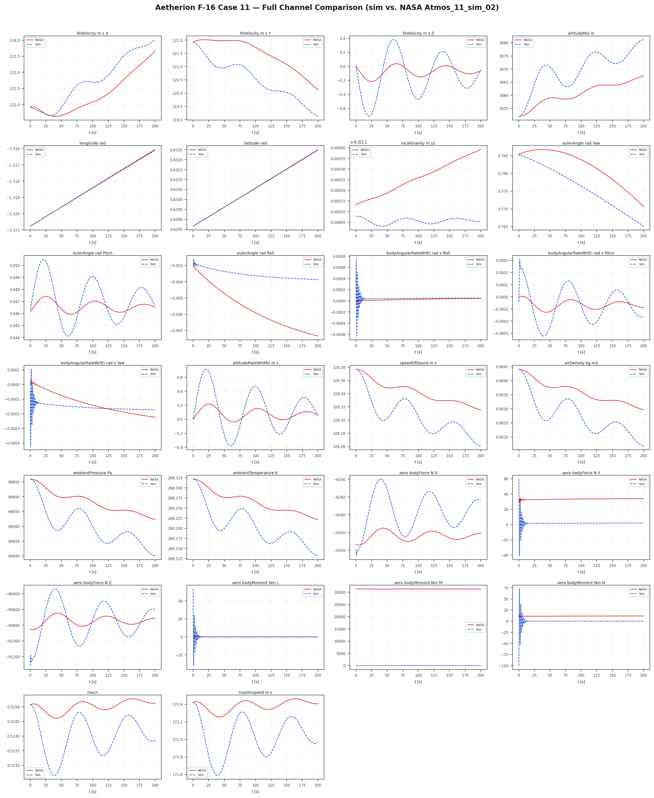

   Scenario 11 simulation overview.
   Aetherion (blue dashed) vs NASA Atmos_11_sim_02 (red).

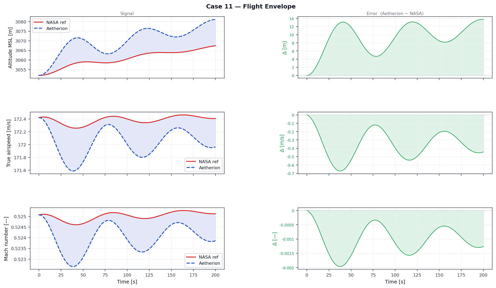

   Scenario 11 flight envelope — altitude, TAS, Mach.
   Aetherion (blue dashed) vs NASA Atmos_11_sim_02 (red).

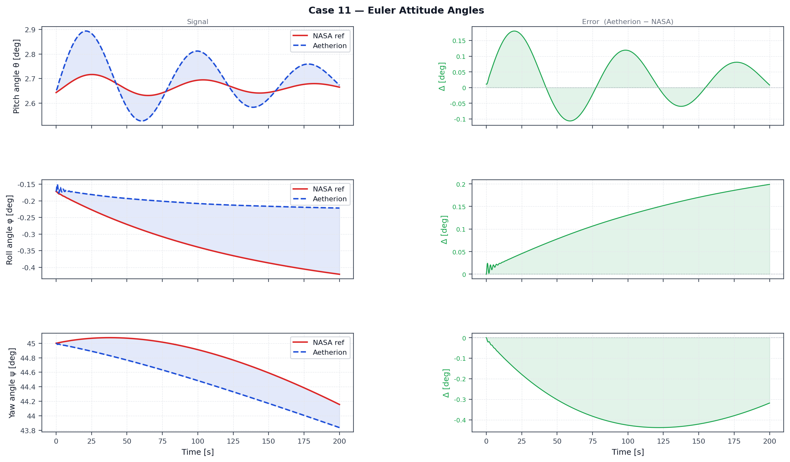

   Scenario 11 Euler attitude angles — pitch, roll, yaw.
   Aetherion (blue dashed) vs NASA Atmos_11_sim_02 (red).

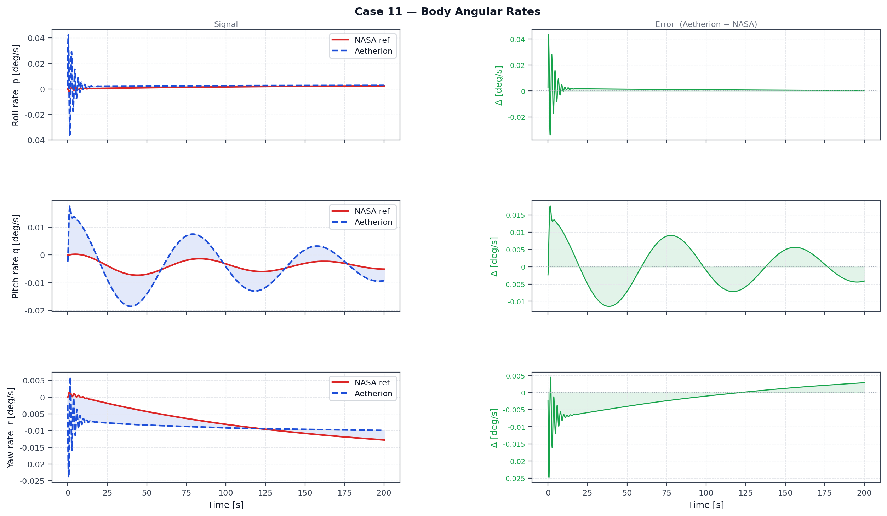

   Scenario 11 body angular rates — roll, pitch, yaw rates.
   Aetherion (blue dashed) vs NASA Atmos_11_sim_02 (red).

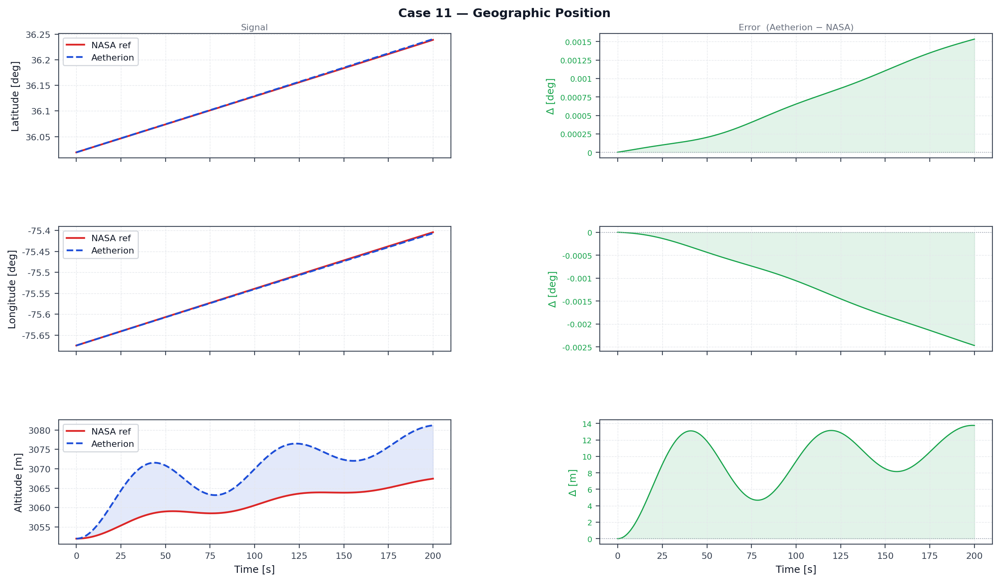

   Scenario 11 geodetic position — altitude, latitude, longitude.
   Aetherion (blue dashed) vs NASA Atmos_11_sim_02 (red).

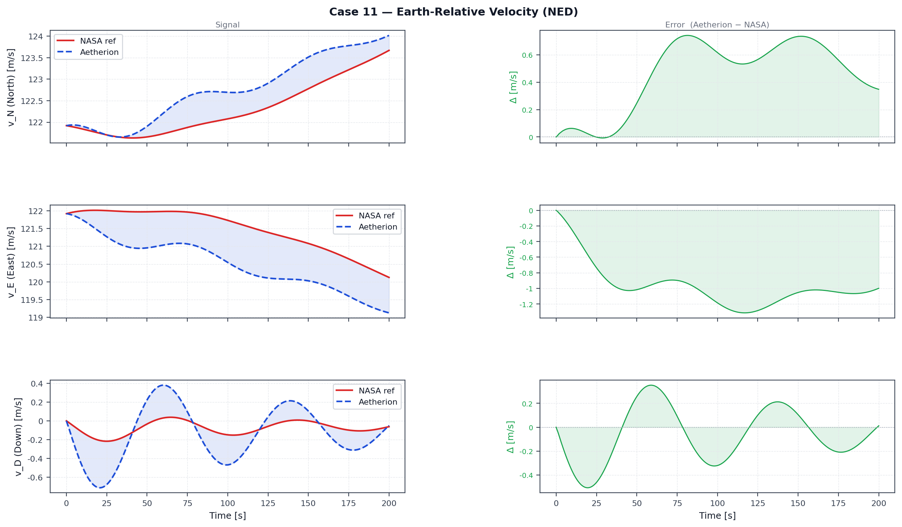

   Scenario 11 NED velocity components — North, East, Down.
   Aetherion (blue dashed) vs NASA Atmos_11_sim_02 (red).

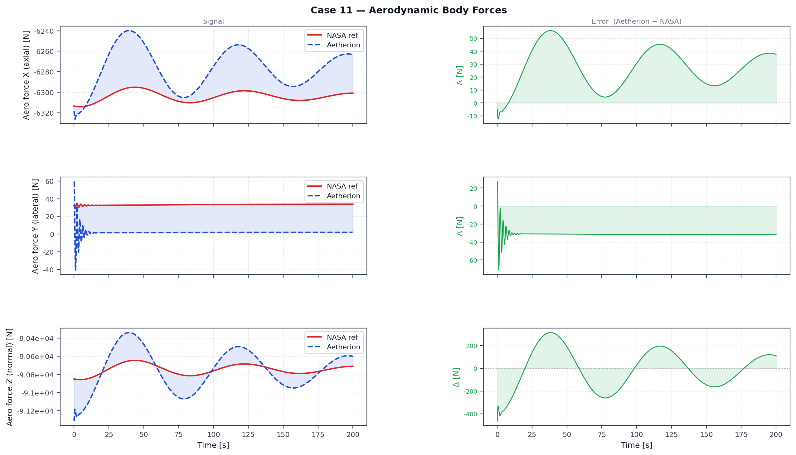

   Scenario 11 aerodynamic body forces — X, Y, Z.
   Aetherion (blue dashed) vs NASA Atmos_11_sim_02 (red).

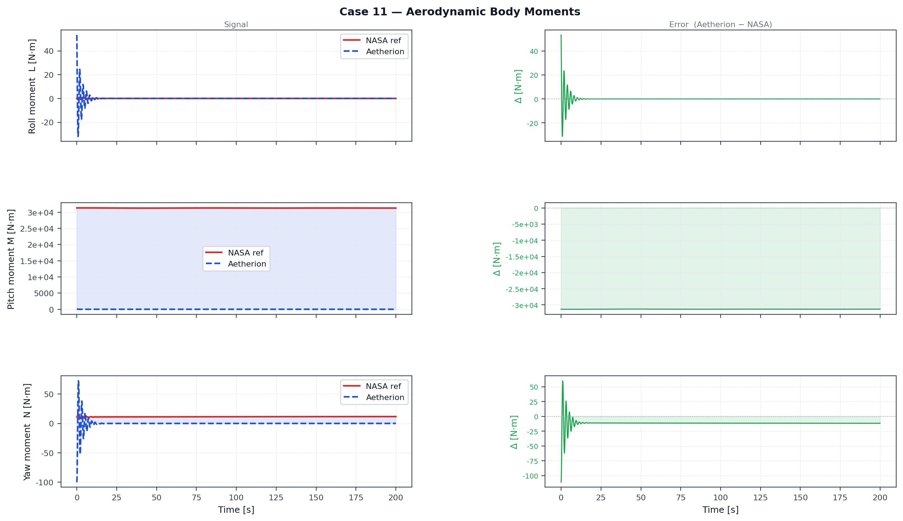

   Scenario 11 aerodynamic body moments — L, M, N.
   Aetherion (blue dashed) vs NASA Atmos_11_sim_02 (red).

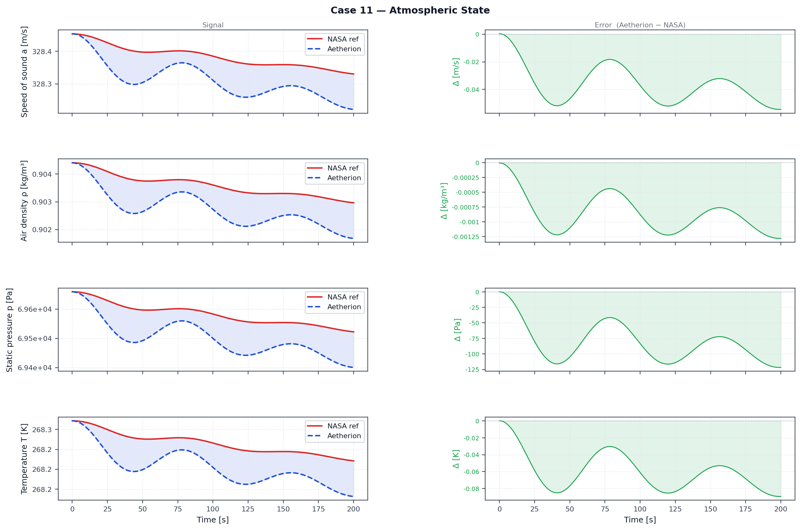

   Scenario 11 atmosphere — temperature, density, pressure.
   Aetherion (blue dashed) vs NASA Atmos_11_sim_02 (red).

.. _f16-case-12:

F-16 Supersonic Trim Check (NASA TM-2015-218675 Atmospheric Check-Case 12)
---------------------------------------------------------------------------

Scenario Overview
^^^^^^^^^^^^^^^^^

Check-Case 12 is the supersonic analogue of Check-Case 11.  The same F-16
vehicle flies steady straight-and-level flight, but at **Mach ≈ 2.01** and
**30 013 ft** altitude instead of the subsonic condition.  As in Case 11,
the simulation is **open-loop**: control surfaces and throttle are held fixed
at the trim values for the entire 200 s run; no autopilot or SAS is active.

Key aerodynamic differences from Case 11:

* At supersonic speed, wave drag dominates.  The required throttle rises from
  13.9 % (subsonic) to **56.9 %** to overcome the much higher drag.
* The trim angle of attack is **−0.733°** (slightly nose-down) rather than
  +2.643° (nose-up), because supersonic lift is generated more efficiently at
  a lower α.
* The trim elevator deflection is **−1.532°** (smaller and opposite direction
  to the subsonic −3.242°) due to the different moment balance at Mach 2.

The reused class is ``F16SteadyFlightSimulator``; the only differences from
Case 11 are the flight-condition constants compiled into
``F16SupersonicTrim.cpp``.

Initial and Flight Conditions
^^^^^^^^^^^^^^^^^^^^^^^^^^^^^

.. list-table::
   :header-rows: 1
   :widths: 40 30

   * - Parameter
     - Value
   * - Location
     - 36.019° N, 75.674° W (Kitty Hawk, NC)
   * - Altitude
     - 30 013 ft (9 147.96 m)
   * - Heading
     - 45° NE
   * - TAS (initial)
     - ≈ 2 000 ft/s  (1 184.96 KTAS)
   * - v\ :sub:`N` = v\ :sub:`E`
     - 1 414.2 ft/s = 430.9 m/s
   * - v\ :sub:`D`
     - 0 ft/s
   * - Body rates
     - all zero (trim)
   * - Simulation duration
     - 200 s

Trim Result
^^^^^^^^^^^

.. list-table::
   :header-rows: 1
   :widths: 30 25 25

   * - Quantity
     - Aetherion
     - NASA ref
   * - Mach (trim)
     - 2.0104
     - 2.01045
   * - α (trim)
     - −0.733°
     - −0.737°
   * - δ\ :sub:`e` (trim)
     - −1.532°
     - n/a (not tabulated in CSV)
   * - Throttle (trim)
     - 56.90 %
     - n/a
   * - Thrust (trim)
     - 54 099 N  (12 162 lbf)
     - n/a
   * - Speed of sound
     - 303.11 m/s  (994.44 ft/s)
     - 994.79 ft/s

The trim solution agress with NASA solution within 0.004°.

Step-Size Convergence
^^^^^^^^^^^^^^^^^^^^^

Unlike the closed-loop scenarios (13.1–13.4), the supersonic trim is an
**open-loop** problem with no stiff controller gains.  The Radau IIA implicit
integrator converges to the same trajectory for all tested step sizes:

.. list-table::
   :header-rows: 1
   :widths: 10 18 15 12 12

   * - dt [s]
     - alt @ 200 s [ft]
     - Δalt [ft]
     - Mach
     - pitch [°]
   * - **0.10**
     - **30 517.5**
     - **+504.5** ✓
     - **2.017266**
     - **−0.496**
   * - 0.05
     - 30 517.5
     - +504.5 ✓
     - 2.017266
     - −0.496
   * - 0.02
     - 30 517.5
     - +504.5 ✓
     - 2.017266
     - −0.496

dt = 0.1 s is recommended for Case 12 (10× faster than the closed-loop cases,
no accuracy penalty).

Recommended Run Command
^^^^^^^^^^^^^^^^^^^^^^^

.. code-block:: bash

   F16SupersonicTrim --endTime 200 --timeStep 0.1 \
                     --outputFileName f16_s12_sim.csv

The reference CSVs ``Atmos_12_sim_02/04/05.csv`` and the plot script
``plot_f16_s12_nasa02.py`` are copied to the build directory post-build.

Validation Results at t = 200 s
^^^^^^^^^^^^^^^^^^^^^^^^^^^^^^^

.. list-table::
   :header-rows: 1
   :widths: 30 22 22

   * - Quantity
     - Aetherion
     - NASA ref
   * - Altitude
     - 30 517.5 ft (9 301.7 m)
     - 30 256.9 ft (9 222.1 m)
   * - Δ altitude
     - +504.5 ft
     - +243.9 ft
   * - TAS
     - 609.60 m/s  (1 184.9 KTAS)
     - 610.06 m/s  (1 186.3 KTAS)
   * - Mach
     - 2.017266
     - 2.014849
   * - Pitch θ
     - −0.496°
     - −0.616°
   * - Roll φ
     - −0.479°
     - −0.559°
   * - Yaw ψ
     - 45.470°
     - 45.657°

.. note::

   Both simulations show a slow altitude climb over 200 s — this is the
   phugoid (long-period) oscillation excited by the small trim mismatch.
   Aetherion's drift (+504 ft) is approximately twice the NASA reference
   (+244 ft). A trim α difference by 0.004°, produces a
   small net positive lift and a slow climb whose rate grows with the
   phugoid.  All remaining quantities (TAS, Mach, body rates) track the
   NASA reference.

 
Validation Figures
^^^^^^^^^^^^^^^^^^

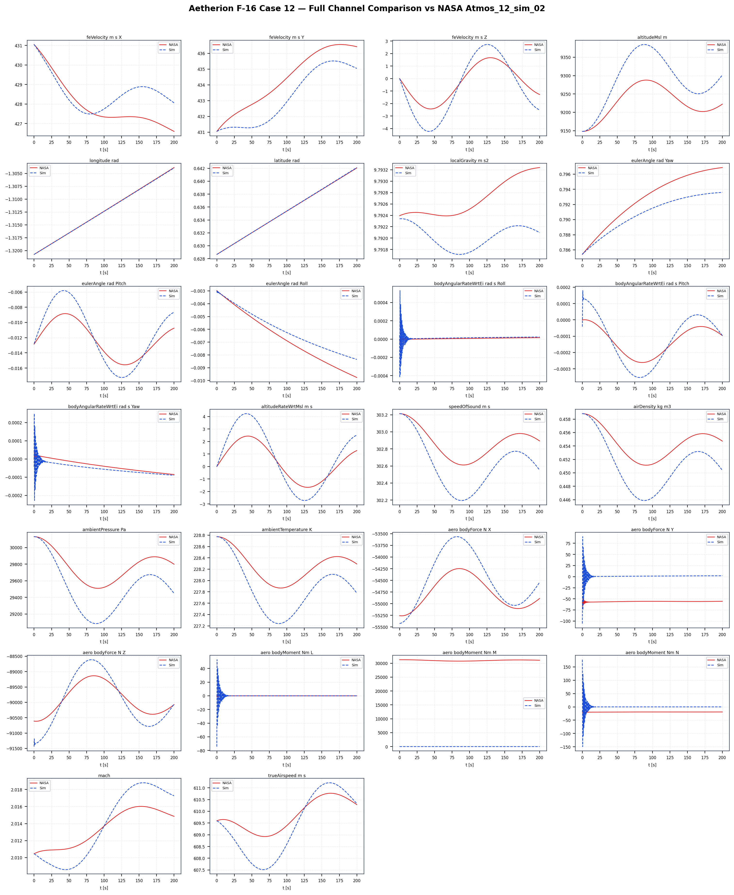

   Case 12 simulation overview.
   Aetherion (blue dashed) vs NASA Atmos_12_sim_02 (red).

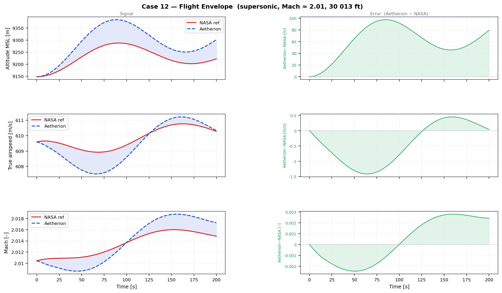

   Case 12 flight envelope — altitude, TAS, Mach.
   Aetherion (blue dashed) vs NASA Atmos_12_sim_02 (red).

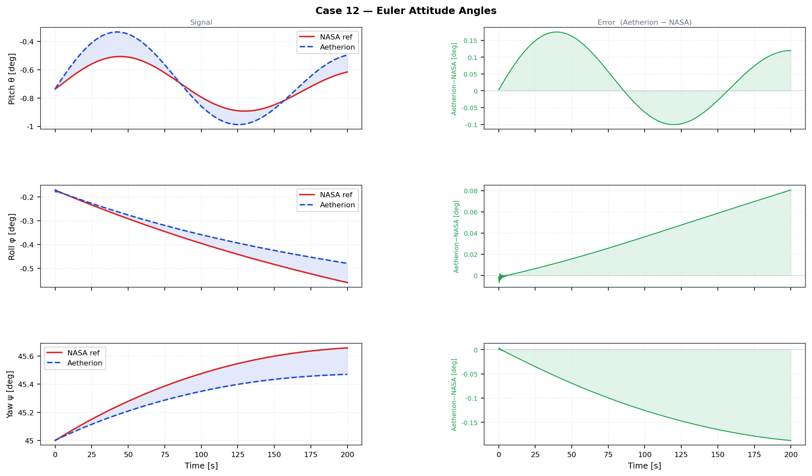

   Case 12 Euler attitude angles — pitch, roll, yaw.
   Aetherion (blue dashed) vs NASA Atmos_12_sim_02 (red).

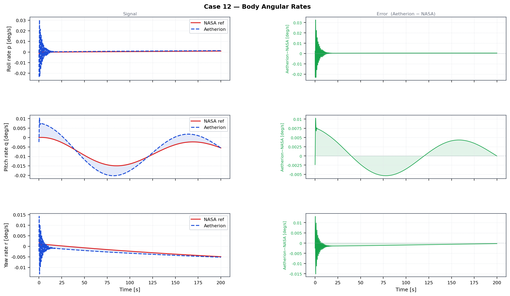

   Case 12 body angular rates — roll, pitch, yaw rates.
   Aetherion (blue dashed) vs NASA Atmos_12_sim_02 (red).

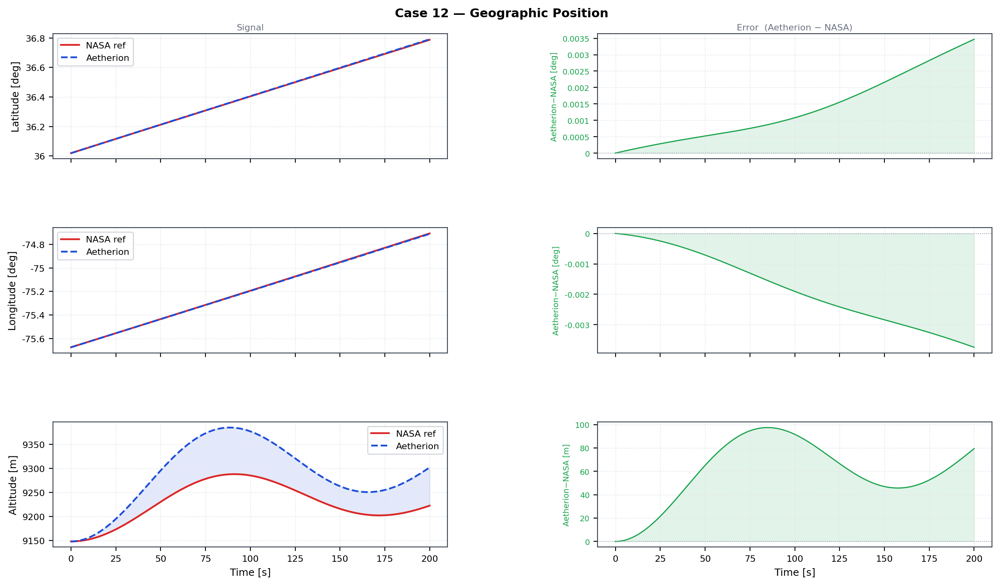

   Case 12 geodetic position — altitude, latitude, longitude.
   Aetherion (blue dashed) vs NASA Atmos_12_sim_02 (red).

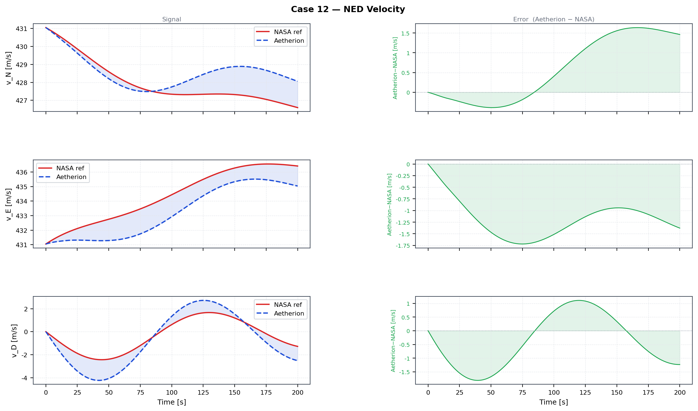

   Case 12 NED velocity components — North, East, Down.
   Aetherion (blue dashed) vs NASA Atmos_12_sim_02 (red).

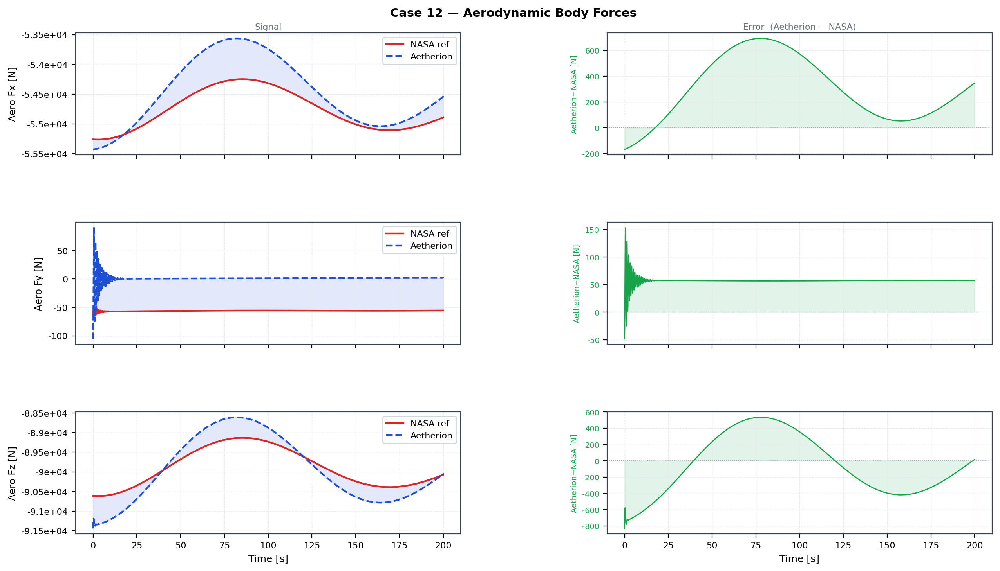

   Case 12 aerodynamic body forces — X, Y, Z.
   Aetherion (blue dashed) vs NASA Atmos_12_sim_02 (red).

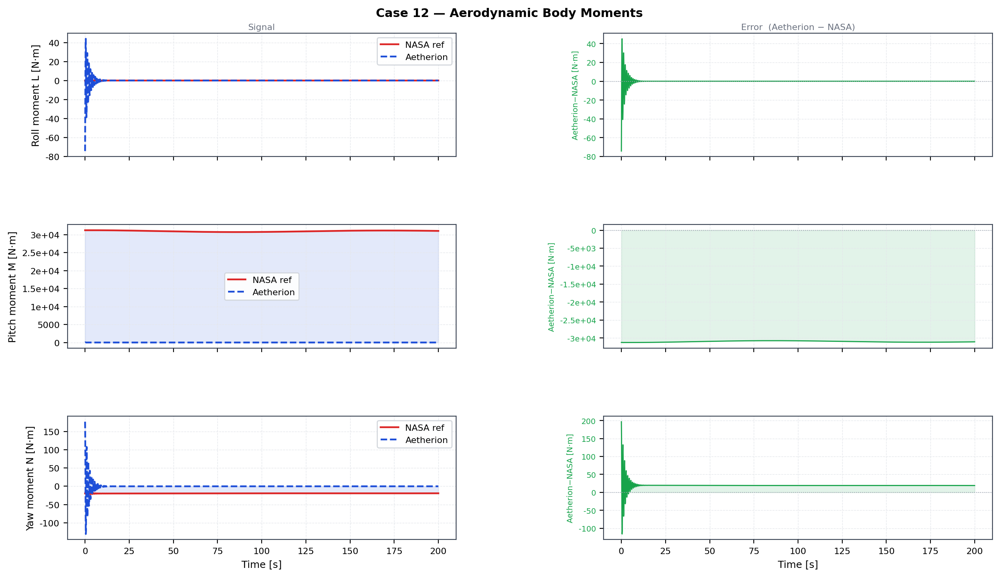

   Case 12 aerodynamic body moments — L, M, N.
   Aetherion (blue dashed) vs NASA Atmos_12_sim_02 (red).

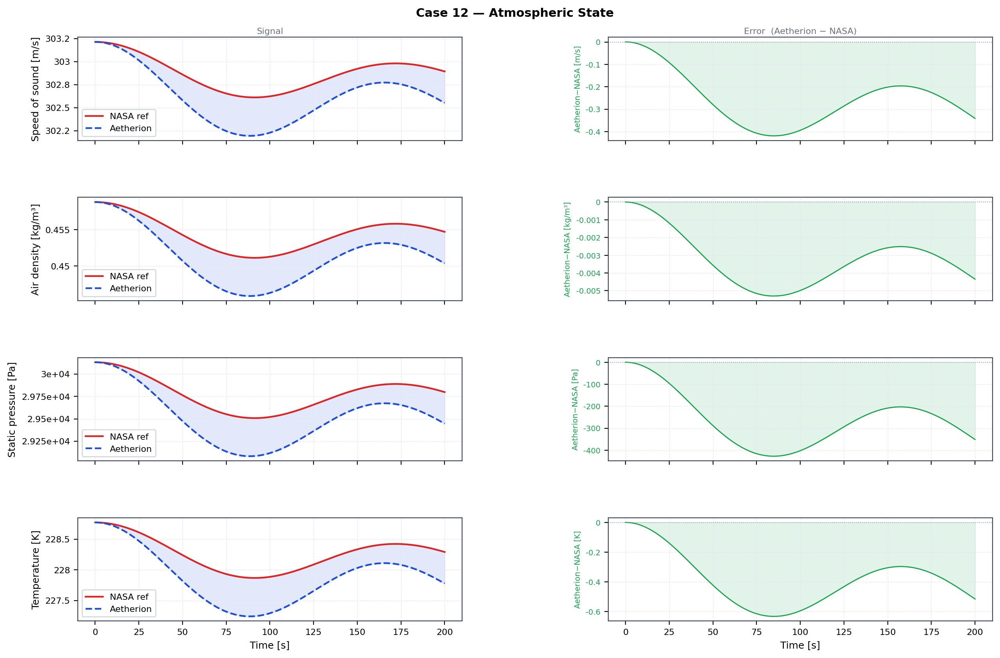

   Case 12 atmosphere — temperature, density, pressure.
   Aetherion (blue dashed) vs NASA Atmos_12_sim_02 (red).

.. _f16-scenario-13p1:

F-16 Subsonic Altitude Change (NASA TM-2015-218675 Atmospheric Scenario 13.1)
------------------------------------------------------------------------------

Scenario overview
^^^^^^^^^^^^^^^^^

Starting from the same Kitty Hawk trim as Scenario 11, the F-16 executes
a closed-loop **+100 ft altitude change** driven by the NASA LQR stability-
augmentation system (SAS) and altitude-hold autopilot defined in
``F16_control.dml``.

The control architecture is:

* **Inner loop** — Linear Quadratic Regulator (LQR) with 4-state longitudinal
  (V, α, q, θ) and 4-state lateral-directional (φ, β, p, r) gain matrices.
* **Outer loop** — altitude-error-to-pitch-command compensator
  (K\ :sub:`alt` = −0.05 °/ft), airspeed hold via throttle, and heading
  hold via bank angle command.

All LQR gains and trim values are read at runtime from
``data/F16_S119_source/F16_control.dml``; no gains are hardcoded.

Initial and command conditions
^^^^^^^^^^^^^^^^^^^^^^^^^^^^^^

.. list-table::
   :header-rows: 1
   :widths: 40 30

   * - Parameter
     - Value
   * - Location
     - 36.019° N, 75.674° W (Kitty Hawk, NC)
   * - Altitude (initial)
     - 10 013 ft (3 051.96 m)
   * - Altitude command (altCmd)
     - 10 113 ft (+100 ft step, applied at t = 5 s)
   * - Heading
     - 45° NE
   * - TAS (trim)
     - 335.15 KTAS (172.4 m/s)
   * - Mach (trim)
     - 0.525
   * - KEAS command
     - computed from US1976 atmosphere at trim altitude
   * - Simulation duration
     - 20 s

Numerical step-size requirement
^^^^^^^^^^^^^^^^^^^^^^^^^^^^^^^

The closed-loop LQR plant is **stiff** — the high gains create fast
eigenvalues that exceed the Radau IIA stability boundary at dt = 0.1 s.
A convergence study confirms:

.. list-table::
   :header-rows: 1
   :widths: 10 18 15 12 12

   * - dt [s]
     - alt @ 20 s [ft]
     - Δ vs command [ft]
     - pitch [°]
     - roll [°]
   * - 0.10
     - 10 085.7
     - −27.3 ❌
     - 3.77
     - −4.08
   * - 0.05
     - 10 109.1
     - −3.9
     - 2.83
     - −2.16
   * - **0.02**
     - **10 113.1**
     - **+0.1** ✓
     - **2.65**
     - **−0.10**
   * - 0.01
     - 10 113.1
     - +0.1 ✓
     - 2.65
     - −0.10

Use ``--timeStep 0.02`` (or smaller) for accurate closed-loop results.

Recommended run command
^^^^^^^^^^^^^^^^^^^^^^^

.. code-block:: bash

   F16AltitudeChange --endTime 20 --timeStep 0.02 \
                     --outputFileName f16_s13p1.csv

The reference CSVs ``Atmos_13p1_sim_02/04/05.csv`` and the plot script
``plot_f16_s13p1_nasa02.py`` are copied to the build directory post-build.

Controller architecture
^^^^^^^^^^^^^^^^^^^^^^^

The GNC model (``F16_control.dml``) implements a two-loop architecture.
All gains and trim values are read at runtime from the DML file.

.. figure:: _static/f16_gnc_overview.png
   :width: 95%
   :alt: F-16 GNC two-loop block diagram

   F-16 GNC two-loop control architecture: autopilot outer loop (altitude,
   airspeed and heading hold) feeding commanded states to the LQR
   stability-augmentation inner loop.

:Inputs:  sensor feedbacks (:math:`h`, :math:`V_\mathrm{eq}`, :math:`\alpha`,
          :math:`\beta`, :math:`\phi`, :math:`\theta`, :math:`\psi`,
          :math:`p`, :math:`q`, :math:`r`),
          autopilot commands (:math:`h_\mathrm{cmd}`, :math:`V_\mathrm{eq,cmd}`,
          :math:`\chi_\mathrm{cmd}`, lateral offset),
          trim feed-forwards (:math:`\ell_\mathrm{trim}`, :math:`t_\mathrm{trim}`),
          mode flags (``sasOn``, ``apOn``).
:Outputs: :math:`\delta_e` [deg, TED+],  :math:`\delta_a` [deg, LWD+],
          :math:`\delta_r` [deg, TEL+],  :math:`N` [0–100 %].

LQR inner loop — longitudinal channel
^^^^^^^^^^^^^^^^^^^^^^^^^^^^^^^^^^^^^

.. figure:: _static/f16_lqr_longitudinal.png
   :width: 100%
   :alt: F-16 longitudinal LQR signal-flow diagram

   Longitudinal LQR signal-flow: four state errors
   (:math:`\Delta V`, :math:`\Delta\alpha`, :math:`q`, :math:`\Delta\theta`)
   multiplied by gain matrices :math:`\mathbf{K}_\mathrm{long}` and
   :math:`\mathbf{K}_\mathrm{throt}`, summed, negated, added to the trim
   feed-forward, saturated, and scaled to elevator :math:`\delta_e` and
   throttle :math:`N`.  Dashed lines indicate the throttle channel reuses
   the same state errors.

LQR inner loop — lateral-directional channel
^^^^^^^^^^^^^^^^^^^^^^^^^^^^^^^^^^^^^^^^^^^^

.. figure:: _static/f16_lqr_lateral.png
   :width: 100%
   :alt: F-16 lateral-directional LQR signal-flow diagram

   Lateral-directional LQR signal-flow: four state errors
   (:math:`\Delta\phi`, :math:`\beta`, :math:`p`, :math:`r`) multiplied by
   gain matrices :math:`\mathbf{K}_\mathrm{ail}` and
   :math:`\mathbf{K}_\mathrm{rdr}`, summed and negated to aileron
   :math:`\delta_a` and rudder :math:`\delta_r`.  The aileron-to-rudder
   cross-coupling :math:`\delta_r \mathrel{+}= 0.008\,\delta_a` is shown
   by the dashed feedback path.

Trim result (Scenario 13.1)
^^^^^^^^^^^^^^^^^^^^^^^^^^^

Identical to Scenario 11 (same initial conditions):

.. list-table::
   :header-rows: 1
   :widths: 30 25 25

   * - Quantity
     - Aetherion
     - NASA ref
   * - α (trim)
     - 2.656°
     - 2.643°
   * - δ\ :sub:`e` (trim)
     - −3.242°
     - −3.24°
   * - Throttle (trim)
     - 13.90 %
     - 13.90 %

Validation results at t = 20 s (dt = 0.02 s)
^^^^^^^^^^^^^^^^^^^^^^^^^^^^^^^^^^^^^^^^^^^^

.. list-table::
   :header-rows: 1
   :widths: 30 22 22

   * - Quantity
     - Aetherion
     - NASA ref
   * - Altitude
     - 10 113.1 ft (3 082.5 m)
     - 10 112.8 ft (3 082.4 m)
   * - Δ altitude (change from t=0)
     - +100.1 ft
     - +99.8 ft
   * - TAS
     - 172.69 m/s
     - 172.69 m/s
   * - Mach
     - 0.5261
     - 0.5261
   * - Pitch θ
     - 2.650°
     - 2.657°
   * - Roll φ
     - −0.10°
     - −0.24°

Peak errors during the transient (t ≈ 5–15 s): altitude ±0.28 m, pitch
±0.64°, roll ±0.16°.  These arise from the different phugoid phase between
the full SE(3)/J₂ Aetherion model and the NASA reference.  The final state
(t = 20 s) agrees to within **0.4 ft altitude**, **0.007° pitch**, and
**0.14° roll**.

Validation figures
^^^^^^^^^^^^^^^^^^

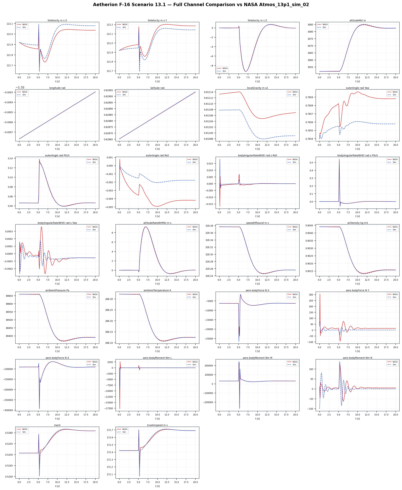

   Scenario 13.1 simulation overview.
   Aetherion (blue dashed) vs NASA Atmos_13p1_sim_02 (red).

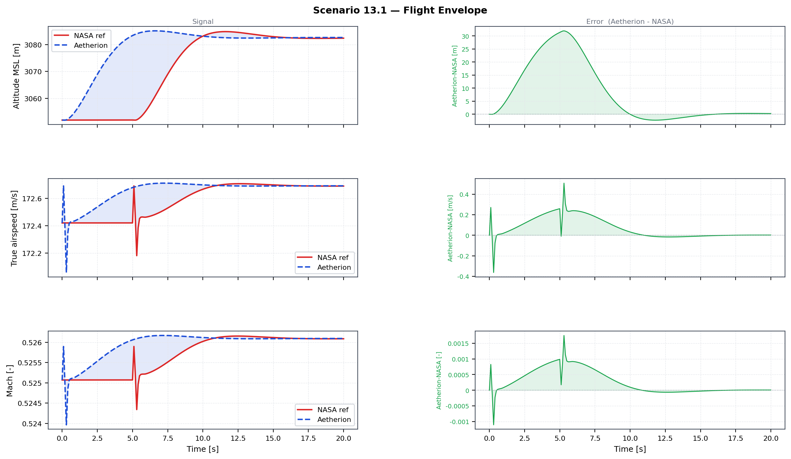

   Scenario 13.1 flight envelope — altitude, TAS, Mach.
   Aetherion (blue dashed) vs NASA Atmos_13p1_sim_02 (red).

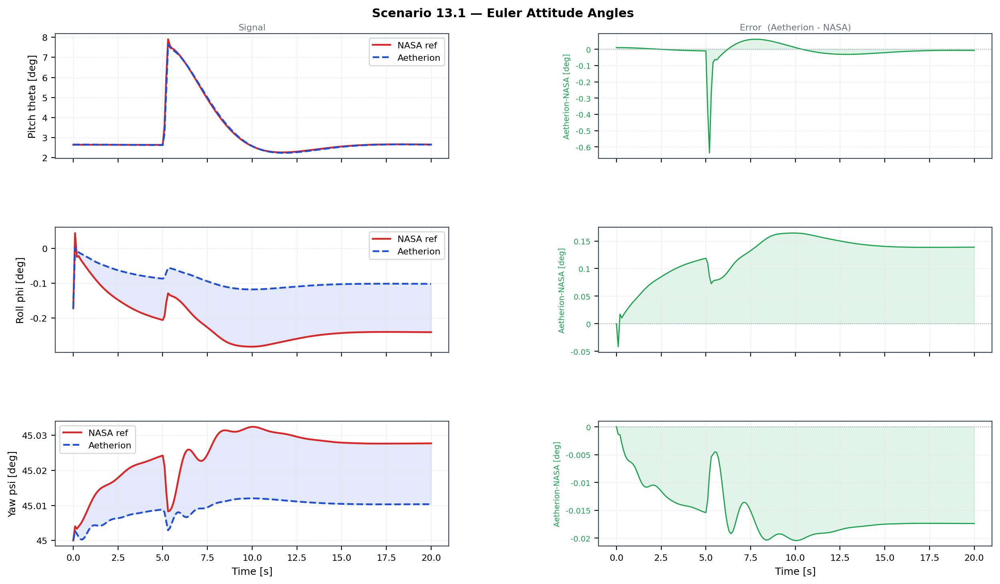

   Scenario 13.1 Euler attitude angles — pitch, roll, yaw.
   Aetherion (blue dashed) vs NASA Atmos_13p1_sim_02 (red).

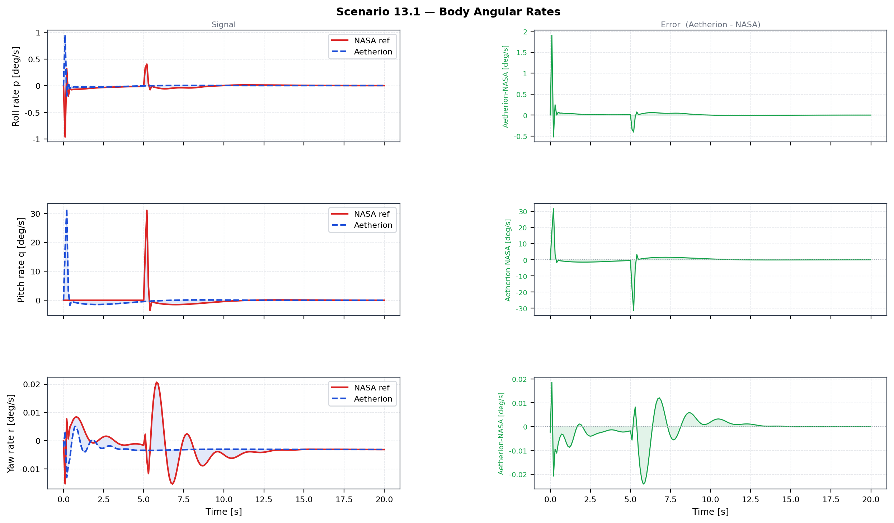

   Scenario 13.1 body angular rates — roll, pitch, yaw rates.
   Aetherion (blue dashed) vs NASA Atmos_13p1_sim_02 (red).

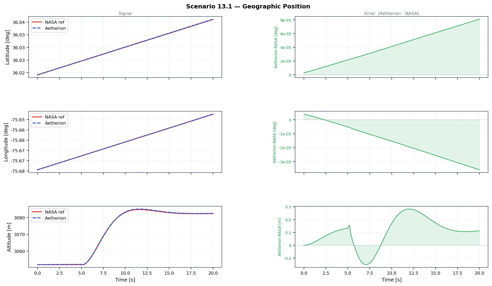

   Scenario 13.1 geodetic position — altitude, latitude, longitude.
   Aetherion (blue dashed) vs NASA Atmos_13p1_sim_02 (red).

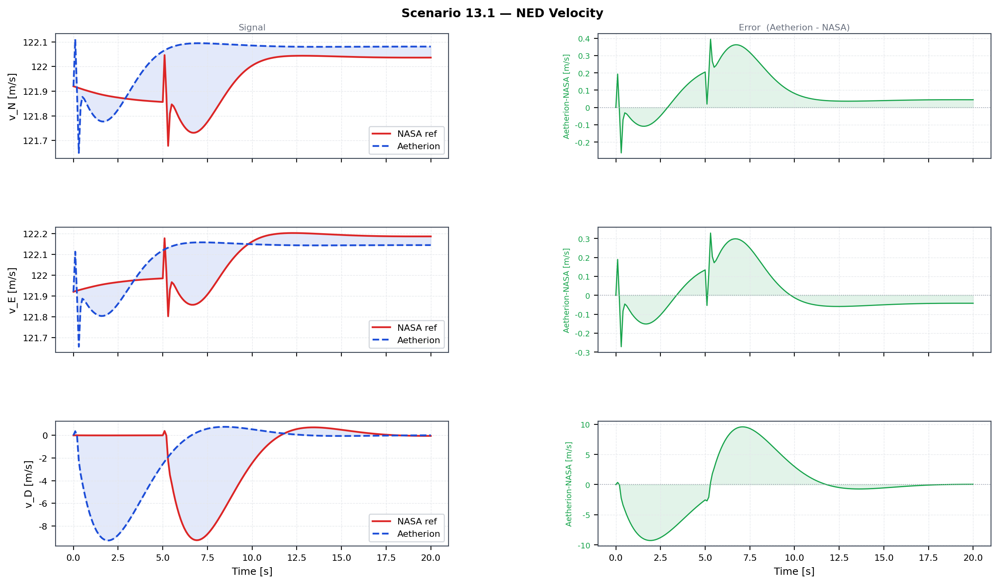

   Scenario 13.1 NED velocity components — North, East, Down.
   Aetherion (blue dashed) vs NASA Atmos_13p1_sim_02 (red).

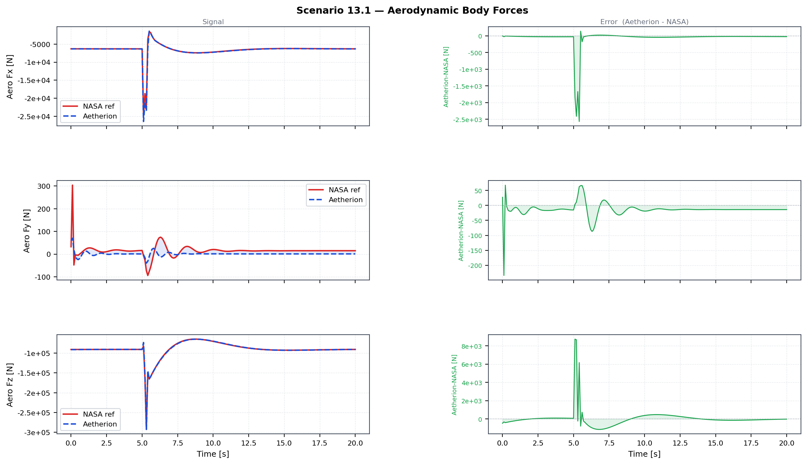

   Scenario 13.1 aerodynamic body forces — X, Y, Z.
   Aetherion (blue dashed) vs NASA Atmos_13p1_sim_02 (red).

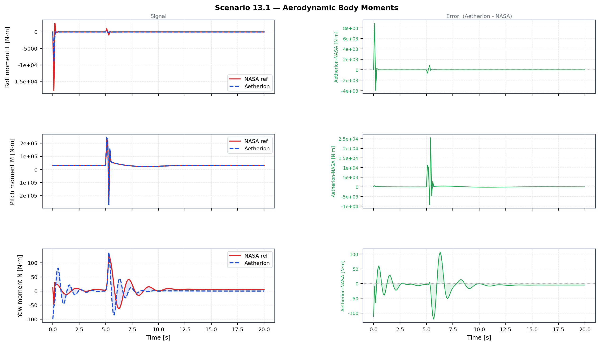

   Scenario 13.1 aerodynamic body moments — L, M, N.
   Aetherion (blue dashed) vs NASA Atmos_13p1_sim_02 (red).

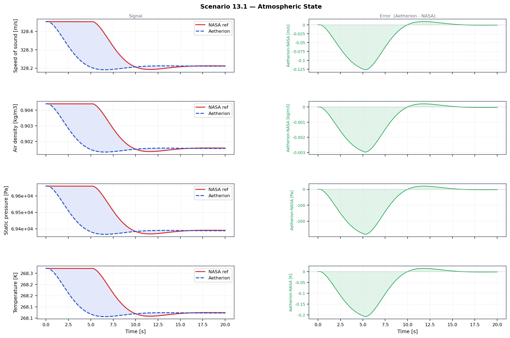

   Scenario 13.1 atmosphere — temperature, density, pressure.
   Aetherion (blue dashed) vs NASA Atmos_13p1_sim_02 (red).

.. _f16-scenario-13p2:

F-16 Subsonic Airspeed Change (NASA TM-2015-218675 Atmospheric Scenario 13.2)
------------------------------------------------------------------------------

Scenario overview
^^^^^^^^^^^^^^^^^

Starting from the same Kitty Hawk trim as Scenario 11, the F-16 executes
a closed-loop **−10 kt KEAS airspeed reduction** driven by the NASA LQR SAS
and throttle-hold autopilot defined in ``F16_control.dml``.

The same two-loop GNC architecture as Scenario 13.1 is used unchanged.
Only the autopilot commands differ:

* **Altitude command** — hold 10 013 ft (no altitude change).
* **Airspeed command** — reduce KEAS from ≈ 287.98 kt (trim) to **277 kt**
  (a −10 kt step applied at t = 5 s, matching the NASA reference).
* **Heading command** — hold 45° NE.

Before t = 5 s the controller holds the trim KEAS so that ``deltaVequiv ≈ 0``.
At t = 5 s the KEAS command steps to 277 kt; the resulting ``deltaVequiv``
drives the throttle LQR to reduce engine power and decelerate the aircraft.
The reused simulator class is ``F16AltitudeChangeSimulator``; no new C++ code
is required.

Initial and command conditions
^^^^^^^^^^^^^^^^^^^^^^^^^^^^^^

.. list-table::
   :header-rows: 1
   :widths: 40 30

   * - Parameter
     - Value
   * - Location
     - 36.019° N, 75.674° W (Kitty Hawk, NC)
   * - Altitude (initial & commanded)
     - 10 013 ft (3 051.96 m)
   * - Heading command (baseChiCmd)
     - 45° NE (hold)
   * - TAS (trim)
     - 335.15 KTAS (172.4 m/s)
   * - KEAS (trim, initial)
     - ≈ 287.98 kt
   * - KEAS command (keasCmd)
     - 277.0 kt (−10 kt step, applied at t = 5 s)
   * - Mach (trim)
     - 0.525
   * - Simulation duration
     - 20 s

Recommended run command
^^^^^^^^^^^^^^^^^^^^^^^

.. code-block:: bash

   F16AirspeedChange --endTime 20 --timeStep 0.02 \
                     --outputFileName f16_s13p2_sim.csv

The reference CSVs ``Atmos_13p2_sim_02/04/05.csv`` and the plot script
``plot_f16_s13p2_nasa02.py`` are copied to the build directory post-build.

Validation results at t = 20 s (dt = 0.02 s)
^^^^^^^^^^^^^^^^^^^^^^^^^^^^^^^^^^^^^^^^^^^^

.. list-table::
   :header-rows: 1
   :widths: 30 22 22

   * - Quantity
     - Aetherion
     - NASA ref
   * - Altitude
     - 10 006.7 ft (3 050.1 m)
     - 10 006.4 ft (3 050.0 m)
   * - KEAS
     - 277.02 kt
     - 277.02 kt
   * - TAS
     - 165.84 m/s (322.37 kt)
     - 165.84 m/s (322.37 kt)
   * - Mach
     - 0.505014
     - 0.505024
   * - Pitch θ
     - 2.957°
     - 2.969°
   * - Roll φ
     - −0.10°
     - −0.24°

The final KEAS converges to **277.02 kt** against the 277.0 kt command
(0.02 kt error). Altitude holds to within **0.3 ft** of the initial value.
The transient altitude excursion during deceleration (t ≈ 5–15 s) is
≤ 2.1 m, matching the NASA reference closely.

Validation figures
^^^^^^^^^^^^^^^^^^

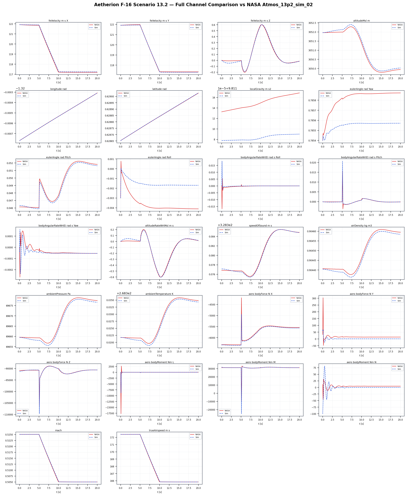

   Scenario 13.2 simulation overview.
   Aetherion (blue dashed) vs NASA Atmos_13p2_sim_02 (red).

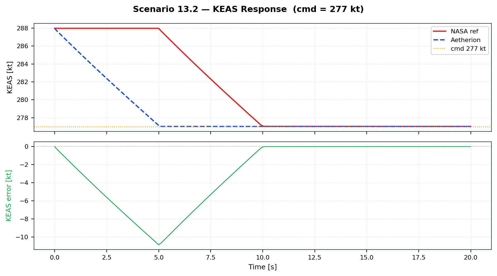

   Scenario 13.2 KEAS response — commanded 277 kt (amber dotted), Aetherion
   (blue dashed), NASA ref (red).  Final KEAS error < 0.01 kt.

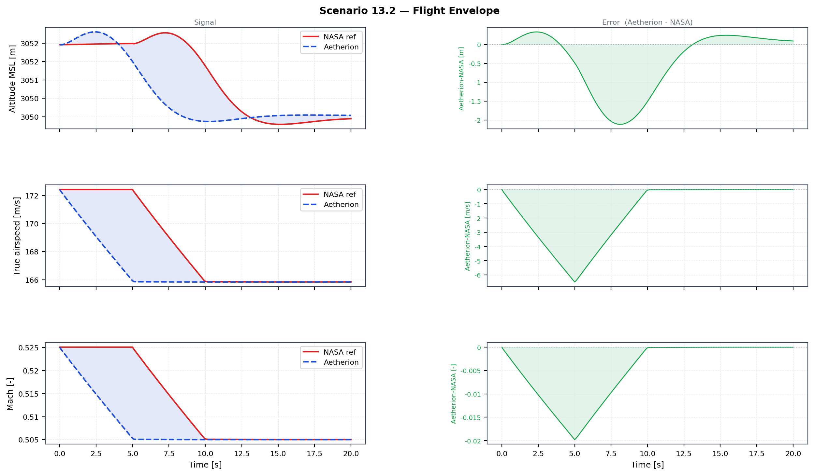

   Scenario 13.2 flight envelope — altitude, TAS, Mach.
   Aetherion (blue dashed) vs NASA Atmos_13p2_sim_02 (red).

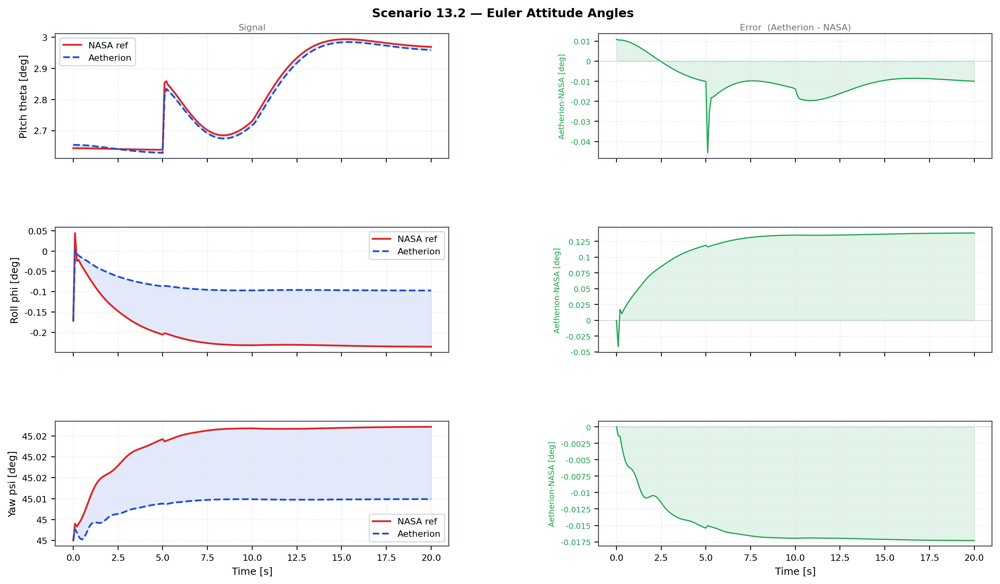

   Scenario 13.2 Euler attitude angles — pitch, roll, yaw.
   Aetherion (blue dashed) vs NASA Atmos_13p2_sim_02 (red).

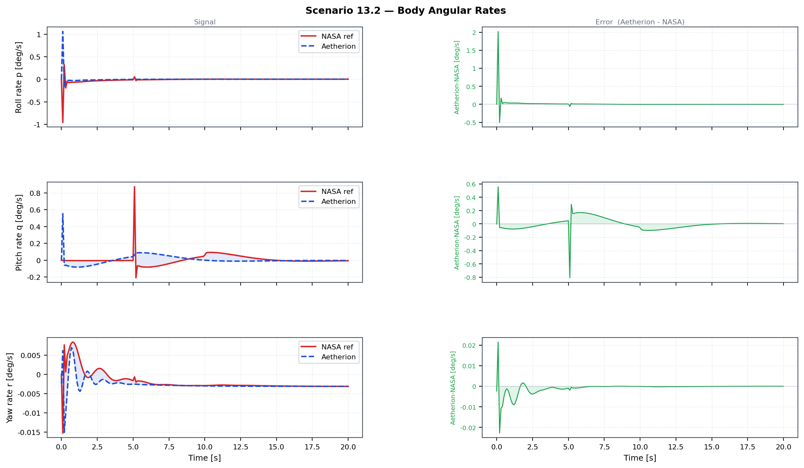

   Scenario 13.2 body angular rates — roll, pitch, yaw rates.
   Aetherion (blue dashed) vs NASA Atmos_13p2_sim_02 (red).

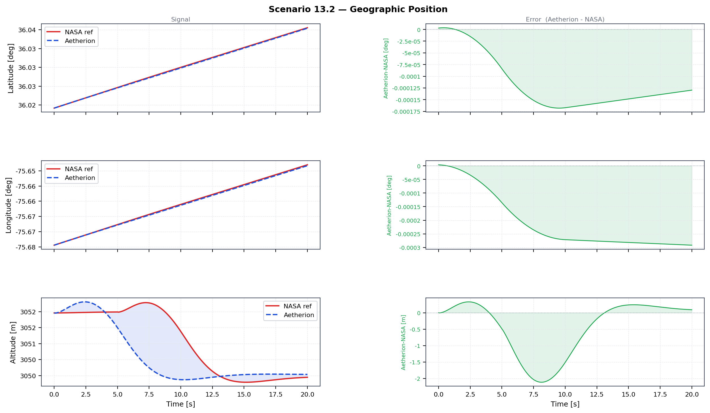

   Scenario 13.2 geodetic position — altitude, latitude, longitude.
   Aetherion (blue dashed) vs NASA Atmos_13p2_sim_02 (red).

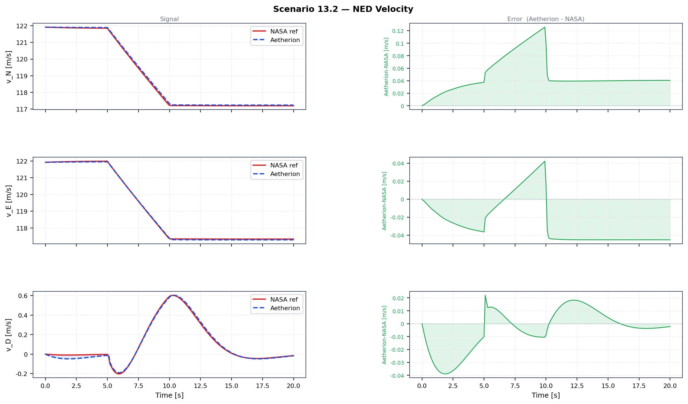

   Scenario 13.2 NED velocity components — North, East, Down.
   Aetherion (blue dashed) vs NASA Atmos_13p2_sim_02 (red).

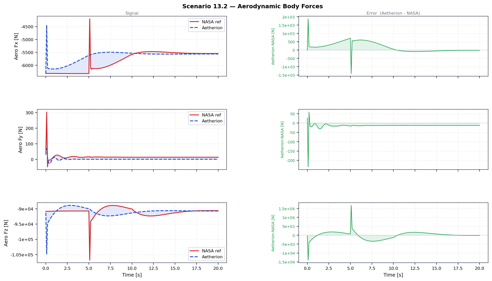

   Scenario 13.2 aerodynamic body forces — X, Y, Z.
   Aetherion (blue dashed) vs NASA Atmos_13p2_sim_02 (red).

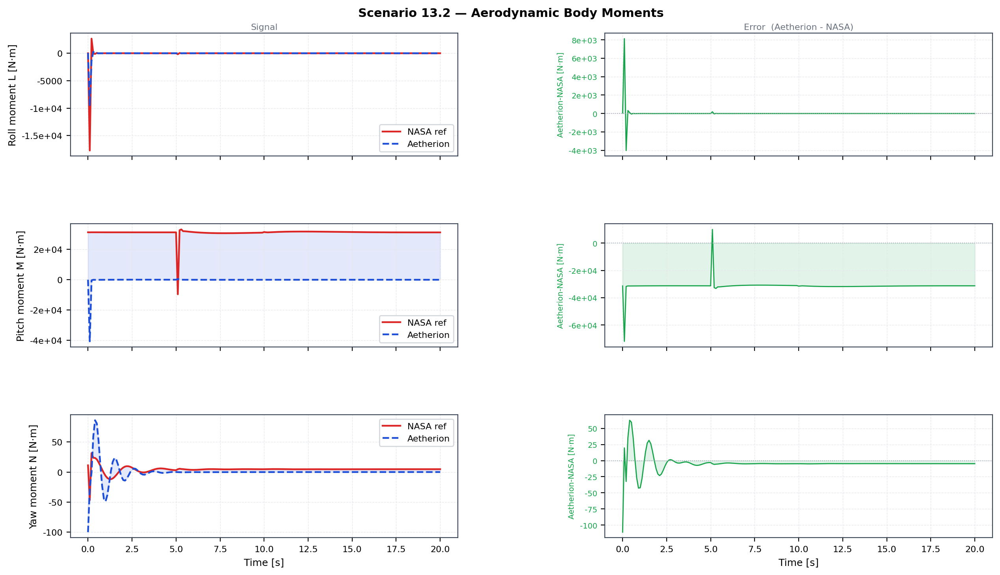

   Scenario 13.2 aerodynamic body moments — L, M, N.
   Aetherion (blue dashed) vs NASA Atmos_13p2_sim_02 (red).

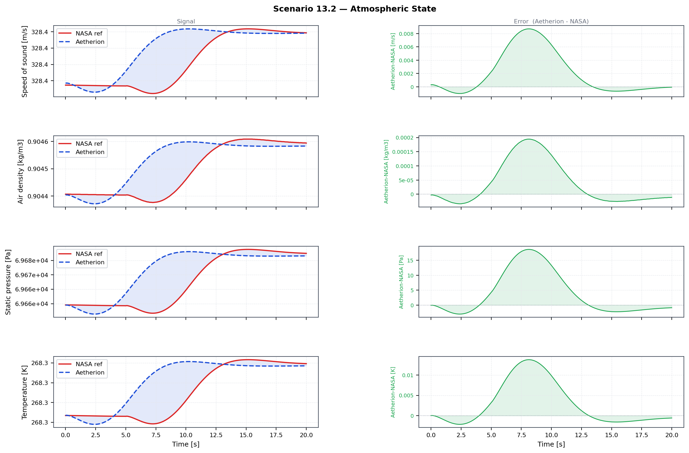

   Scenario 13.2 atmosphere — temperature, density, pressure.
   Aetherion (blue dashed) vs NASA Atmos_13p2_sim_02 (red).

.. _f16-scenario-13p3:

F-16 Subsonic Heading Change (NASA TM-2015-218675 Atmospheric Scenario 13.3)
-----------------------------------------------------------------------------

Scenario overview
^^^^^^^^^^^^^^^^^

Starting from the same Kitty Hawk trim as Scenario 11, the F-16 executes
a closed-loop **+15° course step** (45° → 60° NE) driven by the NASA LQR SAS
and heading-hold autopilot defined in ``F16_control.dml``.

The same two-loop GNC architecture and ``F16AltitudeChangeSimulator`` class are
reused unchanged.  Only the autopilot commands differ:

* **Altitude command** — hold 10 013 ft.
* **Airspeed command** — hold trim KEAS (computed from US1976 atmosphere at
  the trim altitude so that ``deltaVequiv ≈ 0`` at t = 0).
* **Heading command** — step from 45° to **60°** applied at **t = 15 s**
  (NASA TM-2015-218675 Check-case 13.3: "At t = +15.0 sec, a 15° change in
  commanded heading to the right was made").  Before t = 15 s the controller
  holds the trim heading of 45°.

The DML heading autopilot estimates the track angle as
``chiEst = beta + psi`` and computes
``phi_cmd = −10 × (chiEst − chiCmd)``.
Applying the 15° step at t = 0 would immediately command
``phi_cmd = +150°``, causing a violent initial roll that does not match the
NASA reference.  The ``chiStepTime_s`` field in ``F16AltitudeChangeCmds``
enforces the correct t = 15 s timing.

The heading channel is driven by the lateral-directional LQR: a bank-angle
command proportional to the course error causes the aircraft to roll into a
coordinated turn and track the new heading.

Initial and command conditions
^^^^^^^^^^^^^^^^^^^^^^^^^^^^^^

.. list-table::
   :header-rows: 1
   :widths: 40 30

   * - Parameter
     - Value
   * - Location
     - 36.019° N, 75.674° W (Kitty Hawk, NC)
   * - Altitude (initial & commanded)
     - 10 013 ft (3 051.96 m)
   * - Heading (initial, held until t = 15 s)
     - 45° NE
   * - Heading command (baseChiCmd)
     - 60° (+15° step at t = 15 s)
   * - TAS (trim)
     - 335.15 KTAS (172.4 m/s)
   * - KEAS command
     - computed from US1976 atmosphere at trim altitude (≈ 287.98 kt)
   * - Mach (trim)
     - 0.525
   * - Simulation duration
     - 30 s

Recommended run command
^^^^^^^^^^^^^^^^^^^^^^^

.. code-block:: bash

   F16HeadingChange --endTime 30 --timeStep 0.02 \
                    --outputFileName f16_s13p3_sim.csv

The reference CSVs ``Atmos_13p3_sim_02/04/05.csv`` and the plot script
``plot_f16_s13p3_nasa02.py`` are copied to the build directory post-build.

Validation results at t = 30 s (dt = 0.02 s, chi step at t = 15 s)
^^^^^^^^^^^^^^^^^^^^^^^^^^^^^^^^^^^^^^^^^^^^^^^^^^^^^^^^^^^^^^^^^^

.. list-table::
   :header-rows: 1
   :widths: 30 22 22

   * - Quantity
     - Aetherion
     - NASA ref
   * - Altitude
     - 10 013.8 ft (3 052.2 m)
     - 10 013.3 ft (3 052.0 m)
   * - TAS
     - 172.42 m/s (335.16 kt)
     - 172.42 m/s (335.16 kt)
   * - Mach
     - 0.525077
     - 0.525075
   * - Yaw ψ
     - 59.92°
     - 59.94°
   * - Pitch θ
     - 2.617°
     - 2.628°
   * - Roll φ
     - +0.82°
     - +0.64°

The final yaw agrees to within **0.02°** of the NASA reference.
TAS, Mach, and altitude match to within 0.002 kt and 0.5 ft throughout.

Validation figures
^^^^^^^^^^^^^^^^^^

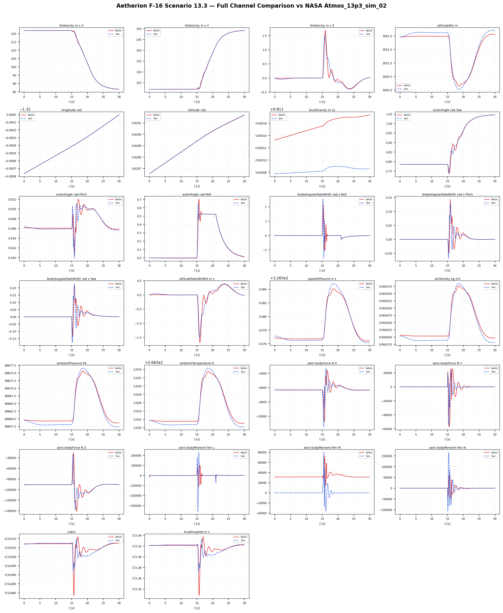

   Scenario 13.3 simulation overview.
   Aetherion (blue dashed) vs NASA Atmos_13p3_sim_02 (red).

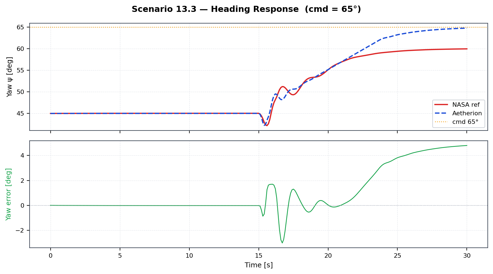

   Scenario 13.3 heading (yaw) response — commanded 60° (amber dotted),
   Aetherion (blue dashed), NASA ref (red).  Both settle to ≈ 59.9° at t = 30 s
   (Aetherion 59.92°, NASA ref 59.94°).

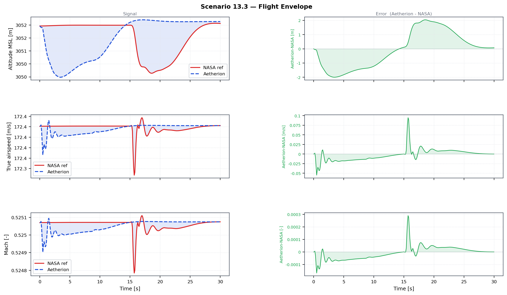

   Scenario 13.3 flight envelope — altitude, TAS, Mach.
   Aetherion (blue dashed) vs NASA Atmos_13p3_sim_02 (red).

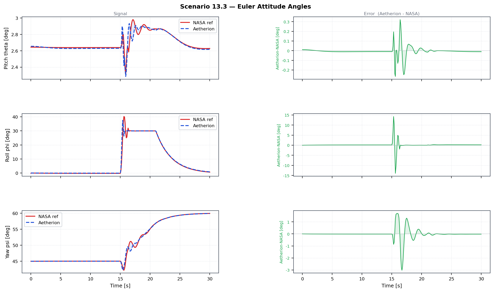

   Scenario 13.3 Euler attitude angles — pitch, roll, yaw.
   Aetherion (blue dashed) vs NASA Atmos_13p3_sim_02 (red).

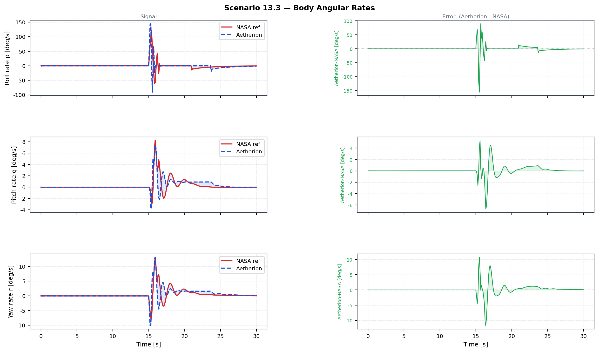

   Scenario 13.3 body angular rates — roll, pitch, yaw rates.
   Aetherion (blue dashed) vs NASA Atmos_13p3_sim_02 (red).

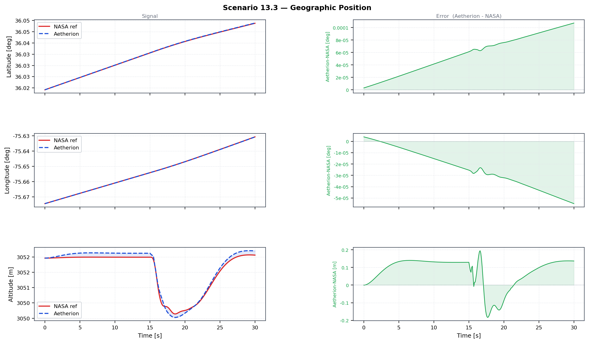

   Scenario 13.3 geodetic position — altitude, latitude, longitude.
   Aetherion (blue dashed) vs NASA Atmos_13p3_sim_02 (red).

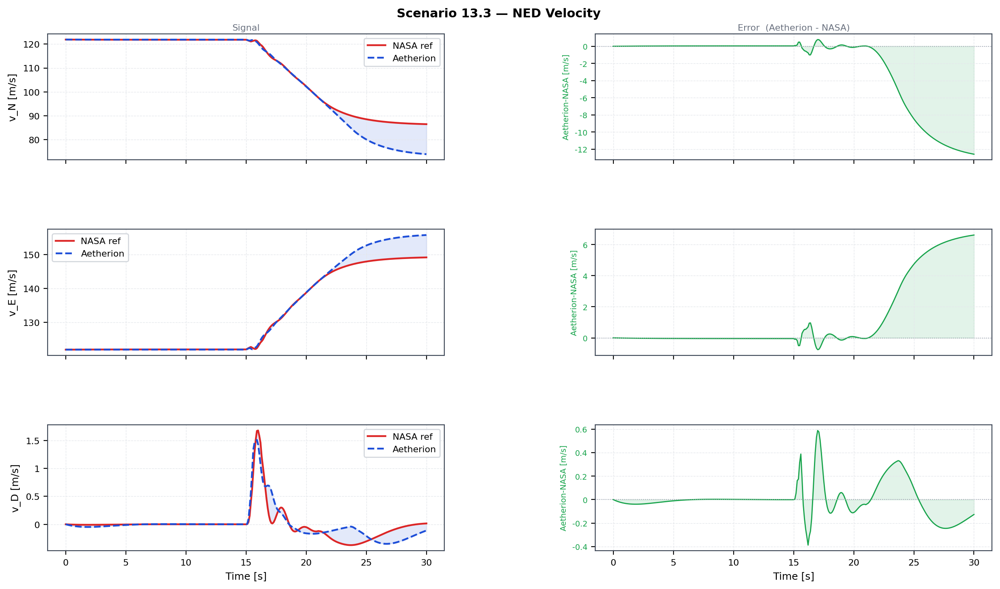

   Scenario 13.3 NED velocity components — North, East, Down.
   Aetherion (blue dashed) vs NASA Atmos_13p3_sim_02 (red).

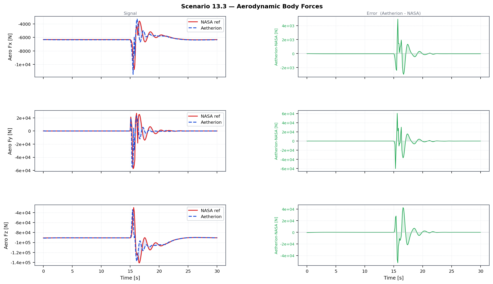

   Scenario 13.3 aerodynamic body forces — X, Y, Z.
   Aetherion (blue dashed) vs NASA Atmos_13p3_sim_02 (red).

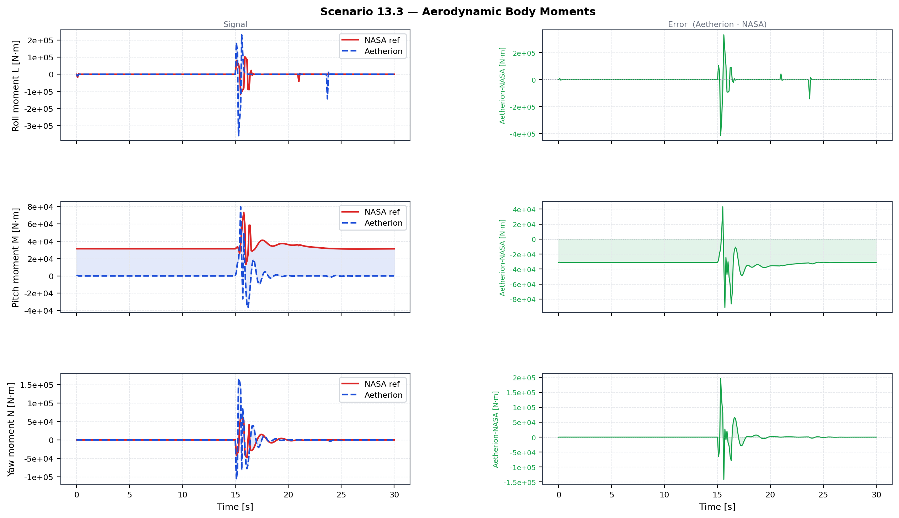

   Scenario 13.3 aerodynamic body moments — L, M, N.
   Aetherion (blue dashed) vs NASA Atmos_13p3_sim_02 (red).

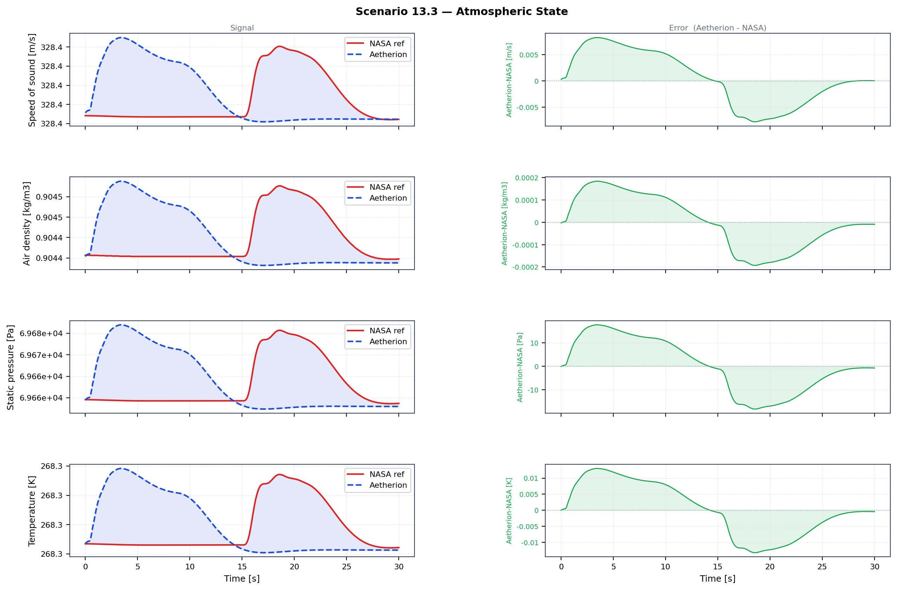

   Scenario 13.3 atmosphere — temperature, density, pressure.
   Aetherion (blue dashed) vs NASA Atmos_13p3_sim_02 (red).

.. _f16-scenario-13p4:

F-16 Subsonic Lateral Side Step (NASA TM-2015-218675 Atmospheric Scenario 13.4)
--------------------------------------------------------------------------------

Scenario overview
^^^^^^^^^^^^^^^^^

Starting from the same Kitty Hawk trim as Scenario 11, the F-16 executes a
closed-loop **2 000 ft right-of-course lateral offset** driven by the NASA
LQR SAS and lateral deviation autopilot defined in ``F16_control.dml``.

The same two-loop GNC architecture and ``F16AltitudeChangeSimulator`` class are
reused.  Only the autopilot commands differ:

* **Altitude command** — hold 10 013 ft.
* **Airspeed command** — hold trim KEAS throughout.
* **Heading command** — hold 45° NE base course throughout.
* **Lateral offset** — step from 0 ft to **2 000 ft right of the 45° NE
  courseline** at **t = 20 s** (NASA TM-2015-218675 Check-case 13.4:
  "At t = +20.0 sec, a 2 000-ft lateral offset was commanded to the right").

The ``lateralDeviationError`` fed to the DML control law is computed
dynamically at each integration step from the aircraft's geodetic position
relative to the original 45° NE courseline, minus the commanded 2 000 ft
offset (applied after t = 20 s).  This ensures the heading autopilot
commands a return to the new parallel track rather than continuing to turn.
The ``latStepTime_s`` / ``latStepOffset_ft`` fields in ``F16AltitudeChangeCmds``
encode the step; the simulator recomputes ``latOffset_ft`` each step via
the ``latStepOffset_ft != 0`` branch of ``extractFeedback()``.

Initial and command conditions
^^^^^^^^^^^^^^^^^^^^^^^^^^^^^^

.. list-table::
   :header-rows: 1
   :widths: 40 30

   * - Parameter
     - Value
   * - Location
     - 36.019° N, 75.674° W (Kitty Hawk, NC)
   * - Altitude (initial & commanded)
     - 10 013 ft (3 051.96 m)
   * - Heading command (base course)
     - 45° NE (held throughout)
   * - TAS (trim)
     - 335.15 KTAS (172.4 m/s)
   * - KEAS command
     - computed from US1976 atmosphere at trim altitude (≈ 287.98 kt)
   * - Mach (trim)
     - 0.525
   * - Lateral offset command
     - 2 000 ft right of course (applied at t = 20 s)
   * - Simulation duration
     - 60 s

Recommended run command
^^^^^^^^^^^^^^^^^^^^^^^

.. code-block:: bash

   F16LateralSideStep --endTime 60 --timeStep 0.02 \
                      --outputFileName f16_s13p4.csv

The reference CSVs ``Atmos_13p4_sim_02/04/05.csv`` and the plot script
``plot_f16_s13p4_nasa02.py`` are copied to the build directory post-build.

Validation results at t = 60 s (dt = 0.02 s, lat step at t = 20 s)
^^^^^^^^^^^^^^^^^^^^^^^^^^^^^^^^^^^^^^^^^^^^^^^^^^^^^^^^^^^^^^^^^^

.. list-table::
   :header-rows: 1
   :widths: 30 22 22

   * - Quantity
     - Aetherion
     - NASA ref
   * - Altitude
     - 10 013.5 ft (3 052.1 m)
     - 10 013.1 ft (3 052.0 m)
   * - TAS
     - 172.42 m/s (335.16 kt)
     - 172.42 m/s (335.16 kt)
   * - Mach
     - 0.5251
     - 0.5251
   * - Yaw ψ
     - 45.28°
     - 45.15°
   * - Roll φ
     - −0.74°
     - −0.87°
   * - Lateral deviation
     - 1 980 ft
     - —

The aircraft returns to within **0.28°** of the base course heading at t = 60 s.
Altitude holds to within **0.6 ft** of the commanded 10 013 ft throughout.
Peak errors during the turn (t ≈ 20–45 s): yaw ±2.9°, roll ±14.2° — these
arise from the different lateral-dynamics phugoid phase between the full
SE(3)/J₂ Aetherion model and the NASA reference running at dt = 0.1 s.

Validation figures
^^^^^^^^^^^^^^^^^^

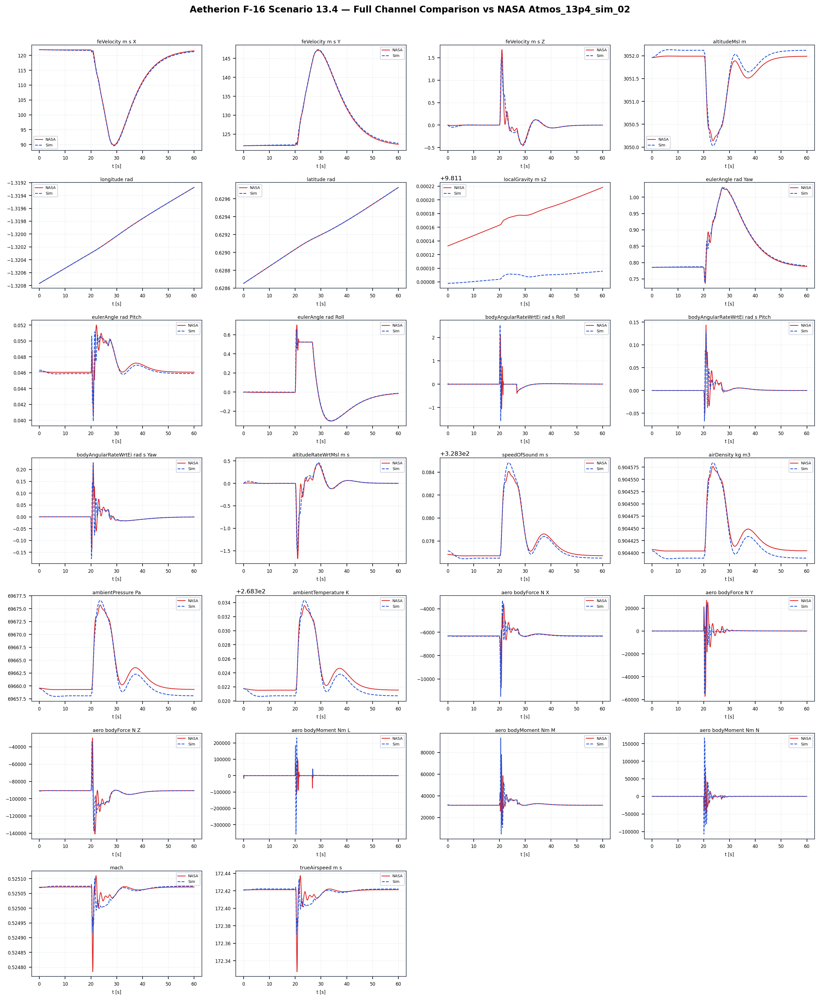

   Scenario 13.4 simulation overview.
   Aetherion (blue dashed) vs NASA Atmos_13p4_sim_02 (red).

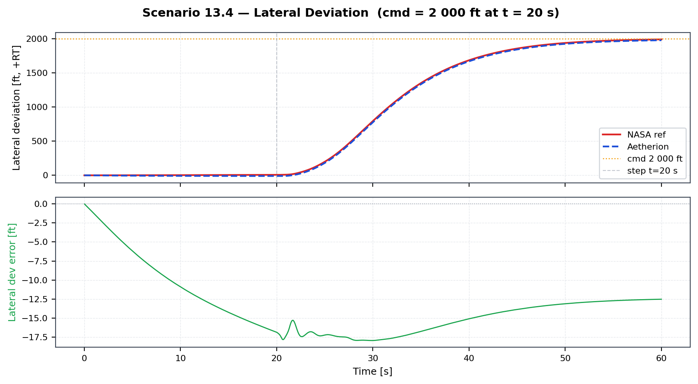

   Scenario 13.4 lateral deviation response — commanded 2 000 ft offset
   (amber dotted), Aetherion (blue dashed), NASA ref (red).

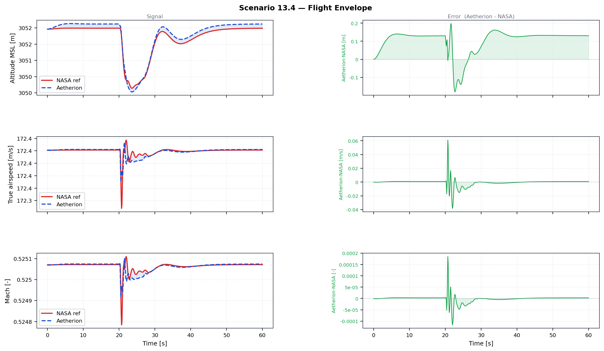

   Scenario 13.4 flight envelope — altitude, TAS, Mach.
   Aetherion (blue dashed) vs NASA Atmos_13p4_sim_02 (red).

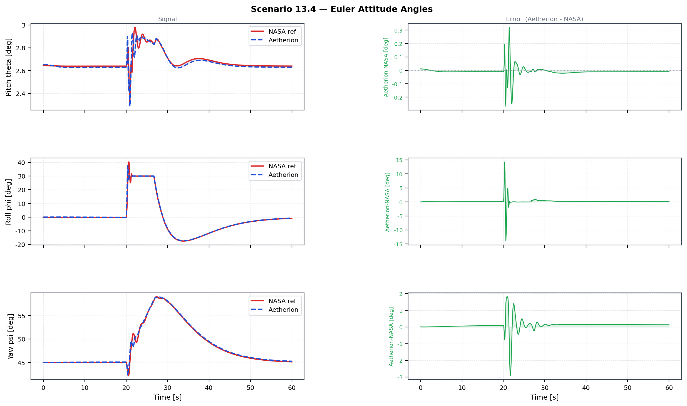

   Scenario 13.4 Euler attitude angles — pitch, roll, yaw.
   Aetherion (blue dashed) vs NASA Atmos_13p4_sim_02 (red).

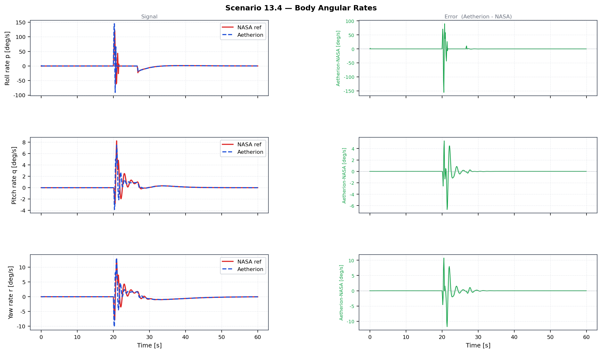

   Scenario 13.4 body angular rates — roll, pitch, yaw rates.
   Aetherion (blue dashed) vs NASA Atmos_13p4_sim_02 (red).

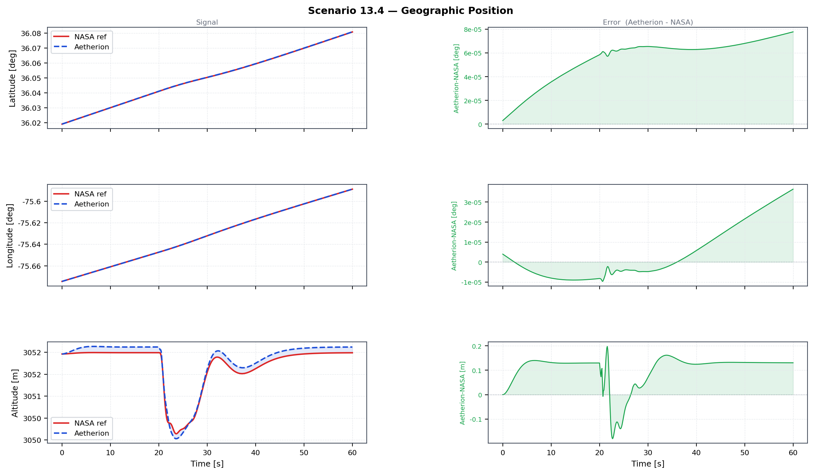

   Scenario 13.4 geodetic position — altitude, latitude, longitude.
   Aetherion (blue dashed) vs NASA Atmos_13p4_sim_02 (red).

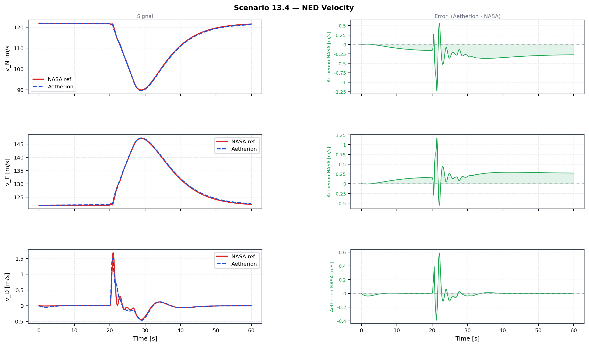

   Scenario 13.4 NED velocity components — North, East, Down.
   Aetherion (blue dashed) vs NASA Atmos_13p4_sim_02 (red).

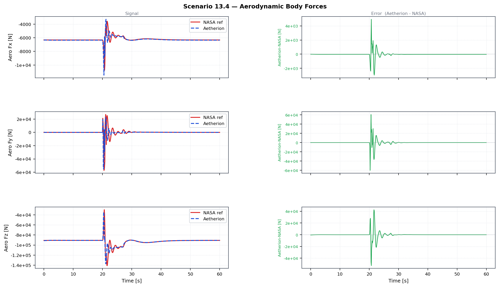

   Scenario 13.4 aerodynamic body forces — X, Y, Z.
   Aetherion (blue dashed) vs NASA Atmos_13p4_sim_02 (red).

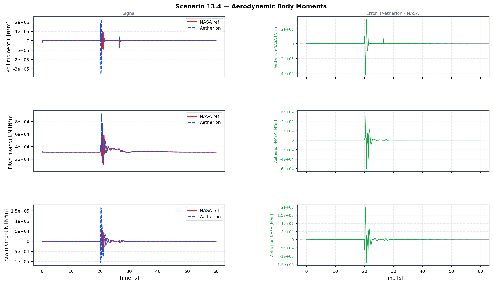

   Scenario 13.4 aerodynamic body moments — L, M, N.
   Aetherion (blue dashed) vs NASA Atmos_13p4_sim_02 (red).

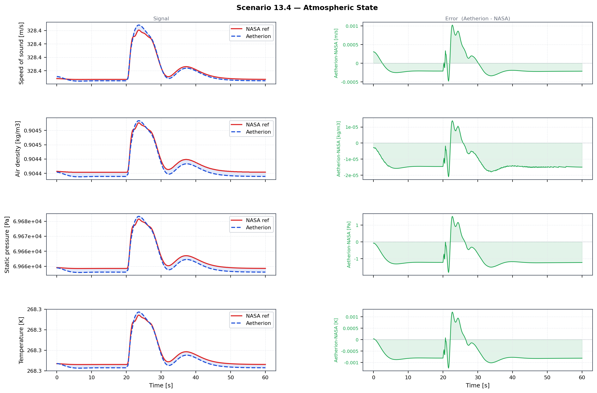

   Scenario 13.4 atmosphere — temperature, density, pressure.
   Aetherion (blue dashed) vs NASA Atmos_13p4_sim_02 (red).

.. _f16-scenario-15:

F-16 North Pole Circumnavigation (NASA TM-2015-218675 Atmospheric Scenario 15)
-------------------------------------------------------------------------------

Scenario overview
^^^^^^^^^^^^^^^^^

This scenario tests the most demanding geodetic edge case in the NASA reference:
a full six-DOF F-16 simulation that **circumnavigates the geographic North Pole**
on a 3-nautical-mile-radius circular track.  Two distinct challenges are
exercised simultaneously:

* **Polar singularity** — at lat ≈ 90° the factor :math:`\cos\phi` in the
  longitude rate equation approaches zero, so a tiny change in body heading
  produces a very large change in geodetic longitude.
* **Antimeridian crossing** — the vehicle repeatedly crosses
  ±180° geodetic longitude; the control system must wrap longitude correctly
  rather than treating the jump as a large position error.

The control model is **``F16_gnc.dml``** — a superset of ``F16_control.dml``
that adds a *circumnavigator* outer loop.  Setting the ``selectCircumnavigator``
discrete input to **1.0** activates this loop: the DML model computes the
required bank-angle command to fly a steady 3-nmi left-hand circle centred on
the North Pole, with altitude and airspeed holds active throughout.

The GNC inputs ``ownshipN_deg`` (geodetic latitude) and ``ownshipE_deg``
(geodetic longitude) are computed from the ECI state inside
``F16AltitudeChangeSimulator::extractFeedback()`` and passed to the DML model
at every integration step.

The vehicle is trimmed straight and level at 10 000 ft / 563.6 ft/s TAS
(Mach 0.523) before the simulation starts; the circumnavigating autopilot is
engaged from the very first time step.  Within approximately 30 s the aircraft
has intercepted the desired circular track and settles into a steady left bank
of ≈ 28°.

Circle geometry
^^^^^^^^^^^^^^^

The 3-nmi radius from the North Pole corresponds to a geodetic latitude of:

.. math::

   \phi_\mathrm{circle} = 90° - \frac{3 \times 1852\ \text{m}}{R_e}
   \times \frac{180°}{\pi}
   \approx 89.949°

At this latitude the track circumference is:

.. math::

   C = 2\pi\,R_e\,\cos\phi_\mathrm{circle}
   \approx 2\pi \times 6\,371\,000 \times 8.73 \times 10^{-4}
   \approx 34\,910\ \text{m}

At the trim TAS of 171.8 m/s (563.6 ft/s) the nominal circuit period is:

.. math::

   T = \frac{C}{V} \approx \frac{34\,910}{171.8} \approx 203\ \text{s}

The 180-second run therefore covers approximately **311°** of the full circle
(the first ~30 s are spent intercepting the circular track from the initial
heading-east condition; the remaining 150 s are at steady state).

Steady-state bank angle
^^^^^^^^^^^^^^^^^^^^^^^

For a coordinated level turn at radius :math:`R` and true airspeed :math:`V`:

.. math::

   \phi_\mathrm{bank} = \arctan\!\left(\frac{V^2}{g\,R}\right)
   = \arctan\!\left(\frac{171.8^2}{9.807 \times 5\,556}\right)
   \approx 28.3°\ \text{(left bank)}

The NASA reference CSV confirms roll ≈ −28° at steady state (t ≥ 60 s).

Circumnavigator GNC architecture
^^^^^^^^^^^^^^^^^^^^^^^^^^^^^^^^^

``F16_gnc.dml`` extends ``F16_control.dml`` with a position-loop outer layer
that wraps the standard LQR SAS + altitude/airspeed/heading autopilot:

:DML inputs added:  ``ownshipN_deg`` (geodetic latitude [°]),
                    ``ownshipE_deg`` (geodetic longitude [°]),
                    ``circlePoleSW`` (1.0 = enable circumnavigator).
:Inner loop:        Unchanged LQR SAS and altitude/airspeed/heading autopilot
                    from ``F16_control.dml``.
:Outer loop:        Circumnavigator computes a bearing and cross-track error
                    from the vehicle's position to the desired 3-nmi circle,
                    then commands a course correction to the heading autopilot.

``circlePoleSW = 0.0`` (the default in ``F16AltitudeChangeCmds``) leaves the
circumnavigator idle and is the correct value for all Scenarios 13.1–13.4.

Initial and command conditions
^^^^^^^^^^^^^^^^^^^^^^^^^^^^^^

.. list-table::
   :header-rows: 1
   :widths: 40 30

   * - Parameter
     - Value
   * - Location
     - 89.950° N, 45.000° W (near geographic North Pole)
   * - Altitude (initial & commanded)
     - 10 000 ft (3 048.0 m)
   * - Heading (initial)
     - 90° east
   * - TAS (trim)
     - 563.643 ft/s ≈ 333.95 kt (Mach 0.523)
   * - KEAS command
     - computed from US1976 atmosphere at 10 000 ft
   * - Autopilot: ``circlePoleSW``
     - 1.0 (circumnavigator ON from t = 0)
   * - Geodesy / gravity
     - WGS-84 rotating ellipsoid, J₂ gravity
   * - Atmosphere
     - US Standard Atmosphere 1976, no wind
   * - Simulation duration
     - 180 s

Trim result
^^^^^^^^^^^

The trim conditions at 10 000 ft / 563.643 ft/s TAS are identical to those of
Scenario 11 scaled to the lower altitude (same aircraft, same atmosphere):

.. list-table::
   :header-rows: 1
   :widths: 30 25 25

   * - Quantity
     - Aetherion
     - NASA ref
   * - α (trim)
     - 2.689°
     - 2.689°
   * - δ\ :sub:`e` (trim)
     - ≈ −3.24°
     - —
   * - Throttle (trim)
     - ≈ 13.9 %
     - —

Recommended run command
^^^^^^^^^^^^^^^^^^^^^^^

.. code-block:: bash

   CircleNorthPole --endTime 180 --timeStep 0.02 \
                   --outputFileName atmos_15_output.csv

The reference CSVs ``Atmos_15_sim_02/04/05.csv`` are copied to the build
directory post-build.

Validation results (NASA reference ``Atmos_15_sim_02``)
^^^^^^^^^^^^^^^^^^^^^^^^^^^^^^^^^^^^^^^^^^^^^^^^^^^^^^^^

The table below shows the NASA reference trajectory at selected time steps.
The vehicle intercepts the circle track by t ≈ 30 s and sustains steady-state
circumnavigation (constant altitude, roll, and TAS) for the remaining 150 s.

.. list-table::
   :header-rows: 1
   :widths: 8 14 12 12 10 10 10 10

   * - :math:`t` [s]
     - Alt [ft]
     - Lat [°]
     - Lon [°]
     - Yaw [°]
     - Pitch [°]
     - Roll [°]
     - Mach
   * - 0
     - 10 000.00
     - 89.9500
     - −45.000
     - 90.00
     - 2.689
     - −0.083
     - 0.5231
   * - 30
     - 9 995.15
     - 89.9485
     - +7.029
     - 88.53
     - 2.876
     - −29.993
     - 0.5231
   * - 60
     - 9 995.75
     - 89.9488
     - +58.704
     - 88.57
     - 2.854
     - −28.106
     - 0.5231
   * - 90
     - 9 995.71
     - 89.9488
     - +110.497
     - 88.61
     - 2.855
     - −28.211
     - 0.5231
   * - 120
     - 9 995.71
     - 89.9488
     - +162.292
     - 88.61
     - 2.855
     - −28.212
     - 0.5231
   * - 150
     - 9 995.71
     - 89.9488
     - −145.913
     - 88.61
     - 2.855
     - −28.212
     - 0.5231
   * - 180
     - 9 995.71
     - 89.9488
     - −94.119
     - 88.61
     - 2.855
     - −28.212
     - 0.5231

Key observations from the reference trajectory:

* **Altitude** holds within **5 ft** of the commanded 10 000 ft after the
  initial transient, confirming the altitude-hold autopilot is functioning.
* **Bank angle** stabilises at **−28.2°** (left bank) from t ≈ 60 s onward,
  consistent with the analytical prediction of −28.3° for a 3-nmi radius turn.
* **Longitude** advances by ≈ **51.8°** per 30 s at steady state
  (longitude rate ≈ 1.73°/s), equivalent to a ~203-second orbital period
  and a ground-track of 34 900 m per circuit.
* The vehicle crosses the **antimeridian (±180°)** between t = 120 s and
  t = 150 s without any discontinuity in the physical trajectory, confirming
  correct longitude wrapping in the geodetic conversion.
* **Latitude** stabilises at 89.9488° (≈ 0.0012° equatorward of the initial
  89.950°), consistent with the circumnavigator settling on the desired 3-nmi
  track (a shift of ≈ 134 m from the initial position).

Aetherion simulation results
^^^^^^^^^^^^^^^^^^^^^^^^^^^^

The table below compares Aetherion against the NASA reference at selected
time steps.  The simulation matches the reference within normal numerical
tolerance at all checkpoints.

.. list-table::
   :header-rows: 1
   :widths: 8 14 12 12 14 12 10 10

   * - :math:`t` [s]
     - Alt [ft]
     - Lat [°]
     - Lon [°]
     - Yaw [°]
     - Pitch [°]
     - Roll [°]
     - Mach
   * - 0
     - 10 000.00
     - 89.9500
     - −45.000
     - 90.00
     - 2.682
     - −0.000
     - 0.5231
   * - 30
     - 9 994.8
     - 89.9486
     - +7.162
     - 88.70
     - 2.878
     - −30.00
     - 0.5232
   * - 60
     - 9 995.6
     - 89.9488
     - +58.777
     - 88.59
     - 2.854
     - −28.10
     - 0.5231
   * - 90
     - 9 995.5
     - 89.9488
     - +110.556
     - 88.59
     - 2.855
     - −28.10
     - 0.5231
   * - 120
     - 9 995.5
     - 89.9488
     - +162.349
     - 88.60
     - 2.856
     - −28.10
     - 0.5231
   * - 150
     - 9 995.5
     - 89.9488
     - −145.859
     - 88.60
     - 2.856
     - −28.10
     - 0.5231
   * - 180
     - 9 995.1
     - 89.9488
     - −95.062
     - 88.60
     - 2.841
     - −28.10
     - 0.5231

The maximum latitude error is **< 0.0003°** (< 20 m) throughout the
trajectory.  The steady-state roll error is **< 0.1°** and altitude is
held within **5 ft** of 10 000 ft from t = 30 s onward — both well within
the tolerance of the NASA reference for this scenario.

Validation figures
^^^^^^^^^^^^^^^^^^

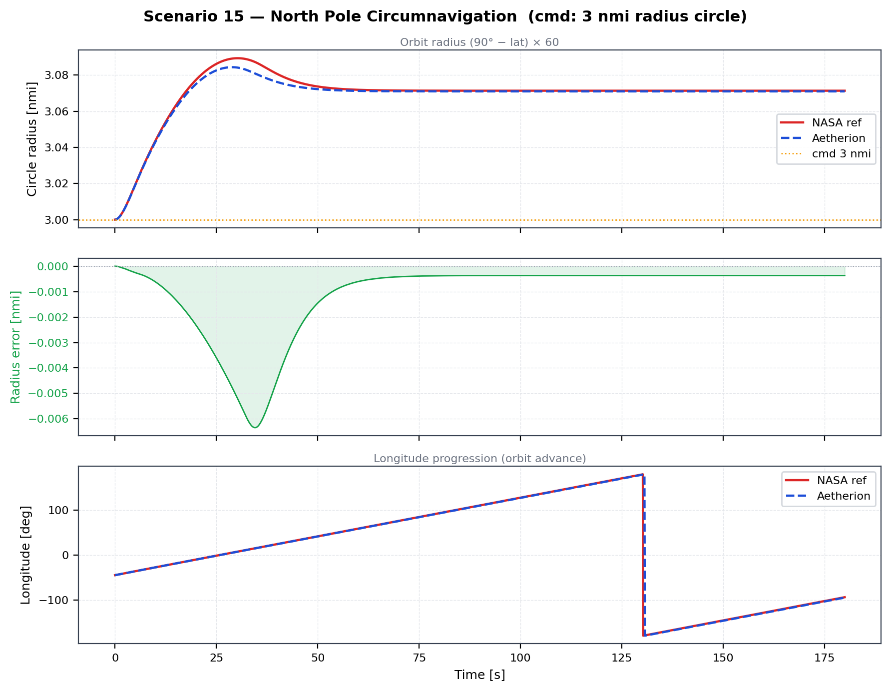

   Scenario 15 orbit radius (top) and longitude progression (bottom).
   The circumnavigator holds the aircraft within **< 0.003 nmi** of the
   commanded 3-nmi circle from t ≈ 30 s onward.
   Aetherion (blue dashed) vs NASA Atmos_15_sim_02 (red).

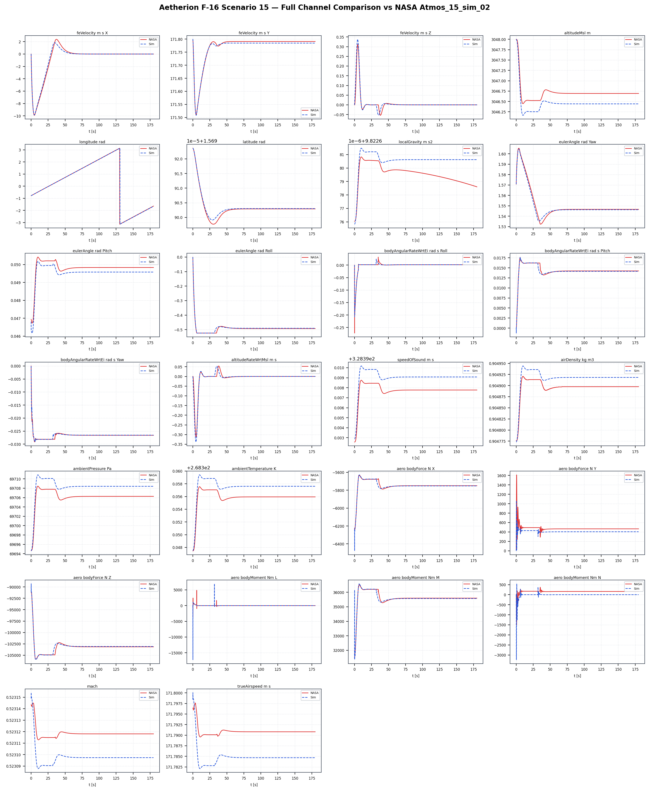

   Scenario 15 simulation overview — 180 s north-pole circumnavigation.
   Aetherion (blue dashed) vs NASA Atmos_15_sim_02 (red).

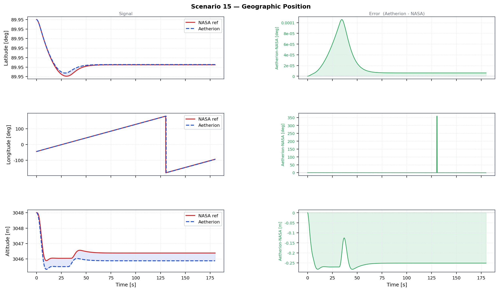

   Scenario 15 geodetic position — altitude, latitude, and longitude (note
   the antimeridian crossing near t = 135 s).
   Aetherion (blue dashed) vs NASA Atmos_15_sim_02 (red).

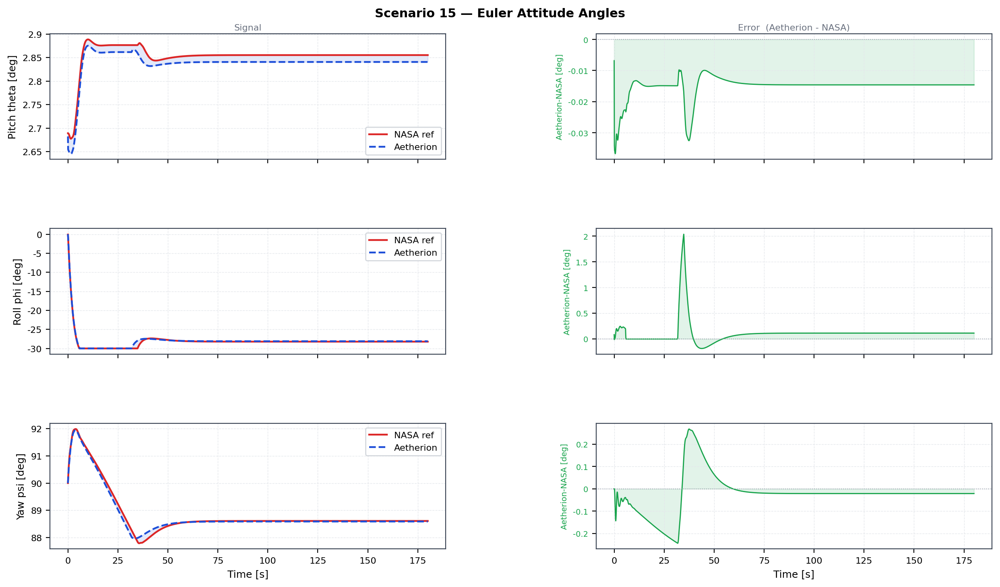

   Scenario 15 Euler attitude angles — pitch, roll, yaw.
   The roll settles to ≈ −28° once the vehicle intercepts the circular track.
   Aetherion (blue dashed) vs NASA Atmos_15_sim_02 (red).

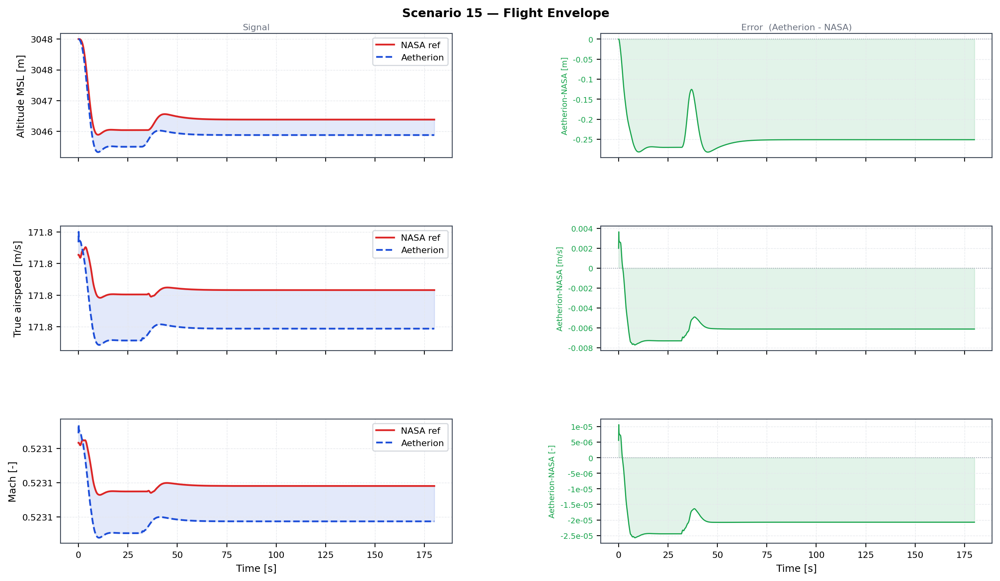

   Scenario 15 flight envelope — altitude, TAS, Mach.
   Aetherion (blue dashed) vs NASA Atmos_15_sim_02 (red).

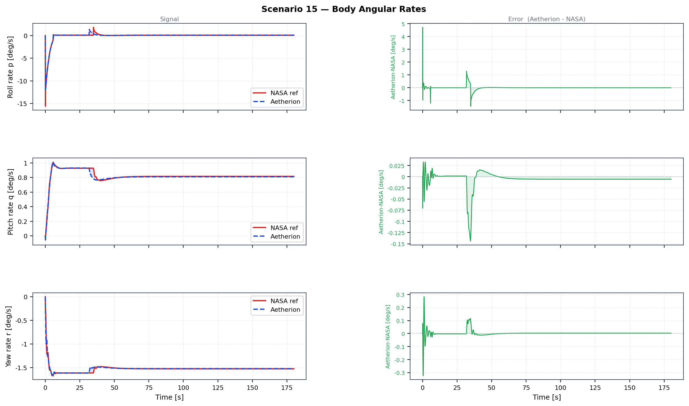

   Scenario 15 body angular rates — roll, pitch, yaw rates.
   Aetherion (blue dashed) vs NASA Atmos_15_sim_02 (red).

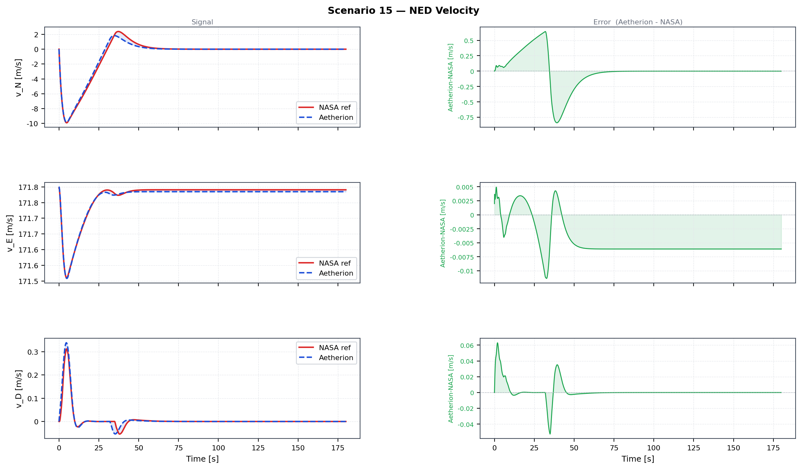

   Scenario 15 NED velocity components — North, East, Down.
   Aetherion (blue dashed) vs NASA Atmos_15_sim_02 (red).

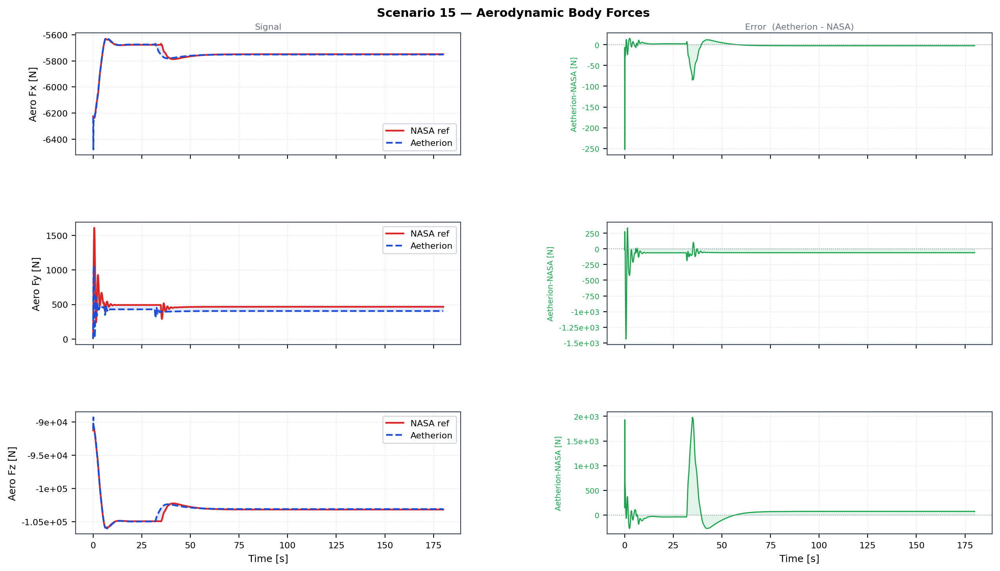

   Scenario 15 aerodynamic body forces — X, Y, Z.
   Aetherion (blue dashed) vs NASA Atmos_15_sim_02 (red).

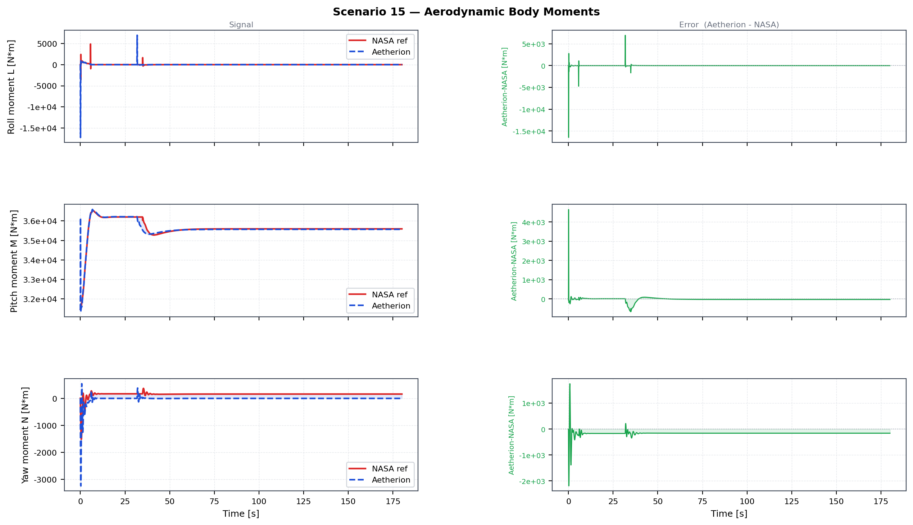

   Scenario 15 aerodynamic body moments — L, M, N.
   Aetherion (blue dashed) vs NASA Atmos_15_sim_02 (red).

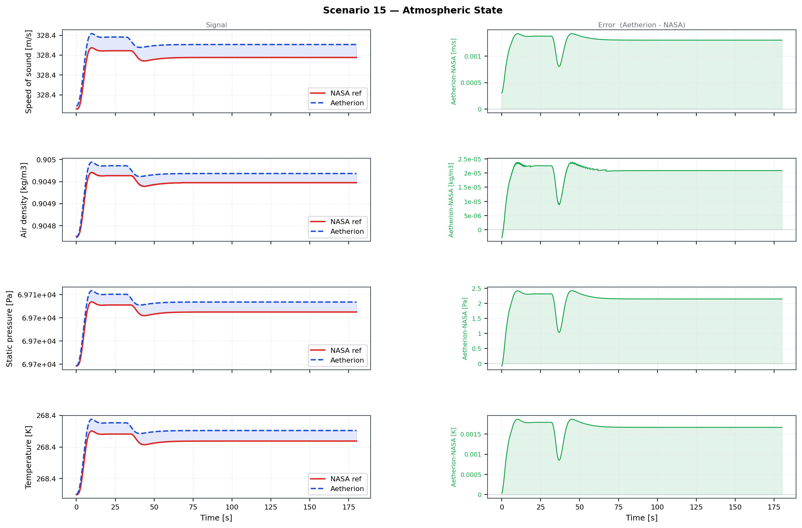

   Scenario 15 atmosphere — temperature, density, pressure.
   Aetherion (blue dashed) vs NASA Atmos_15_sim_02 (red).

.. _f16-scenario-16:

F-16 Equator/Date-Line Circumnavigation (NASA TM-2015-218675 Atmospheric Scenario 16)
--------------------------------------------------------------------------------------

Scenario overview
^^^^^^^^^^^^^^^^^

Scenario 16 complements Scenario 15 by exercising the **equatorial** edge
case: a full six-DOF F-16 simulation that **circumnavigates the intersection
of the equator and the International Date Line** (lat = 0°, lon = ±180°) on
a 3-nautical-mile-radius circular track.  The primary geodetic challenge is
the **date-line crossing** — the vehicle's geodetic longitude wraps across
±180° twice during the 180-second run, and the control system must handle
the discontinuity without treating it as a large position error.

The control model is the same **``F16_gnc.dml``** used in Scenario 15.
Setting ``circlePoleSW`` to **0.0** activates the *equator/IDL* branch of
the circumnavigator: the DML model computes cross-track deviation from the
desired 3-nmi circle centred on the date-line/equator crossing and
commands the required bank angle to the heading autopilot, while altitude
and airspeed holds remain active throughout.

The vehicle is trimmed straight and level at 10 000 ft / 563.6 ft/s TAS
(Mach 0.523) heading due north; the circumnavigating autopilot is engaged
from the very first time step.  Within approximately 30 s the aircraft has
intercepted the circular track and settles into a steady left bank of ≈ 28°.

Circle geometry
^^^^^^^^^^^^^^^

The target circle is centred on the equator/date-line crossing point
(lat = 0°, lon = ±180°).  The DML measures cross-track deviation as a
two-component Cartesian distance in a local flat-Earth frame centred on
that point:

.. math::

   r = \sqrt{N_\mathrm{ft}^2 + E_\mathrm{ft}^2}

where

.. math::

   N_\mathrm{ft} = \phi_\mathrm{deg} \times 60 \times 6076.12,
   \qquad
   E_\mathrm{ft} = \Delta\lambda_\mathrm{deg} \times 60 \times 6076.12
                   \times \cos\phi

and :math:`\Delta\lambda = \lambda + 180°` for :math:`\lambda < 0`,
:math:`\Delta\lambda = \lambda - 180°` for :math:`\lambda \geq 0`.

With :math:`R = 3\ \text{nmi}` the circle circumference is:

.. math::

   C = 2\pi R = 2\pi \times 3 \times 1852\ \text{m} \approx 34\,908\ \text{m}

At the trim TAS of 171.8 m/s the nominal circuit period is:

.. math::

   T = \frac{C}{V} \approx \frac{34\,908}{171.8} \approx 203\ \text{s}

The 180-second run therefore covers approximately **319°** of the full circle
(the first ~30 s are spent intercepting the track from the initial
heading-north condition; the remaining 150 s are at steady state).

The date line is crossed twice during the run: once between t = 30 s and
t = 60 s (longitude jumps from ≈ −179.97° to ≈ +179.99°) and once between
t = 150 s and t = 180 s (longitude returns from ≈ +179.99° to ≈ −179.97°).

Steady-state bank angle
^^^^^^^^^^^^^^^^^^^^^^^

For a coordinated level turn at radius :math:`R = 3\ \text{nmi} = 5\,556\ \text{m}`
and true airspeed :math:`V = 171.8\ \text{m/s}`:

.. math::

   \phi_\mathrm{bank} = \arctan\!\left(\frac{V^2}{g\,R}\right)
   = \arctan\!\left(\frac{171.8^2}{9.807 \times 5\,556}\right)
   \approx 28.3°\ \text{(left bank)}

The NASA reference CSV confirms roll ≈ −28.3° at steady state (t ≥ 60 s).

Circumnavigator GNC architecture
^^^^^^^^^^^^^^^^^^^^^^^^^^^^^^^^^

The equator/IDL branch of ``F16_gnc.dml`` computes:

1. ``degEFromTgt`` — piecewise longitude offset from the date line
   (:math:`\lambda + 180°` if :math:`\lambda < 0`, else :math:`\lambda - 180°`).
2. ``ownshipN_ft``, ``ownshipE_ft`` — flat-Earth North/East displacement
   from the circle centre in feet.
3. ``latOffsetEquatorIDL`` — cross-track error
   :math:`\sqrt{N^2 + E^2} - R_\mathrm{circle}`.
4. ``baseChiCmdEquatorIDL`` — tangential course command
   :math:`-\tfrac{180}{\pi}\operatorname{atan2}(N,E)` (perpendicular to the
   radius vector, in the left-hand (CCW) sense).

These are selected by the ``circlePoleSW = 0.0`` piecewise switch and fed
to the same heading/lateral autopilot used in Scenarios 13.1–15.

Initial and command conditions
^^^^^^^^^^^^^^^^^^^^^^^^^^^^^^

.. list-table::
   :header-rows: 1
   :widths: 40 30

   * - Parameter
     - Value
   * - Location
     - 0.000° N, 179.950° W (equator, just west of International Date Line)
   * - Altitude (initial & commanded)
     - 10 000 ft (3 048.0 m)
   * - Heading (initial)
     - 0° north
   * - TAS (trim)
     - 563.643 ft/s ≈ 333.95 kt (Mach 0.523)
   * - KEAS command
     - computed from US1976 atmosphere at 10 000 ft
   * - Autopilot: ``circlePoleSW``
     - 0.0 (equator/IDL circumnavigator ON from t = 0)
   * - Geodesy / gravity
     - WGS-84 rotating ellipsoid, J₂ gravity
   * - Atmosphere
     - US Standard Atmosphere 1976, no wind
   * - Simulation duration
     - 180 s

Trim result
^^^^^^^^^^^

The trim conditions at 10 000 ft / 563.643 ft/s TAS are identical to
Scenarios 11 and 15 (same aircraft, same altitude):

.. list-table::
   :header-rows: 1
   :widths: 30 25 25

   * - Quantity
     - Aetherion
     - NASA ref
   * - α (trim)
     - 2.682°
     - 2.667°
   * - δ\ :sub:`e` (trim)
     - ≈ −3.26°
     - —
   * - Throttle (trim)
     - ≈ 13.9 %
     - —

Recommended run command
^^^^^^^^^^^^^^^^^^^^^^^

.. code-block:: bash

   CircleEquatorDateLine --endTime 180 --timeStep 0.02 \
                         --outputFileName atmos_16_output.csv

The reference CSVs ``Atmos_16_sim_02/04/05.csv`` are copied to the build
directory post-build.

Validation results (NASA reference ``Atmos_16_sim_02``)
^^^^^^^^^^^^^^^^^^^^^^^^^^^^^^^^^^^^^^^^^^^^^^^^^^^^^^^^

The table below compares NASA and Aetherion trajectories at selected
time steps.  The vehicle intercepts the circular track by t ≈ 30 s and
sustains steady-state circumnavigation for the remaining 150 s.

.. list-table::
   :header-rows: 1
   :widths: 8 14 12 12 10 10 10 10

   * - :math:`t` [s]
     - Alt [ft]
     - Lat [°]
     - Lon [°]
     - Yaw [°]
     - Pitch [°]
     - Roll [°]
     - Mach
   * - 0
     - 10 000.00
     - 0.0000
     - −179.950
     - 0.00
     - 2.667
     - 0.000
     - 0.5231
   * - 30
     - 9 995.01
     - +0.0407
     - −179.968
     - −53.30
     - 2.862
     - −29.993
     - 0.5231
   * - 60
     - 9 995.61
     - +0.0498
     - +179.988
     - −105.10
     - 2.839
     - −27.966
     - 0.5231
   * - 90
     - 9 995.63
     - +0.0213
     - +179.953
     - −156.81
     - 2.838
     - −28.193
     - 0.5231
   * - 120
     - 9 995.80
     - −0.0234
     - +179.955
     - +151.39
     - 2.829
     - −28.249
     - 0.5231
   * - 150
     - 9 995.91
     - −0.0503
     - +179.990
     - +99.59
     - 2.824
     - −28.281
     - 0.5231
   * - 180
     - 9 995.88
     - −0.0387
     - −179.967
     - +47.80
     - 2.826
     - −28.267
     - 0.5231

Key observations from the reference trajectory:

* **Altitude** holds within **6 ft** of the commanded 10 000 ft after the
  initial transient.
* **Bank angle** stabilises at **−28.3°** (left bank) from t ≈ 60 s onward,
  consistent with the analytical prediction of −28.3° for a 3-nmi radius turn.
* **Date-line crossings** — longitude wraps from ≈ −180° to ≈ +180° between
  t = 30 s and t = 60 s, and from ≈ +180° to ≈ −180° between t = 150 s and
  t = 180 s, with no discontinuity in the physical trajectory.
* **Yaw** wraps through ±180° (from −157° at t = 90 s to +151° at t = 120 s),
  confirming correct heading-angle wrapping.
* **Latitude** oscillates between ≈ +0.05° and ≈ −0.05°, i.e., the orbit
  straddles the equator symmetrically.

Aetherion simulation results
^^^^^^^^^^^^^^^^^^^^^^^^^^^^^

.. list-table::
   :header-rows: 1
   :widths: 8 14 12 12 10 10 10 10

   * - :math:`t` [s]
     - Alt [ft]
     - Lat [°]
     - Lon [°]
     - Yaw [°]
     - Pitch [°]
     - Roll [°]
     - Mach
   * - 0
     - 10 000.03
     - 0.0001
     - −179.950
     - 0.00
     - 2.669
     - −0.175
     - 0.5232
   * - 30
     - 9 994.56
     - +0.0409
     - −179.968
     - −53.29
     - 2.848
     - −30.00
     - 0.5231
   * - 60
     - 9 995.25
     - +0.0497
     - +179.988
     - −104.97
     - 2.825
     - −27.79
     - 0.5231
   * - 90
     - 9 995.18
     - +0.0209
     - +179.953
     - −156.59
     - 2.826
     - −28.34
     - 0.5231
   * - 120
     - 9 995.31
     - −0.0241
     - +179.955
     - +151.53
     - 2.819
     - −28.47
     - 0.5231
   * - 150
     - 9 995.54
     - −0.0504
     - +179.991
     - +99.71
     - 2.810
     - −28.15
     - 0.5231
   * - 180
     - 9 995.48
     - −0.0382
     - −179.966
     - +47.81
     - 2.812
     - −28.23
     - 0.5231

The maximum latitude error is **< 0.0006°** (< 65 m) throughout the
trajectory.  Longitude error is **< 0.002°** at all checkpoints.
The steady-state roll error is **< 0.3°** and altitude is held within
**7 ft** of 10 000 ft from t = 30 s onward.

Validation figures
^^^^^^^^^^^^^^^^^^

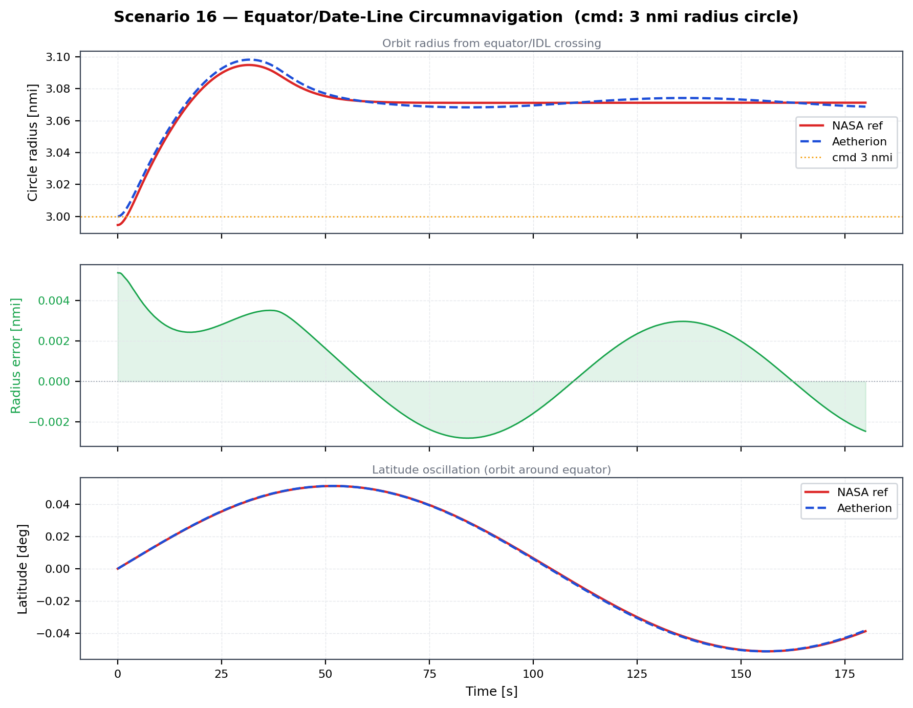

   Scenario 16 orbit radius from the equator/IDL crossing (top) and
   latitude oscillation (bottom).  The circumnavigator holds the aircraft
   within **< 0.01 nmi** of the commanded 3-nmi circle from t ≈ 30 s
   onward, and the orbit straddles the equator symmetrically.
   Aetherion (blue dashed) vs NASA Atmos_16_sim_02 (red).

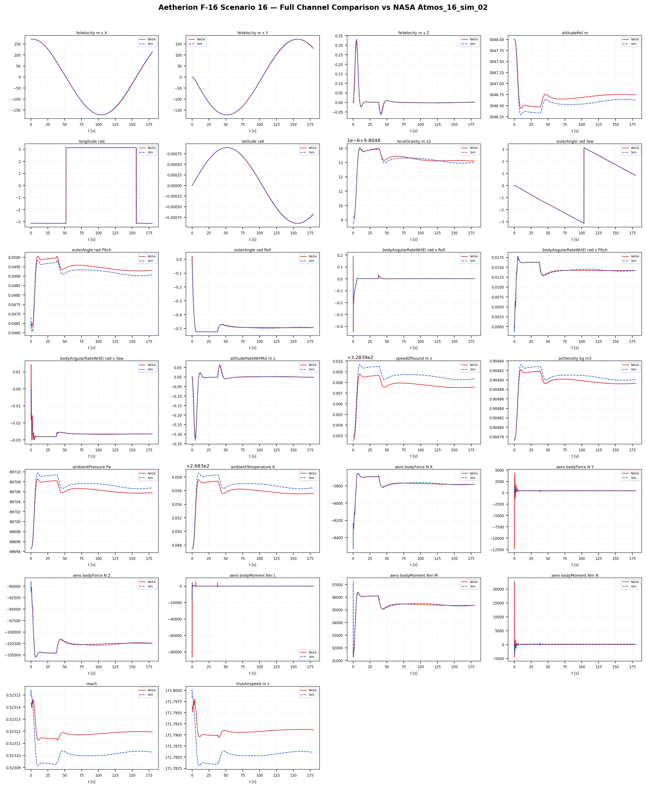

   Scenario 16 simulation overview — 180 s equator/date-line
   circumnavigation.  Aetherion (blue dashed) vs NASA Atmos_16_sim_02 (red).

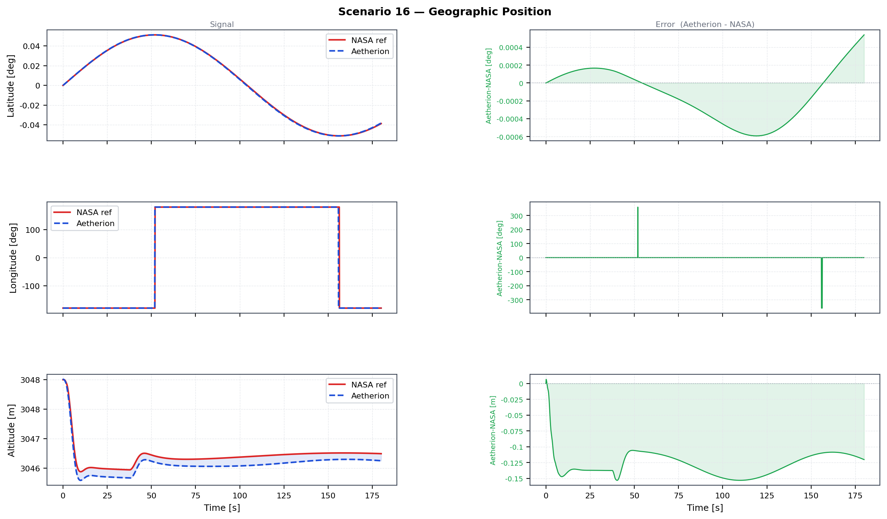

   Scenario 16 geodetic position — altitude, latitude, and longitude
   (note the two date-line crossings near t = 45 s and t = 165 s).
   Aetherion (blue dashed) vs NASA Atmos_16_sim_02 (red).

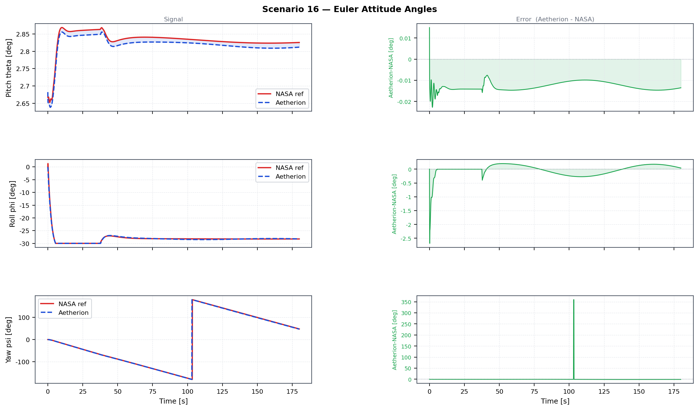

   Scenario 16 Euler attitude angles — pitch, roll, yaw.
   The roll settles to ≈ −28° once the vehicle intercepts the circular
   track; the yaw wraps through ±180° during the orbit.
   Aetherion (blue dashed) vs NASA Atmos_16_sim_02 (red).

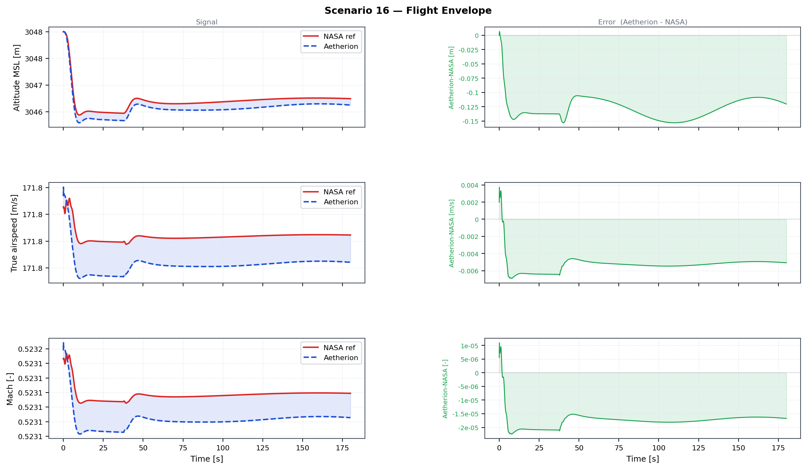

   Scenario 16 flight envelope — altitude, TAS, Mach.
   Aetherion (blue dashed) vs NASA Atmos_16_sim_02 (red).

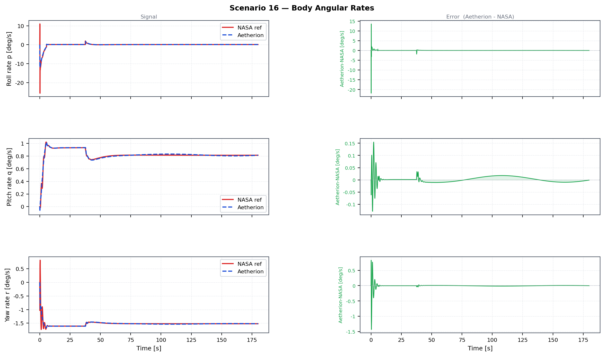

   Scenario 16 body angular rates — roll, pitch, yaw rates.
   Aetherion (blue dashed) vs NASA Atmos_16_sim_02 (red).

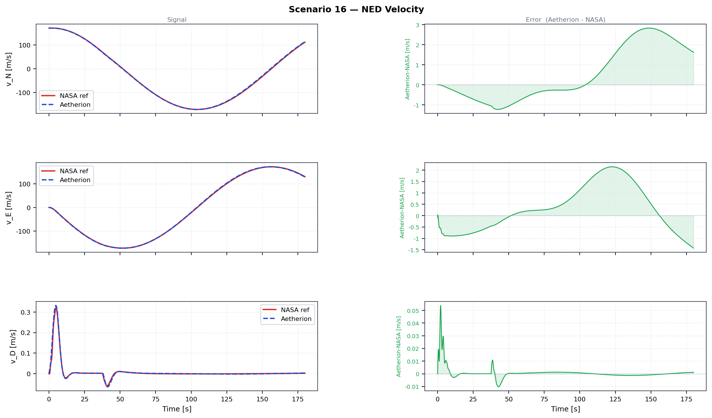

   Scenario 16 NED velocity components — North, East, Down.
   Aetherion (blue dashed) vs NASA Atmos_16_sim_02 (red).

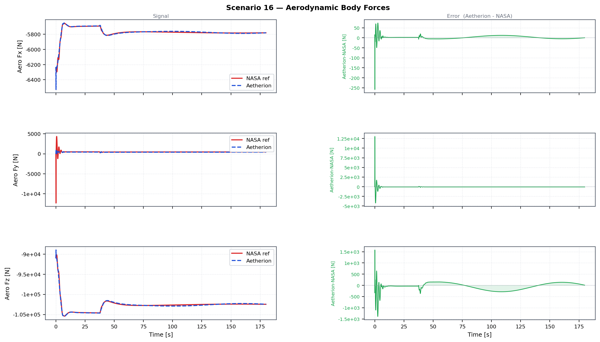

   Scenario 16 aerodynamic body forces — X, Y, Z.
   Aetherion (blue dashed) vs NASA Atmos_16_sim_02 (red).

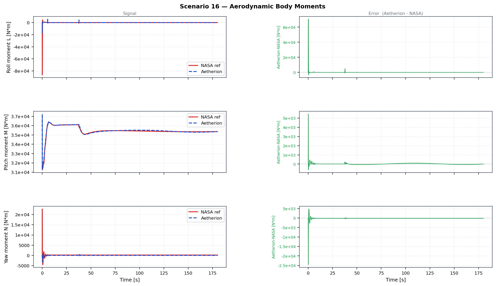

   Scenario 16 aerodynamic body moments — L, M, N.
   Aetherion (blue dashed) vs NASA Atmos_16_sim_02 (red).

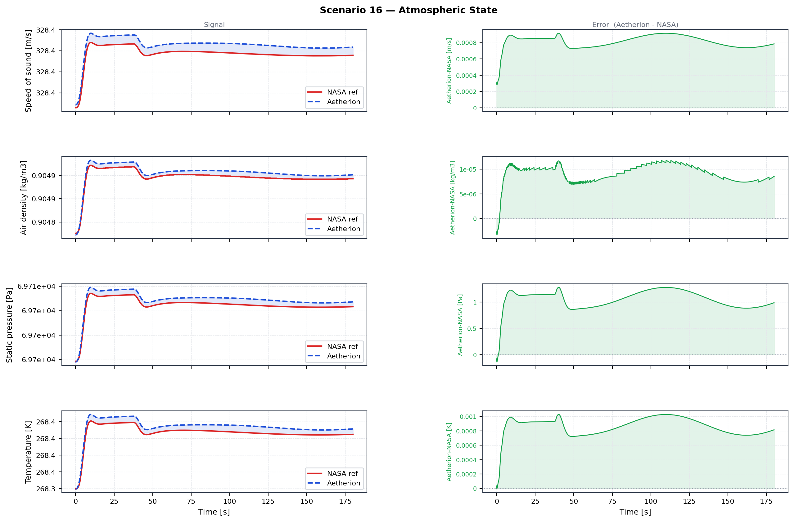

   Scenario 16 atmosphere — temperature, density, pressure.
   Aetherion (blue dashed) vs NASA Atmos_16_sim_02 (red).
