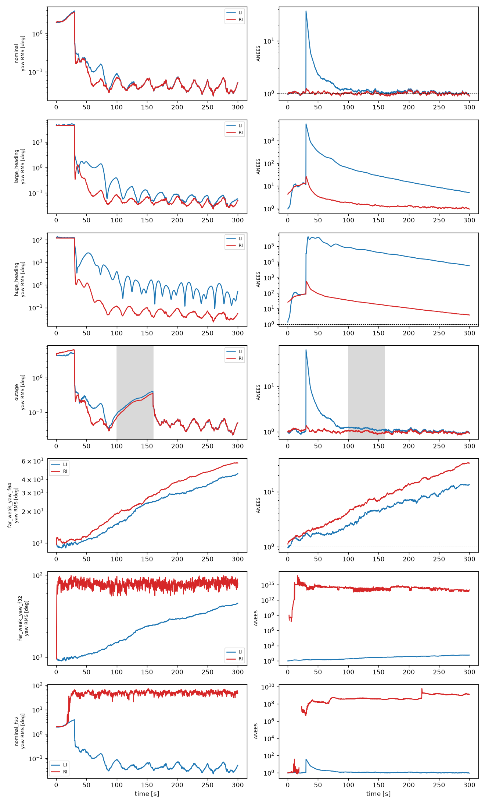

.. ------------------------------------------------------------------------------
.. Project: Aetherion
.. Copyright (c) 2025-2026, Onur Tuncer, PhD, Istanbul Technical University
..
.. SPDX-License-Identifier: MIT
.. License-Filename: LICENSE
.. ------------------------------------------------------------------------------

.. _sensor-fusion:

Sensor Fusion: Approach
=======================

.. contents::
   :local:
   :depth: 2

This chapter describes how Aetherion will estimate the state of a flight
vehicle from IMU, GNSS and barometer measurements: how the work is split
with the Hemerion flight software, the filter form, the navigation frame,
how the error state is built, and how the filter will be validated against
truth. It records decisions as they are taken. Where a decision is still
open, both options are given with their consequences.

.. note::

   **Status (v0.16.1).** Step 2 (block scheme, vehicle configuration, log
   contract) is implemented in ``Aetherion/Estimation/Blocks.h``,
   ``Configuration.h`` and ``LogContract.h``. There is no filter yet;
   ``EKF.h``, ``EstimationState.h``, ``MeasurementModels.h`` and
   ``ProcessModel.h`` are placeholders. The working plan is
   ``TODO-sensor-fusion.md`` at the repository root.

Scope and ownership
-------------------

Sensor fusion is split between two repositories.

.. list-table::
   :header-rows: 1
   :widths: 20 40 40

   * -
     - Aetherion (MIT)
     - Hemerion (GPL-3.0)
   * - Owns
     - Truth (plant FMUs, environment), estimator mathematics: state blocks,
       process and measurement models, a double-precision reference filter,
       the code generator, consistency analysis.
     - Everything a sensor touches: sensor FMUs (GPS, IMU, BMP390,
       MMC5983MA, radar altimeter), drivers, arrival time-stamping, the
       flight computer, co-simulation hosts.
   * - Produces
     - Generated plain C for :math:`f`, :math:`h` and their Jacobians, a
       configuration header, golden test vectors.
     - Co-simulation logs: decoded sensor samples and plant truth.

**Dependency direction.** Aetherion never depends on Hemerion. It replays
the logs that Hemerion's co-simulation hosts write. Generated code flows
from Aetherion to Hemerion; sensor code never flows back. This keeps the
licences compatible and means the estimator can be developed and validated
without the flight software in the build.

**Steps.** The work is ordered in numbered steps shared by both
repositories' TODO files:

.. list-table::
   :header-rows: 1
   :widths: 10 20 70

   * - Step
     - Repository
     - Content
   * - 2
     - Aetherion
     - Block scheme, vehicle configuration, configuration hash, log contract.
   * - 3, 4
     - Hemerion
     - Sensor FMUs publish realised bias values; filter rates.
   * - 5
     - Aetherion
     - Process and measurement models, scalar-templated and AD-friendly.
   * - 6
     - Aetherion
     - Reference EKF (double precision), replay harness, time base,
       delayed GNSS measurements, NEES/NIS.
   * - 7, 7b
     - Aetherion
     - Tuning and observability on the check cases; float32 and covariance
       form.
   * - 8
     - Aetherion
     - Code generation (CppADCodeGen) and golden vectors.
   * - 9
     - Hemerion
     - Replay equivalence of the embedded filter against the golden vectors.

Filter form
-----------

The estimator is an invariant extended Kalman filter (IEKF)
:cite:`barrau2017iekf,barrau2018invariant` on the group of extended poses,
with Euclidean bias states appended.

State space
^^^^^^^^^^^

The navigation core is one element of :math:`\SE_2(3)`, the group of
*extended poses* (rotation plus two vectors):

.. math::

   X =
   \begin{bmatrix}
     R & v & p \\
     0_{1\times 3} & 1 & 0 \\
     0_{1\times 3} & 0 & 1
   \end{bmatrix},
   \qquad R \in \SO(3),\quad v, p \in \R^3,

with :math:`R \equiv {}^{L}\!R_{B}` the attitude (body :math:`B` to
navigation frame :math:`L`, see :ref:`sensor-fusion-frame`), and
:math:`v, p` the inertial velocity and position resolved in :math:`L`.
Composition is matrix multiplication,

.. math::

   X_1 X_2 = (R_1 R_2,\; R_1 v_2 + v_1,\; R_1 p_2 + p_1).

The group has dimension 9. A tangent vector is
:math:`\xi = (\phi, \nu, \rho) \in \R^9`, with hat map

.. math::

   \xi^\wedge =
   \begin{bmatrix}
     [\phi]_\times & \nu & \rho \\
     0_{2\times 3} & 0 & 0
   \end{bmatrix}.

The exponential map has a closed form built from the :math:`\SO(3)`
exponential and left Jacobian :math:`J_l(\phi)`,

.. math::

   \Exp(\xi) = \big(\Exp(\phi),\; J_l(\phi)\,\nu,\; J_l(\phi)\,\rho\big),

so it reuses ``ODE/RKMK/Lie/SO3.h`` (see :ref:`group-exp-log` for the
:math:`\SE(3)` case).

The full state is :math:`\SE_2(3) \times \R^7`: the navigation core plus a
gyro bias :math:`b_g \in \R^3`, an accelerometer bias :math:`b_a \in \R^3`
and a barometer bias :math:`b_p \in \R`.

Kinematics and the group-affine property
^^^^^^^^^^^^^^^^^^^^^^^^^^^^^^^^^^^^^^^^

With :math:`\tilde\omega, \tilde a` the gyro and accelerometer readings,
the strapdown kinematics in the inertial frame :math:`L` are

.. math::

   \dot R = R\,[\tilde\omega - b_g]_\times, \qquad
   \dot v = R\,(\tilde a - b_a) + g_L(p), \qquad
   \dot p = v,
   \qquad \dot b_g = w_g,\quad \dot b_a = w_a,\quad \dot b_p = w_p,

(white noise on the readings omitted). A system :math:`\dot X = f_u(X)` is
*group-affine* :cite:`barrau2017iekf` if, for all :math:`X_1, X_2`,

.. math::

   f_u(X_1 X_2) = f_u(X_1)\,X_2 + X_1\,f_u(X_2) - X_1\,f_u(I)\,X_2 .

For constant gravity the navigation kinematics above are group-affine. The
consequence is that the left- and right-invariant errors defined below obey
dynamics that do **not** depend on the state estimate. The
linearisation is then exact for the navigation error, a poor initial
attitude does not corrupt the propagation Jacobian, and in the
deterministic setting the filter is a locally stable observer
:cite:`barrau2017iekf`.

Two things break the property in this filter, both mildly:

* **Gravity varies with position.** :math:`g_L(p)` is evaluated with the
  WGS-84 model (:ref:`sensor-fusion-frame`). Its gradient
  :math:`G = \partial g_L / \partial p` is of order
  :math:`\mu / r^3 \approx 1.5\times 10^{-6}\,\mathrm{s^{-2}}` (the square
  of the Schuler frequency). It adds an estimate-dependent term that is
  negligible over flights of minutes: a 100 m position error gives about
  :math:`10^{-4}\,\mathrm{m/s^2}`.
* **Biases.** Bias states do not fit the group structure. They are kept as
  Euclidean states (the "imperfect IEKF" of :cite:`hartley2020contact`),
  and their coupling into the navigation error is where the two error
  conventions differ (below).

Error convention (open)
^^^^^^^^^^^^^^^^^^^^^^^

.. important::

   **Not yet decided, and deliberately not blocking.** Step 5 is written
   with the convention as a *template parameter* of the process and
   measurement models, so both filters exist from the first commit and the
   decision is taken on evidence (:ref:`sensor-fusion-convention-evidence`),
   not in advance. The configuration descriptor of step 2 names the
   convention, so each choice has its own configuration hash; the
   implementation currently carries ``right-invariant`` as a provisional
   value. Only the configuration that is generated for the flight computer
   (step 8) has to commit to one.

The two candidate errors on the navigation core, with :math:`\hat X` the
estimate and :math:`\zeta = b - \hat b` the bias error, are

.. math::

   \text{right-invariant:}\quad \eta_R = X \hat X^{-1} = \Exp(\xi),
   \qquad X \approx (I + \xi^\wedge)\,\hat X,

.. math::

   \text{left-invariant:}\quad \eta_L = \hat X^{-1} X = \Exp(\xi),
   \qquad X \approx \hat X\,(I + \xi^\wedge).

To first order, the right-invariant components are world-frame quantities,
:math:`v - \hat v = \nu + [\phi]_\times \hat v` (and likewise for
:math:`p`). The left-invariant ones are body-frame quantities,
:math:`v - \hat v = \hat R\,\nu`.

**Propagation.** With :math:`\hat\omega = \tilde\omega - \hat b_g` and
:math:`\hat a = \tilde a - \hat b_a`, and constant gravity:

.. math::

   \text{RI:}\quad
   \dot\xi =
   \underbrace{\begin{bmatrix}
     0 & 0 & 0 \\ [g]_\times & 0 & 0 \\ 0 & I & 0
   \end{bmatrix}}_{A_R}\xi
   \;-\; \Ad_{\hat X}
   \begin{bmatrix} \zeta_g \\ \zeta_a \\ 0 \end{bmatrix},
   \qquad
   \Ad_{\hat X} =
   \begin{bmatrix}
     \hat R & 0 & 0 \\
     [\hat v]_\times \hat R & \hat R & 0 \\
     [\hat p]_\times \hat R & 0 & \hat R
   \end{bmatrix},

.. math::

   \text{LI:}\quad
   \dot\xi =
   \underbrace{\begin{bmatrix}
     -[\hat\omega]_\times & 0 & 0 \\
     -[\hat a]_\times & -[\hat\omega]_\times & 0 \\
     0 & I & -[\hat\omega]_\times
   \end{bmatrix}}_{A_L(\hat\omega,\,\hat a)}\xi
   \;-\;
   \begin{bmatrix} \zeta_g \\ \zeta_a \\ 0 \end{bmatrix}.

In the RI form the navigation block is constant, but the bias coupling and
the process noise (:math:`\Ad_{\hat X}\, Q\, \Ad_{\hat X}^{\mathsf T}`)
depend on the estimate. In the LI form the navigation block depends on the
IMU readings, but not on the estimate, and the bias coupling is constant.

**Measurements.** A GNSS position fix is :math:`Y = p + V`; in the group's
terms, :math:`Y = X b` with :math:`b = (0, 0, 1)`, which
:cite:`barrau2017iekf` calls a *left-invariant observation*. GNSS velocity
is the same with :math:`b = (0, 1, 0)`. A magnetometer reading
:math:`Y = R^{\mathsf T} m` is a *right-invariant observation*,
:math:`Y = X^{-1} b`. The innovation Jacobians on the navigation core are:

.. list-table::
   :header-rows: 1
   :widths: 25 35 40

   * - Measurement
     - RI: :math:`H` on :math:`(\phi, \nu, \rho)`
     - LI: :math:`H` on :math:`(\phi, \nu, \rho)`
   * - GNSS position
     - :math:`[\,-[\hat p]_\times,\; 0,\; I\,]`
     - :math:`[\,0,\; 0,\; I\,]`, innovation
       :math:`\hat R^{\mathsf T}(Y - \hat p)`
   * - GNSS velocity
     - :math:`[\,-[\hat v]_\times,\; I,\; 0\,]`
     - :math:`[\,0,\; I,\; 0\,]`, innovation
       :math:`\hat R^{\mathsf T}(Y - \hat v)`
   * - Barometer :math:`h(p) + b_p`
     - :math:`\nabla h^{\mathsf T}[\,-[\hat p]_\times,\; 0,\; I\,]`
     - :math:`\nabla h^{\mathsf T}[\,0,\; 0,\; \hat R\,]`
   * - Magnetometer (deferred)
     - :math:`[\,[m]_\times,\; 0,\; 0\,]`, innovation
       :math:`\hat R Y - m`
     - :math:`[\,[\hat R^{\mathsf T} m]_\times,\; 0,\; 0\,]`

Each pairing (world-frame measurement with LI, body-frame measurement with
RI) gives a constant Jacobian; the other pairing gives one that depends on
the estimate. The barometer is a nonlinear function of position and depends
on the estimate either way.

**Trade-off for this filter.**

.. list-table::
   :header-rows: 1
   :widths: 34 33 33

   * -
     - Right-invariant
     - Left-invariant
   * - Navigation error dynamics
     - Constant (gravity only)
     - IMU-dependent, estimate-independent
   * - Bias coupling
     - :math:`-\Ad_{\hat X}`, estimate-dependent
     - :math:`-I`, constant
   * - GNSS position / velocity :math:`H`
     - Estimate-dependent
     - Constant
   * - Magnetometer :math:`H` (later)
     - Constant
     - Estimate-dependent
   * - Size of the coupling terms in LCI
     - :math:`[\hat p]_\times` with :math:`\lVert\hat p\rVert` up to
       :math:`\sim 10^5` m: 1 mrad of :math:`\phi` maps to
       :math:`\sim 100` m in :math:`\rho`
     - Bounded by :math:`\lVert\hat R\rVert = 1`

The first configuration is updated by world-frame measurements only (GNSS
position, GNSS velocity, barometric altitude) and carries biases, which
points to LI on structural grounds. The RI form keeps the navigation block
constant and anticipates the magnetometer. The structural arguments do not
settle the question, so it is settled on evidence (below).

First-order equivalence
^^^^^^^^^^^^^^^^^^^^^^^

The two errors are related exactly by the adjoint of the estimate,
:math:`\eta_R = \hat X \eta_L \hat X^{-1}`, so
:math:`\xi_R = \Ad_{\hat X}\,\xi_L` and
:math:`P_R = \Ad_{\hat X} P_L \Ad_{\hat X}^{\mathsf T}`. Pushing this map
through every step of the filter: the propagation matrices, the bias
couplings and the process noise map onto each other exactly, and so do the
measurement Jacobians (:math:`H_R \Ad_{\hat X} = H_L`, up to the rotation of
the innovation by :math:`\hat R^{\mathsf T}`), the gains and the corrected
state (because :math:`\hat X \Exp(\xi) \hat X^{-1} = \Exp(\Ad_{\hat X}\xi)`).
The one place they differ is **after an update**: the estimate jumps from
:math:`\hat X^-` to :math:`\hat X^+`, each filter keeps its covariance
unchanged, and the two are then no longer related by
:math:`\Ad_{\hat X^+}` but differ by about
:math:`\Ad_{\Exp(\delta)} \approx I + \ad_\delta`. The difference is
second order in the correction :math:`\delta`: negligible for small
corrections, decisive for large ones.

So the conventions differ in two respects only: behaviour under **large
corrections** (initial heading error, onset of heading observability,
reacquisition after an outage) and **numerics** (the coordinates the
covariance is stored in).

.. _sensor-fusion-convention-evidence:

Evidence: Monte Carlo prototype
^^^^^^^^^^^^^^^^^^^^^^^^^^^^^^^

``scripts/iekf_convention_mc.py`` is a NumPy prototype of the first
configuration with the convention as a switch. Both conventions see the same
truth, the same sensor samples and the same initial error (paired runs), so
every difference is the convention's.

* **Model.** LCI frame, point-mass gravity with its gradient, MEMS-class IMU
  (gyro 5·10⁻⁵ rad/s/√Hz, accelerometer 7·10⁻⁴ m/s²/√Hz, random-walk
  biases), GNSS position (1.5 m horizontal, 3 m vertical) and velocity
  (0.1 m/s) at 5 Hz, barometric height with random-walk bias at 10 Hz, IMU at
  50 Hz. Truth is an F-16-like flight at 250 m/s: 30 s straight, then S-turns
  up to about 35° of bank, with light turbulence; or straight throughout.
  Initial covariance is given in physical coordinates and mapped to each
  convention, so both start equivalent. Joseph-form update, no covariance
  reset after updates (standard IEKF practice).
* **Not modelled.** Geodetic and ECEF mapping, latency, lever arm. These are
  the same for both conventions.
* **Verification.** Every entry of :math:`F` and :math:`H` in both
  conventions was checked against central finite differences of the full
  nonlinear propagation and measurement functions. This check found that RI
  needs :math:`F` averaged over the step: its bias coupling
  :math:`-\Ad_{\hat X}` contains :math:`[\hat p]_\times \hat R`, which changes
  within one IMU step at a rate of about :math:`\lVert\hat p\rVert
  \lVert\omega\rVert`, so a start-of-step :math:`F` is only first-order
  accurate (an error of about :math:`\tfrac12\, dt\, \lVert\hat p\rVert
  \lVert\omega\rVert` in that entry). LI is second-order either way, because
  the corresponding variation sits inside :math:`A_L`. With a trapezoidal
  :math:`F` both match the finite differences to :math:`O(dt^2)`. This is an
  implementation requirement for step 5.

Results, 30 paired runs per scenario, 300 s each (``--runs 30 --seed 1``).
ANEES is averaged over the last two thirds of the run (1 is consistent);
"converged" is the median time after which the yaw error stays below 1°;
"failed" counts runs whose covariance lost positive definiteness.

.. list-table::
   :header-rows: 1
   :widths: 24 8 12 12 14 14 8

   * - Scenario
     - Conv.
     - ANEES
     - Final yaw RMS [°]
     - Final pos. RMS [m]
     - Converged [s]
     - Failed
   * - Nominal (yaw σ 2°)
     - LI / RI
     - 1.06 / 1.00
     - 0.052 / 0.052
     - 0.31 / 0.31
     - 30 / 30
     - 0 / 0
   * - Heading error 45°
     - LI / RI
     - 20.1 / 1.26
     - 0.058 / 0.051
     - 0.32 / 0.31
     - 77 / 37
     - 0 / 0
   * - Heading error 120°
     - LI / RI
     - 2.8·10⁴ / 13.3
     - 0.53 / 0.054
     - 2.7 / 0.32
     - 80 (2 never) / 48
     - 0 / 0
   * - GNSS outage 100–160 s
     - LI / RI
     - 1.07 / 0.97
     - 0.049 / 0.049
     - 0.34 / 0.34
     - 30 / 30
     - 0 / 0
   * - 158 km out, straight, yaw σ 10°, float64
     - LI / RI
     - 7.3 / 14.9
     - 45 / 57
     - 0.31 / 0.31
     - never / never
     - 0 / 0
   * - Same, float32 covariance
     - LI / RI
     - 7.3 / 1.8·10¹⁴
     - 45 / 80
     - 0.31 / 5.4·10⁴
     - never / never
     - 0 / 30
   * - Nominal, float32 covariance
     - LI / RI
     - 1.06 / 7.5·10⁸
     - 0.052 / 48
     - 0.31 / 300
     - 30 / never
     - 0 / 30

During the outage the maximum position error was 59 m (LI) and 51 m (RI);
ANEES in the 20 s after reacquisition was 1.06 and 0.96.

   Yaw RMS (left) and ANEES (right) against time, LI blue, RI red; grey band
   is the GNSS outage.

**Findings.**

1. **Equivalent in normal operation**, as the first-order argument predicts:
   same final accuracy, same behaviour through a 60 s GNSS outage and at
   reacquisition.
2. **RI handles large corrections better.** With 45° and 120° of initial
   heading error RI converges about twice as fast and stays close to
   consistent. LI becomes badly overconfident when heading first becomes
   observable, and with 120° two LI runs never converge. The effect is
   visible even in the nominal case: at the first turn (t = 30 s), when
   heading becomes observable, LI's ANEES spikes to about 30 and takes some
   70 s to recover, while RI stays at 1.
3. **LI is robust in float32; RI is not.** With a plain Joseph-form
   covariance in float32, RI loses positive definiteness in every run: at
   the first update when 158 km from the origin, and within 3–10 s (at
   :math:`\lVert\hat p\rVert` of 1–2.5 km) in the nominal case, after which
   the estimate diverges. LI in float32 reproduces its float64 results to
   every printed digit. This confirms the conditioning argument above: RI
   stores world-frame coordinates coupled through :math:`[\hat p]_\times`
   and :math:`[\hat v]_\times`.
4. **Long unobservable yaw: both overconfident.** In 300 s of straight
   flight, yaw and the vertical gyro bias are unobservable and the yaw error
   grows to about 50°. Both filters become overconfident, RI more so (ANEES
   14.9 against 7.3).

**Caveats.** One trajectory family and one sensor grade; no covariance
reset after updates; float32 tested only with the Joseph form. A covariance
reset (re-anchoring :math:`P` with :math:`\Ad_{\Exp(\delta)}` or the
corresponding Jacobian after each update) acts exactly on the second-order
term where the conventions differ, and may narrow finding 2. A UD or
square-root covariance may rescue RI in float32 (finding 3). Both are the
next experiments.

**Implications.** The evidence does not pick a single winner. It frames the
decision as **robustness to large heading errors (RI) against
single-precision robustness (LI)**:

* Without a magnetometer, initial heading is the hard part of the first
  configuration outside simulation, which favours RI.
* If the flight computer runs the filter in float32, RI needs a
  square-root or UD covariance at least, and that is unproven; LI works with
  the Joseph form.
* Remaining experiments, in order: covariance reset in both conventions; RI
  with UD / square-root covariance in float32; a sweep of initial heading
  error (5°, 10°, 20°) to find where LI stops being consistent, since a
  heading initialiser only needs to beat that bound; a second trajectory
  family (the rocket ascent).

Step 5 keeps both conventions behind the template parameter until these are
done.

.. _sensor-fusion-frame:

Navigation frame: launch-centred inertial
-----------------------------------------

Definition
^^^^^^^^^^

The navigation frame :math:`L` is **launch-centred inertial** (LCI). Its
origin is the launch or take-off point and its axes are the local NED axes
at the initial time :math:`t_0`, frozen in inertial space from then on (they
do not rotate with the Earth). With :math:`W` the ECI frame, :math:`E` ECEF
and :math:`N` local NED (notation of :doc:`frames_notation` and
:doc:`launch_initialization`):

.. math::

   r_{W,0} = {}^{W}\!R_{E}(t_0)\, r_E(\varphi_0, \lambda_0, h_0),
   \qquad
   {}^{W}\!R_{L} = {}^{W}\!R_{E}(t_0)\; {}^{E}\!R_{N}(\varphi_0, \lambda_0),

.. math::

   p = {}^{L}\!R_{W}\,\big(r_W - r_{W,0}\big), \qquad
   v = {}^{L}\!R_{W}\,\dot r_W, \qquad
   g_L(p) = {}^{L}\!R_{W}\; g_W\!\big(r_{W,0} + {}^{W}\!R_{L}\, p\big).

:math:`L` differs from ECI by a constant rotation and translation, so it is
inertial. The origin :math:`(\varphi_0, \lambda_0, h_0)` is read from the
run-configuration sidecar of the replayed log (``lat0_deg``, ``lon0_deg``,
``alt0_ft``).

Why not local NED or ECEF
^^^^^^^^^^^^^^^^^^^^^^^^^

**Local NED** about a fixed origin, with Earth rate neglected, is exactly
group-affine under its own model. But Aetherion's truth runs in ECI and the
IMU measures inertial rates and specific force, so that model is wrong by:

* Earth rate, :math:`15^\circ/\mathrm{h}`. It rotates with attitude in the
  body frame, so the gyro bias state cannot absorb it; over 10 min of weakly
  observable yaw this is about :math:`2.5^\circ`.
* Coriolis, :math:`2\,\omega_\oplus \times v`: about 3.6 mg at 250 m/s, the
  size of a MEMS accelerometer bias.
* Gravity direction: at distance :math:`d` from the origin the local
  vertical is tilted by :math:`d/R_\oplus` (:math:`0.45^\circ` at 50 km),
  which the filter would read as tilt error.

It also cannot carry the rocket to orbit.

**ECEF** loses the group-affine property. Applying the test above to the
ECEF strapdown model (Earth rate, Coriolis, centrifugal) with
:math:`\Omega = -[\omega_\oplus]_\times`, the rotation and position rows
pass, but the velocity row leaves the residual

.. math::

   (\Omega R_1 - R_1 \Omega)\,(v_2 + \Omega\, p_2) \neq 0 .

ECEF (or ECI) positions are also about :math:`6.4\times 10^6` m, which
float32 resolves to only about 0.5 m, the same as one 500 Hz integration
step at 250 m/s.

In LCI there are no Earth-rate or Coriolis terms, the only violation of the
group-affine property is the gravity gradient, truth and IMU are compared
like with like, the same frame serves the rocket, and positions stay around
:math:`10^5` m (float32 resolution of a few centimetres).

Costs
^^^^^

* Gravity is evaluated at the estimated position, not taken as constant.
* GNSS measurements are mapped through the time-dependent rotation
  :math:`{}^{W}\!R_{E}(t)`:

  .. math::

     Y_p = {}^{L}\!R_{W}\big({}^{W}\!R_{E}(t)\, r_E(\varphi, \lambda, h) - r_{W,0}\big),
     \qquad
     Y_v = {}^{L}\!R_{W}\; {}^{W}\!R_{E}(t)\,
           \big({}^{E}\!R_{N}(\varphi,\lambda)\, v_{N} + \omega_\oplus \times r_E\big).

  GNSS velocity is Earth-relative; the transport term
  :math:`\omega_\oplus \times r_E` (up to 465 m/s) makes it inertial.
* **Time base.** A timing error :math:`\delta t` rotates the ECEF-to-LCI
  mapping by :math:`\omega_\oplus\,\delta t`, about 0.47 m per millisecond at
  the Earth's radius. The replay time-base calibration (step 6) must leave a
  residual well below 1 ms.
* Heading and yaw covariance are reported by rotating into the current local
  NED frame.

Error-state composition
-----------------------

Blocks
^^^^^^

The error state is composed from named **blocks**, each with a fixed
dimension, units, frame and process model (``Aetherion/Estimation/Blocks.h``):

.. list-table::
   :header-rows: 1
   :widths: 16 8 22 10 18 10

   * - Block
     - Dim
     - Units
     - Frame
     - Process model
     - Rank
   * - ``nav_core``
     - 9
     - rad, m/s, m (:math:`\phi, \nu, \rho`)
     - LCI
     - strapdown
     - 0
   * - ``gyro_bias``
     - 3
     - rad/s
     - body
     - random walk
     - 1
   * - ``accel_bias``
     - 3
     - m/s²
     - body
     - random walk
     - 2
   * - ``baro_bias``
     - 1
     - m of pressure altitude
     - --
     - random walk
     - 3

The block's position in the error vector is fixed by its **rank**, never by
the order a configuration lists blocks, so the navigation core is always
first and two configurations that share a block agree on its layout. The
barometer bias is a random walk, not a constant: a temperature offset gives a
pressure-altitude error that grows with height, so the bias drifts in a
climb.

Vehicle configuration
^^^^^^^^^^^^^^^^^^^^^

A **configuration** (``Configuration.h``) selects blocks and measurements at
build time. Each measurement declares the blocks it depends on, and a
configuration that selects a measurement without its blocks is rejected.
Whether a measurement is available at run time (no GNSS fix, barometer below
its rated floor) is handled by skipping updates, never by resizing the
state.

The first configuration, ``kNavBaroGnss16``, carries all four blocks
(16 error states) and the updates GNSS position, GNSS velocity and
barometer. It has no magnetometer (deferred until Hemerion's replay
equivalence, step 9, has passed once) and no GNSS antenna lever arm.

Configuration hash
^^^^^^^^^^^^^^^^^^

Every configuration has a canonical text **descriptor** and a 64-bit FNV-1a
hash of it. The descriptor names the group, the error convention and the
navigation frame, then the blocks in rank order and the measurements with
their block dependencies::

   aetherion.estimation/1
   group=SE2(3)
   error=right-invariant
   frame=LCI
   block=nav_core,9,rad[3],m/s[3],m[3],LCI,strapdown
   block=gyro_bias,3,rad/s[3],body,random_walk
   block=accel_bias,3,m/s^2[3],body,random_walk
   block=baro_bias,1,m[1],none,random_walk
   meas=gnss_position,3,nav_core
   meas=gnss_velocity,3,nav_core
   meas=barometer,1,nav_core+baro_bias

(``error=right-invariant`` is provisional; see the error convention above.)
Generated code and golden vectors carry the hash, so the flight software can
reject a mismatch. The hash of the first configuration is pinned in
``tests/Estimation/test_Configuration.cpp``: changing a block, a measurement
or the filter form fails that test until the pin is updated together with
the generated artefacts.

Measurement models
------------------

Measurement models (step 5) are written against what Hemerion's drivers
decode, not against idealised quantities:

* **GNSS position** from UBX-NAV-PVT latitude, longitude and height. The
  height is ellipsoidal (NAV-PVT ``height``), mapped to LCI as above.
* **GNSS velocity** from UBX-NAV-PVT ``velN``, ``velE``, ``velD``, made
  inertial and mapped to LCI as above.
* **Barometer**: compensated pressure converted to pressure altitude by
  inverting the standard atmosphere, modelled as
  :math:`y = h(p) + b_p + v`. Constant offsets between pressure altitude and
  ellipsoidal height (geoid, non-standard sea-level pressure) are absorbed by
  :math:`b_p`.

The first configuration assumes the GNSS antenna is at the IMU (no lever
arm). The models are scalar-templated, in the same style as the dynamics, so
one definition serves the double-precision reference filter (via CppAD
Jacobians, :cite:`cppad`) and the code generator.

Replay and log contract
-----------------------

The reference filter runs on logs written by Hemerion's co-simulation
hosts. No new format is defined; the existing logs are the contract:

.. list-table::
   :header-rows: 1
   :widths: 22 22 56

   * - Log
     - Written by
     - Columns read
   * - ``gps_fixes.csv``
     - flight computer
     - ``host_time_s``, ``fix_type``, ``latitude_deg``, ``longitude_deg``,
       ``altitude_m``, ``horizontal_accuracy_m``, ``vertical_accuracy_m``;
       for GNSS velocity ``vel_north_mps``, ``vel_east_mps``,
       ``vel_down_mps``, ``speed_accuracy_mps`` (not yet written)
   * - ``imu_samples.csv``
     - flight computer
     - ``part_time_s``, ``host_time_s``, ``accel_{x,y,z}_mps2``,
       ``gyro_{x,y,z}_rad_s``
   * - ``baro_samples.csv``
     - flight computer
     - ``part_time_s``, ``host_time_s``, ``pressure_pa``, ``temperature_c``
   * - truth CSV
     - co-simulation host
     - ``time``, ``out.{lat_deg, lon_deg, alt_m}``,
       ``out.v_{north,east,down}_m_s``, ``out.{yaw,pitch,roll}_rad``
   * - ``<truth>.config``
     - co-simulation host
     - ``lat0_deg``, ``lon0_deg``, ``alt0_ft``, ``gps_latency_s``,
       ``realtime_factor``

``LogContract.h`` binds columns **by name** when a log is opened and reports
every missing column at once, so a rename on the Hemerion side fails loudly
instead of silently shifting a column. Which columns are required depends on
the configuration.

**Time base.** ``host_time_s`` is the flight computer's clock and equals
simulation time only when the host runs at a real-time factor of 1;
``part_time_s`` is the sensor's own clock; the truth log's ``time`` is
simulation time. The replay harness maps flight-computer time onto
simulation time with a fit over the IMU log, which carries both clocks. GNSS
fixes arrive late (``--gps-latency``) and are handled as delayed
measurements.

**Known gaps.** Hemerion's GPS driver does not yet decode NAV-PVT velocity,
so ``kNavBaroGnss16`` does not bind against current GPS logs (a test asserts
this). The rocket truth log carries no attitude, and the rocket plant
publishes only Euler angles, which are singular at the 90° pitch of a
vertical launch; the rocket configuration needs a quaternion truth output.

Validation plan
---------------

Consistency is judged against truth with the normalised estimation error
squared (NEES) and the normalised innovation squared (NIS)
:cite:`simon2006optimal`. Bias-state NEES needs the realised bias values,
which the sensor FMUs will publish (Hemerion step 3).

Tuning and observability (step 7) use the F-16 check cases with turbulence
on (in calm air every body rate on case 11 stays below one gyro count):

.. list-table::
   :header-rows: 1
   :widths: 15 85

   * - Case
     - Purpose
   * - 11
     - Baseline: position, velocity, tilt and bias consistency.
   * - 12
     - Degraded mode: no GNSS fix, barometer below its rated floor.
   * - 13.1
     - Barometer bias drift in the climb.
   * - 13.3, 13.4
     - Heading observability.

Without a magnetometer, yaw is only weakly observable in trimmed flight, so
yaw covariance growing on case 11 is expected, not a bug. Heading is
initialised from truth. It is **not** initialised or aided from GNSS course:
in a 10 m/s crosswind, course and yaw differ by 2.28°.

**Numerical form (step 7b).** The reference filter is rerun in float32, and
the covariance form (Joseph form, or UD / square-root) is chosen while truth
is still available. The choice is an input to the embedded implementation.
A UKF is run as a cross-check once the EKF is consistent.

Code generation
---------------

The double-precision reference filter is the specification. For the flight
computer, a host-side generator (CppADCodeGen, step 8) emits plain C for
:math:`f`, :math:`h` and their Jacobians for one configuration, together
with a header that carries the dimension, block offsets and configuration
hash. Golden vectors (recorded inputs and outputs of the reference filter,
with tolerances and the same hash) let Hemerion verify the embedded filter
by replay (step 9). Both are checked in on the Hemerion side.

Deferred
--------

* Magnetometer block (hard and soft iron) and measurement, after Hemerion
  step 9. This is where the error convention matters again.
* Wind block; GNSS antenna lever arm.
* Second vehicle configuration (rocket, then the tail-sitter), after step 9.
  That is the earliest point at which the block scheme is shown to be
  general.
* Optical-flow measurement; fault scenarios injected from Hemerion.

References
----------

.. bibliography::
   :filter: docname in docnames
