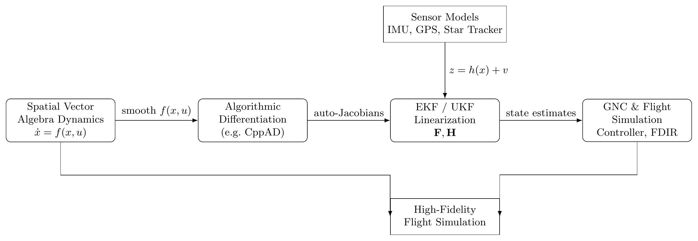

Spatial Vector Algebra Basics
=============================

Rigid-body motion is most naturally described using the Lie group
:math:`SE(3)` and its Lie algebra :math:`\mathfrak{se}(3)`.
Spatial Vector Algebra (SVA) is a coordinate realization of these objects,
producing a unified framework for rigid-body kinematics and dynamics.
The algebra respects the adjoint and co-adjoint structures of the group and
produces numerically stable equations of motion with minimal overhead.

Spatial Motion Vectors (Twists)
-------------------------------

A spatial motion vector (or *twist*) is an element of
:math:`\mathfrak{se}(3)` represented in coordinates as

.. math::

   \mathbf{v}
   =
   \begin{bmatrix}
      \boldsymbol{\omega} \\
      \mathbf{v}
   \end{bmatrix}
   \in \mathbb{R}^6,

where :math:`\boldsymbol{\omega}` is the angular velocity and
:math:`\mathbf{v}` is the linear velocity of a point fixed in the body.

The corresponding matrix in :math:`\mathfrak{se}(3)` is

.. math::

   \hat{\mathbf{v}}
   =
   \begin{bmatrix}
     \widehat{\boldsymbol{\omega}} & \mathbf{v} \\
     0 & 0
   \end{bmatrix}.

A rigid body's configuration :math:`X \in SE(3)` obeys

.. math::

   \dot{X} = X \hat{\mathbf{v}}.

Spatial Force Vectors (Wrenches)
--------------------------------

A spatial force vector (or *wrench*) is an element of the dual space
:math:`\mathfrak{se}(3)^* \cong \mathbb{R}^{6*}`. In coordinates,

.. math::

   \mathbf{f}
   =
   \begin{bmatrix}
      \mathbf{n} \\
      \mathbf{f}
   \end{bmatrix},

where :math:`\mathbf{n}` is the moment and :math:`\mathbf{f}` is the linear
force. The natural duality pairing giving instantaneous power is

.. math::

   \langle \mathbf{f}, \mathbf{v} \rangle
   =
   \mathbf{n}^\top \boldsymbol{\omega}
   +
   \mathbf{f}^\top \mathbf{v}.

Spatial Cross Product for Motion Vectors
----------------------------------------

The Lie bracket on :math:`\mathfrak{se}(3)` induces the spatial cross product

.. math::

   \mathbf{v} \times \mathbf{w}
   =
   \begin{bmatrix}
     \boldsymbol{\omega} \times \boldsymbol{\omega}' \\
     \boldsymbol{\omega} \times \mathbf{v}'
     + \mathbf{v} \times \boldsymbol{\omega}'
   \end{bmatrix}
   =
   \mathrm{ad}_{\mathbf{v}} \mathbf{w}.

Spatial Cross Product for Forces
--------------------------------

The co-adjoint action yields

.. math::

   \mathbf{v} \times^* \mathbf{f}
   =
   \begin{bmatrix}
     \boldsymbol{\omega} \times \mathbf{n}
     + \mathbf{v} \times \mathbf{f} \\
     \boldsymbol{\omega} \times \mathbf{f}
   \end{bmatrix}.

Spatial Transforms
------------------

A transform :math:`{}_A X_B \in SE(3)` maps vectors from frame :math:`B` to
frame :math:`A`. Let :math:`{}_A X_B = (R, p)` with :math:`R \in SO(3)`,
:math:`p \in \mathbb{R}^3`.

Action on Motion Vectors (Adjoint Map)
~~~~~~~~~~~~~~~~~~~~~~~~~~~~~~~~~~~~~~

.. math::

   {}_A X_B
   =
   \begin{bmatrix}
     R & 0 \\
     p^\wedge R & R
   \end{bmatrix},

and motion vectors transform as

.. math::

   \mathbf{v}_A = {}_A X_B \, \mathbf{v}_B.

Action on Forces (Co-Adjoint Map)
~~~~~~~~~~~~~~~~~~~~~~~~~~~~~~~~~

.. math::

   {}_A X_B^*
   =
   ({}_A X_B^{-1})^\top
   =
   \begin{bmatrix}
     R & p^\wedge R \\
     0 & R
   \end{bmatrix},

which preserves duality:

.. math::

   \langle \mathbf{f}_A, \mathbf{v}_A \rangle
   =
   \langle {}_A X_B^* \mathbf{f}_B, {}_A X_B \mathbf{v}_B \rangle.

Spatial Inertia
---------------

For mass :math:`m`, center of mass :math:`c_F` (expressed in frame
:math:`F`), and rotational inertia :math:`IC_F` at the COM:

.. math::

   \mathbb{I}_F
   =
   \begin{bmatrix}
     IC_F + m c_F^\wedge c_F^\wedge{}^\top & m c_F^\wedge \\
     m c_F^\wedge{}^\top & m I_3
   \end{bmatrix}.

Spatial inertias transform by the co-adjoint sandwich

.. math::

   \mathbb{I}_A
   =
   {}_A X_B^* \, \mathbb{I}_B \, ({}_A X_B).

Newton–Euler Equations in Spatial Form
--------------------------------------

The rigid-body equations of motion are

.. math::

   \mathbf{f}_{\text{net}}
   = \mathbb{I} \dot{\mathbf{v}}
   + \mathbf{v} \times^* \bigl( \mathbb{I}\mathbf{v} \bigr),

.. math::

   \dot{\mathbf{v}}
   =
   \mathbb{I}^{-1}
   \left(
     \mathbf{f}_{\text{net}}
     -
     \mathbf{v} \times^* \bigl( \mathbb{I}\mathbf{v} \bigr)
   \right),

and are covariant under all frame changes in :math:`SE(3)`.

Benefits of SVA for GNC and EKF Design
--------------------------------------

SVA replaces separate translational and rotational equations with a single
6-D rigid-body equation

.. math::

   \mathbf{I} \mathbf{a}
   + \mathbf{v} \times^{*} (\mathbf{I}\mathbf{v})
   = \mathbf{f},

where :math:`\mathbf{v}, \mathbf{a} \in \mathbb{R}^6` are spatial velocity
and acceleration, :math:`\mathbf{I} \in \mathbb{R}^{6\times 6}` is the spatial
inertia, and :math:`\mathbf{f} \in \mathbb{R}^6` is the net spatial wrench.

This unification is especially helpful for:

- GNC design,
- Extended Kalman Filters (EKF),
- algorithmic differentiation and code generation.

EKF-Friendly Dynamics and Jacobians
~~~~~~~~~~~~~~~~~~~~~~~~~~~~~~~~~~~

In an inertial frame formulation, all pseudo-forces are eliminated and
Earth's rotation enters only through the atmospheric velocity model.

The dynamics are

.. math::

   \dot{x} = f(x,u),

and the EKF requires the state-transition Jacobian

.. math::

   \mathbf{F}
   =
   \left. \frac{\partial f(x,u)}{\partial x} \right|_{x = \hat{x}},

and measurement Jacobian

.. math::

   \mathbf{H}
   =
   \left. \frac{\partial h(x)}{\partial x} \right|_{x = \hat{x}},

where :math:`h(x)` encodes sensor models (IMU, GPS, star tracker, etc.).

Building blocks of :math:`f(x,u)` in SVA:

- fixed-size matrices (:math:`6\times 6` spatial inertia, adjoints, cross operators),
- bilinear cross operators :math:`\mathbf{v} \times`, :math:`\mathbf{v} \times^*`,
- smooth frame transforms between body, inertial, and sensor frames.

These are smooth and branch-free, making them ideal for algorithmic
differentiation (e.g. CppAD) to generate :math:`\mathbf{F}` and
:math:`\mathbf{H}` automatically.

Consistent Sensor Models in Body Frame
~~~~~~~~~~~~~~~~~~~~~~~~~~~~~~~~~~~~~~

IMU sensors are naturally expressed in the body frame. Using SVA, the same
spatial quantities used in the dynamics appear in the measurement models.
Accelerometer and gyroscope measurements become smooth functions of
:math:`(\mathbf{v}_B, \mathbf{a}_B, R_{WB})`, without ad-hoc mixing
of coordinates.

Numerical Robustness and Real-Time Implementation
~~~~~~~~~~~~~~~~~~~~~~~~~~~~~~~~~~~~~~~~~~~~~~~~~

Because SVA is conceptually coordinate-free and implemented via fixed-size
linear algebra, it is well suited to

- high-order ODE solvers in flight simulation,
- embedded real-time targets with limited resources,
- code generation pipelines where both dynamics and Jacobians are needed.

The absence of pseudo-forces and singular parameterizations improves
numerical stability and reduces the risk of EKF divergence.

GNC and EKF Pipeline Diagram
----------------------------

   Role of Spatial Vector Algebra in the GNC and EKF pipeline.
   SVA provides a smooth, unified 6-D dynamics model compatible with
   algorithmic differentiation and real-time GNC implementation.

*(Export your TikZ figure as a PDF/PNG and place it under ``_static/`` with this name.)*
